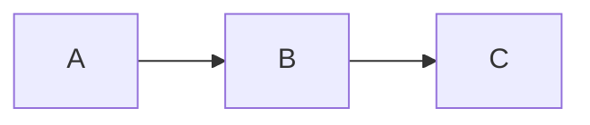

# <Doc Title>

> One-sentence summary of what this doc is about.

<!--
  This is the SINGLE template every swedocs doc follows, across all areas and all three
  parts (1-knowledge, 2-case-studies, 3-practice). Copy it, delete this comment, and fill in.

  Writing principles (apply to every doc):
   • Purpose-first — lead with WHY this exists / what problem it solves, not mechanics.
   • Example-driven — give one concrete, minimal example where it aids understanding.
   • Don't over-detail — clarity of purpose beats exhaustive coverage; cross-link instead
     of repeating what another doc (or another area) already covers.
   • Top-down — start from something the reader already does, then drill down.
   • Cross-link liberally with relative links: [text](../path/to/doc.md).

  Not every section fits every doc. Use the sections that serve the topic; the three
  doc types adapt the same skeleton (see "Variants by part" at the bottom).
-->

## Top-down: where you already meet this
Start from something the reader already does or has seen, then pull the thread down to
*this* topic. Why does it matter?

## Problem
What problem does this solve? Why is it hard / why does it matter?

## Core concepts
The key ideas. Lead with purpose; add a diagram (Mermaid) where it helps. Keep detail
proportional to understanding — link out rather than exhausting every edge case.

## Essential terminology
Define the words a beginner needs before they can read anything else on this topic.

| Term | Meaning |
| --- | --- |
| ... | ... |

## Example
One concrete, minimal example — a code snippet, a trace, a worked calculation, a command
+ its output — that makes the concept click.

## Common tools
| Tool | What it is | Use it for |
| --- | --- | --- |
| `tool` | ... | ... |

## Trade-offs
- ✅ Pros / what it guarantees
- ⚠️ Cons / costs / limits
- When it applies / when it doesn't

## Real-world examples
How real systems apply this in practice.

## References
- [Link](https://example.com)

---

## Variants by part
The same skeleton above, adapted per part — keep the purpose-first, example-driven spirit:

- **1-knowledge** (academic doc): use the full structure above.
- **2-case-studies** (a real system/scenario end-to-end): swap the middle for
  **The scenario** → **Requirements** → **How it works** (diagram, end-to-end) →
  **Deep dives / the theory in action** → **Trade-offs & failure modes** → **References**.
  Link back to the knowledge docs for the theory instead of re-teaching it.
- **3-practice** (a hands-on lab): lead with **Goal** + what it *Builds* (the knowledge doc
  it mirrors), then numbered **Steps** (commands/code + expected output), **Exercises**,
  **What you proved**, **References**. The goal is doing/observing the concept.
