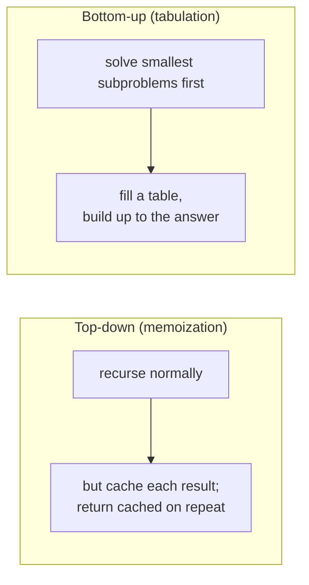

# Dynamic Programming

> Solve a hard problem by breaking it into **overlapping subproblems** and **solving each only once**,
> caching the answers. It's the technique that turns exponential [recursion](./recursion-and-divide-and-conquer.md)
> into polynomial time — and the one that trips up the most engineers.

## Top-down: where you already meet this
You've used `git diff` (edit distance), spell-check suggestions, or a route that minimizes cost —
all dynamic programming underneath. And you've probably written a naive recursive solution that was
correct but impossibly slow; DP is usually the fix. It has a fearsome reputation, but the core idea
is simple: *don't solve the same subproblem twice.*

## Problem
Some problems have **optimal substructure** (the best overall answer is built from best answers to
subproblems) but also **overlapping subproblems** (the same subproblem recurs over and over). Naive
[recursion](./recursion-and-divide-and-conquer.md) re-solves those overlaps exponentially — `fib(n)`
is O(2ⁿ). [Divide and conquer](./recursion-and-divide-and-conquer.md) doesn't help because *its*
subproblems are independent (no overlap). DP is precisely the tool for the *overlapping* case: solve
each subproblem once, store it, reuse it.

## Core concepts
Two ingredients must be present for DP to apply:
1. **Optimal substructure** — the optimal solution uses optimal solutions of subproblems.
2. **Overlapping subproblems** — the same subproblems are computed repeatedly.

Given those, there are **two implementations** of the same idea:



- **Top-down / memoization** — write the natural recursion, add a cache. Easy to derive from a brute-
  force solution; recursion overhead + stack depth.
- **Bottom-up / tabulation** — iterate from the base cases, filling a table (array) until you reach
  the answer. No recursion, often more space-efficient (you can sometimes keep just the last row).

Both turn exponential into **O(states × work-per-state)** — usually O(n) or O(n²).

### The method (how to actually do it)
1. **Define the state** — what parameters identify a subproblem? (e.g. "min coins for amount `a`").
2. **Write the recurrence** — express a state's answer in terms of smaller states.
3. **Identify base cases.**
4. **Add memoization** (top-down) *or* **fill a table** (bottom-up).
The hard part is always **step 1–2** — *finding the state and recurrence*. The coding is mechanical.

## Essential terminology
| Term | Meaning |
| --- | --- |
| **Optimal substructure** | Optimal answer built from optimal sub-answers |
| **Overlapping subproblems** | Same subproblems recur (the reason caching helps) |
| **Memoization** | Top-down: cache results of a recursion |
| **Tabulation** | Bottom-up: fill a table from base cases up |
| **State** | The parameters that uniquely define a subproblem |
| **Recurrence** | The formula relating a state to smaller states |

## Example
**Coin change** — fewest coins to make an amount — the textbook DP, bottom-up:

```python
def min_coins(coins, amount):
    INF = amount + 1
    dp = [0] + [INF] * amount                 # dp[a] = fewest coins for amount a; dp[0]=0
    for a in range(1, amount + 1):
        for c in coins:
            if c <= a:
                dp[a] = min(dp[a], dp[a - c] + 1)   # recurrence: use coin c, +1
    return dp[amount] if dp[amount] != INF else -1

min_coins([1, 3, 4], 6)     # 2  (3+3, not 4+1+1)
```
- **State:** `dp[a]` = min coins for amount `a`. **Recurrence:** `dp[a] = min(dp[a-c]+1)` over coins.
- Greedy (“take the biggest coin”) gives 3 here (4+1+1) — *wrong*; DP explores all and gets 2.
Implement this top-down *and* bottom-up in [lab: dynamic programming](../../3-practice/lab-dynamic-programming.md).

## Trade-offs
- ✅ Turns exponential brute force into polynomial time for a huge class of optimization/counting
  problems (shortest paths, edit distance, knapsack, sequence alignment).
- ⚠️ **It's a space-for-time trade**: caching costs O(states) memory (sometimes reducible). The real
  difficulty is *recognizing* a DP and *defining the state/recurrence* — not the code. Overkill for
  problems without overlapping subproblems (use plain recursion / greedy / divide-and-conquer there).
- Don't force it: if subproblems don't overlap, DP adds memory for no gain; if a greedy choice is
  provably optimal, greedy is simpler.

## Real-world examples
- **`diff` / version control** and DNA sequence alignment use **edit distance / LCS** (classic DPs).
- **Spell checkers / fuzzy search** rank suggestions by edit distance.
- **Resource optimization** (knapsack-style: budget, scheduling, bin-packing approximations) and
  some [shortest-path](./graph-algorithms.md) algorithms (Bellman-Ford, Floyd-Warshall) are DP.

## References
- [Recursion & divide and conquer](./recursion-and-divide-and-conquer.md) · [Big-O](../fundamentals/big-o-complexity.md) · [Graph algorithms](./graph-algorithms.md)
- Cormen et al. — *Introduction to Algorithms*, DP chapter
