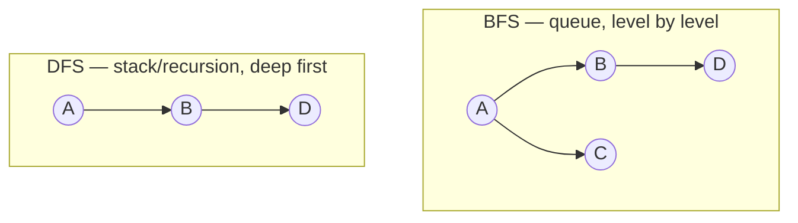

# Graph Algorithms

> What you actually *do* with a [graph](../data-structures/graphs.md): visit every node (BFS/DFS),
> find shortest paths (Dijkstra), and order by dependency (topological sort). A handful of
> traversals that answer most "connected / shortest / order" questions.

## Top-down: where you already meet this
Google Maps finding the fastest route, a build tool deciding compile order, "people you may know,"
a maze solver, detecting a circular dependency that breaks your build — all are graph algorithms.
Master the two traversals (BFS and DFS) and most graph problems become variations on them.

## Problem
A [graph](../data-structures/graphs.md) just stores relationships; the value is in *querying* them:
Is B reachable from A? What's the shortest/cheapest path? Is there a cycle? In what order can I
process tasks that depend on each other? These look like different problems but reduce to a few
traversal patterns — so learning the traversals is high-leverage.

## Core concepts
### The two traversals (everything builds on these)

- **BFS (Breadth-First Search)** — explore level by level using a [queue](../data-structures/linked-lists-stacks-queues.md).
  Visits nearest nodes first, so it finds the **shortest path in an *unweighted* graph**. Used for
  shortest hops, "degrees of separation," level-order.
- **DFS (Depth-First Search)** — go as deep as possible, backtrack, using a
  [stack](../data-structures/linked-lists-stacks-queues.md) or [recursion](./recursion-and-divide-and-conquer.md).
  Used for cycle detection, connectivity, topological sort, and exploring all paths (backtracking).

Both are **O(V + E)** — you touch each vertex and edge once. The only structural difference is
queue (BFS) vs. stack (DFS).

### The essential named algorithms
| Algorithm | Answers | Idea | Complexity |
| --- | --- | --- | --- |
| **BFS** | Shortest path (unweighted), reachability | Queue, level by level | O(V + E) |
| **DFS** | Cycle detection, connectivity, all-paths | Stack/recursion, deep first | O(V + E) |
| **Dijkstra** | Shortest path (non-negative **weights**) | Greedy + [min-heap](../data-structures/trees-and-heaps.md) | O(E log V) |
| **Topological sort** | Valid order of a [DAG](../data-structures/graphs.md)'s dependencies | DFS / Kahn's algorithm | O(V + E) |

**Dijkstra** is BFS upgraded for *weighted* edges: instead of a plain queue, use a
[priority queue (heap)](../data-structures/trees-and-heaps.md) to always expand the cheapest-so-far
node. It's how maps compute fastest routes (A* adds a heuristic to go faster).

**Topological sort** orders a DAG so every node comes before its dependents — exactly "what order do
I build/install these in?" If the graph has a cycle, no order exists (and that's how you *detect*
the circular dependency).

## Essential terminology
| Term | Meaning |
| --- | --- |
| **BFS / DFS** | Breadth-first (queue, levels) / depth-first (stack, deep) traversal |
| **Visited set** | Tracks seen nodes so you don't loop forever on cycles |
| **Shortest path** | Fewest edges (BFS) or least total weight (Dijkstra) |
| **Topological order** | Linear ordering of a DAG respecting all dependencies |
| **Cycle detection** | Finding a path that returns to a node (DFS with recursion stack) |
| **Greedy** | Make the locally-best choice each step (Dijkstra picks the nearest frontier node) |

## Example
**BFS** — shortest number of hops in an unweighted graph (note the queue + visited set):

```python
from collections import deque

def shortest_hops(graph, start, goal):
    queue = deque([(start, 0)])          # (node, distance) — FIFO queue = BFS
    visited = {start}
    while queue:
        node, dist = queue.popleft()
        if node == goal:
            return dist                  # first time we reach goal = shortest (BFS guarantee)
        for nbr in graph[node]:
            if nbr not in visited:
                visited.add(nbr)         # mark on enqueue to avoid revisits/cycles
                queue.append((nbr, dist + 1))
    return -1                            # unreachable
```
Swap the queue for a stack (or recursion) and you have DFS. Implement both — and solve a maze — in
[lab: BFS & DFS](../../3-practice/lab-bfs-dfs.md); see weighted shortest paths in the
[maps case study](../../2-case-studies/shortest-path-maps.md).

## Trade-offs
- ✅ A tiny toolbox (BFS, DFS, Dijkstra, topo-sort) answers a huge range of real problems —
  routing, scheduling, dependency resolution, recommendations, reachability.
- ⚠️ **Always track visited nodes** — forget it and cycles loop forever (the #1 graph bug). BFS uses
  more memory (the whole frontier); recursive DFS can overflow the stack on deep graphs (use an
  explicit stack). **Dijkstra fails with negative weights** (use Bellman-Ford then).
- ⚠️ Many *advanced* graph problems (traveling salesman, max clique) are NP-hard — no efficient exact
  algorithm; you use approximations/heuristics.
- Pick by question: unweighted shortest → BFS; explore/cycle/order → DFS; weighted shortest →
  Dijkstra; dependency order → topological sort.

## Real-world examples
- **Maps & navigation** — Dijkstra/A* over weighted road graphs ([shortest-path case study](../../2-case-studies/shortest-path-maps.md));
  network [routing](../../../computer-networks/1-knowledge/network-layer/routing-and-forwarding.md) uses shortest-path algorithms.
- **Build systems & package managers** — topological sort of the dependency DAG; cycle detection
  reports "circular dependency."
- **Social networks / web** — BFS for "degrees of separation," graph traversal for recommendations.

## References
- [Graphs (the data structure)](../data-structures/graphs.md) · [Trees & heaps (priority queue)](../data-structures/trees-and-heaps.md) · [Recursion](./recursion-and-divide-and-conquer.md)
