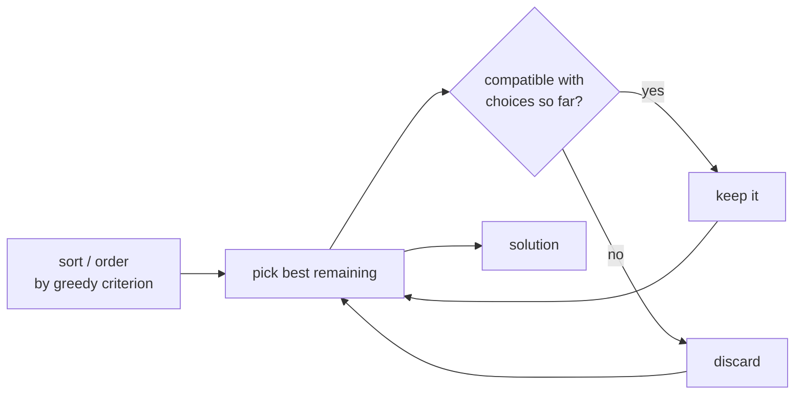

# Greedy Algorithms

> Build a solution by always taking the **locally best choice** and never looking back. Dead simple
> and fast — but only *correct* when the problem has the right structure. The third classic paradigm,
> next to [divide and conquer](./recursion-and-divide-and-conquer.md) and
> [dynamic programming](./dynamic-programming.md).

## Top-down: where you already meet this
You make change without thinking: hand over the biggest bill that still fits, repeat. To pay $7 you
grab a $5, then a $1, then a $1 — never reconsidering an earlier choice. That reflex *is* a greedy
algorithm: at each step, commit to whatever looks best right now. The surprise is that this obvious
strategy is sometimes provably optimal — and sometimes quietly wrong.

## Problem
Optimization problems ask for the *best* arrangement — the fewest coins, the most meetings scheduled,
the cheapest network. Checking every combination is exponential. A greedy algorithm makes one pass,
taking the best immediate option each step, for a fast (often O(n log n)) answer. The catch: a choice
that's best *now* can foreclose a better solution *later*. So the real question is never "what's the
greedy choice?" — it's **"does greedy even give the right answer for this problem?"**

## Core concepts
A greedy algorithm is provably optimal only when the problem has **both** properties:
- **Greedy-choice property** — a globally optimal solution can be reached by making locally optimal
  choices. You never need to undo a choice to reach the best answer.
- **Optimal substructure** — an optimal solution contains optimal solutions to its subproblems (also
  what makes [DP](./dynamic-programming.md) work).

The contrast with DP is the whole point: **DP explores all choices** and keeps the best; **greedy
commits to one** and moves on. Greedy is faster and simpler — *when it's valid*. When it isn't, DP
(or full search) is the fallback. Proving validity usually uses an **exchange argument**: show that
any optimal solution can be transformed, swap by swap, into the greedy one without getting worse.



## Essential terminology
| Term | Meaning |
| --- | --- |
| **Greedy-choice property** | Locally optimal choices lead to a global optimum |
| **Optimal substructure** | An optimal solution is built from optimal sub-solutions |
| **Local vs. global optimum** | Best right here vs. best overall — greedy bets they coincide |
| **Exchange argument** | Proof technique: morph any optimum into the greedy one without loss |
| **Counterexample** | A single input where greedy loses — disproves correctness instantly |

## Example
**When greedy works — interval scheduling.** Pick the most non-overlapping meetings from a room. The
winning greedy rule is *earliest finish time* (not earliest start, not shortest): finishing soonest
leaves the most room for the rest, and an exchange argument proves it optimal.

```python
def max_meetings(intervals):           # intervals = [(start, end), ...]
    intervals.sort(key=lambda iv: iv[1])   # greedy criterion: earliest finish first
    chosen, last_end = [], float("-inf")
    for start, end in intervals:
        if start >= last_end:              # compatible with what we've already taken?
            chosen.append((start, end))
            last_end = end                 # commit — never reconsidered
    return chosen
# [(0,3),(2,5),(4,7),(6,9)] → [(0,3),(4,7)]  : 2 meetings, provably the most
```

**When greedy fails — coin change.** With coins `{1, 3, 4}` make 6. Greedy grabs `4`, then `1+1` =
**3 coins**. The optimum is `3+3` = **2 coins**. One counterexample, and "biggest coin first" is
dead — this problem needs [DP](./dynamic-programming.md). (Greedy *is* optimal for ordinary
`{1,5,10,25}` currency, which is exactly why the trap is easy to miss.)

## Trade-offs
- ✅ Fast and tiny: usually one sort + one pass = O(n log n), constant memory, easy to code.
- ⚠️ **Correctness is the hard part, not the code.** The locally-best move can be globally wrong; a
  greedy solution is only trustworthy *with a proof* (or known result). Always hunt for a
  counterexample before trusting it.
- When greedy fails the greedy-choice property, you generally need [dynamic
  programming](./dynamic-programming.md) (considers all options) or full search/backtracking.
- Rule of thumb: reach for greedy when an obvious "best next step" exists *and* you can argue an
  earlier choice never needs undoing — otherwise assume DP.

## Real-world examples
- **[Dijkstra's shortest path](./graph-algorithms.md)** and **MST** (Kruskal/Prim) are greedy —
  always extend by the cheapest safe edge; both are provably optimal. See [shortest path in
  maps](../../2-case-studies/shortest-path-maps.md).
- **Huffman coding** (compression) greedily merges the two least-frequent symbols to build optimal
  prefix codes — the basis of ZIP/JPEG entropy coding.

## References
- [Dynamic programming](./dynamic-programming.md) (the fallback when greedy fails) · [Graph algorithms](./graph-algorithms.md) (Dijkstra/MST are greedy) · [Sorting & searching](./sorting-and-searching.md) (greedy usually sorts first)
- CLRS — *Introduction to Algorithms*, ch. 16 "Greedy Algorithms"
