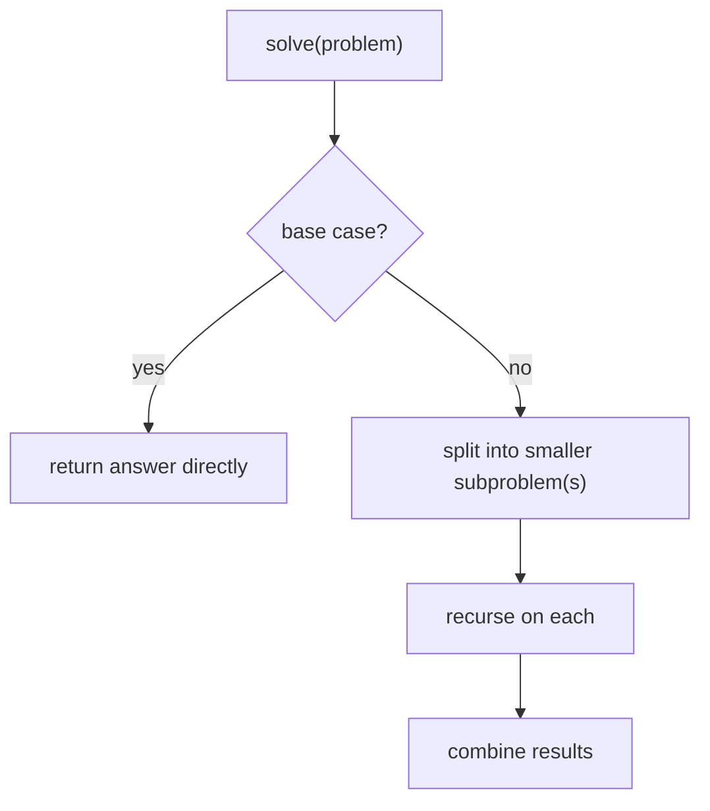

# Recursion & Divide and Conquer

> Solve a problem by solving **smaller versions of itself**. Recursion is the technique; divide and
> conquer is the strategy that splits a problem into independent parts, solves each recursively, and
> combines them — the engine behind merge sort, binary search, and most tree/graph work.

## Top-down: where you already meet this
You've walked a nested folder tree, parsed nested JSON, or computed a factorial. Each is naturally
recursive — "to process this, process its parts the same way." Once you see a problem as
"itself, but smaller," a whole class of elegant solutions opens up.

## Problem
Many problems are *self-similar*: a tree is subtrees, a sorted range is two half-ranges, a path is a
step plus the rest of the path. Expressing these with loops is awkward and error-prone; expressing
them recursively matches their structure exactly. The challenge is doing it *correctly* (terminating)
and *efficiently* (not re-doing work — the bridge to [dynamic programming](./dynamic-programming.md)).

## Core concepts
**Recursion = a function that calls itself**, with two non-negotiable parts:
- **Base case** — the smallest input you can answer directly (stops the recursion). Forget it → infinite
  recursion → stack overflow.
- **Recursive case** — reduce toward the base case and call yourself on the smaller input.



**Divide and conquer** is the most powerful recursive pattern — three steps:
1. **Divide** the problem into independent subproblems (usually halves).
2. **Conquer** each by recursion.
3. **Combine** the sub-answers into the full answer.

[Merge sort](./sorting-and-searching.md) (split, sort halves, merge), [binary search](./sorting-and-searching.md)
(halve the range), and quicksort all follow this. The halving is *why* they're O(log n) or
O(n log n): splitting in two gives log n levels of depth.

### Recursion's costs and cures
- **The call stack.** Each call uses a stack frame; too-deep recursion overflows it (Python caps
  ~1000). Some recursions can be rewritten as loops; *tail-call* languages optimize this away.
- **Recomputation.** Naive recursion can re-solve the same subproblem exponentially often (naive
  Fibonacci is O(2ⁿ)). The fix — remember results — is **memoization**, which turns recursion into
  [dynamic programming](./dynamic-programming.md).

## Essential terminology
| Term | Meaning |
| --- | --- |
| **Base case** | The terminating case answered without recursing |
| **Recursive case** | Reduces the problem and calls itself |
| **Divide and conquer** | Split → recurse on parts → combine |
| **Call stack / stack overflow** | Frames for pending calls / running out of that space |
| **Memoization** | Caching subproblem results to avoid recomputation |
| **Tail recursion** | Recursive call is the last action — optimizable into a loop |

## Example
The classic trap and its cure — naive recursion is exponential; memoizing makes it linear:

```python
# ⚠️ O(2ⁿ): recomputes the same fib(k) exponentially many times
def fib(n):
    if n < 2: return n                 # base case
    return fib(n - 1) + fib(n - 2)     # recursive case

# ✅ O(n): remember each result once (memoization → dynamic programming)
from functools import lru_cache
@lru_cache(None)
def fib_fast(n):
    if n < 2: return n
    return fib_fast(n - 1) + fib_fast(n - 2)
```
`fib(35)` does ~30 million calls; `fib_fast(35)` does 36. Same recursion, one cache — the leap to
[dynamic programming](./dynamic-programming.md). Solve a DP this way in
[lab: dynamic programming](../../3-practice/lab-dynamic-programming.md).

## Trade-offs
- ✅ Recursion matches self-similar problems (trees, divide-and-conquer, backtracking) with clean,
  minimal code; divide-and-conquer turns many O(n²) approaches into O(n log n) and parallelizes
  naturally (independent subproblems).
- ⚠️ Stack depth limits + per-call overhead; naive recursion silently recomputes (exponential
  blowup) — memoize or convert to iteration. Deep or hot recursion is sometimes better as an explicit
  loop with a [stack](../data-structures/linked-lists-stacks-queues.md).
- Rule of thumb: recursive when the problem is *naturally* recursive (trees, splitting); watch for
  repeated subproblems (→ DP) and depth (→ iteration).

## Real-world examples
- **Tree/graph traversal** ([DFS](./graph-algorithms.md)), parsing nested structures (JSON, ASTs),
  and file-system walks are inherently recursive.
- **Merge sort & quicksort** ([sorting](./sorting-and-searching.md)), FFT, and many "split the array"
  algorithms are divide-and-conquer.

## References
- [Sorting & searching](./sorting-and-searching.md) · [Dynamic programming](./dynamic-programming.md) · [Graph algorithms](./graph-algorithms.md)
