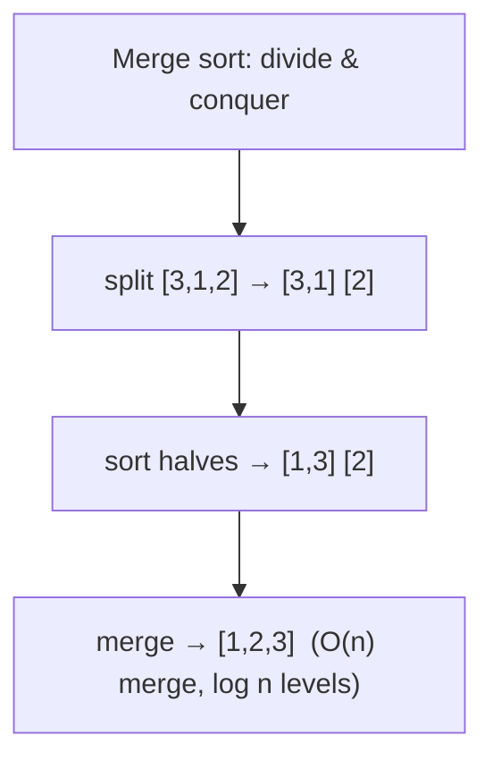

# Sorting & Searching

> The two most fundamental operations on data — put it in order, then find things fast. They're
> worth understanding not to *reimplement* (your language already has them) but because they teach
> the core algorithmic ideas and the **sort-then-binary-search** pattern you'll reuse forever.

## Top-down: where you already meet this
You call `sorted()` / `.sort()` constantly, and `if x in list` to find things. You've sorted a table
by column and searched a dictionary. Behind those everyday calls are decades-refined algorithms —
and knowing how they work tells you *when* sorting first pays off and why "binary search needs sorted
data."

## Problem
Two recurring needs: **ordering** data (for display, for grouping, or to enable fast search) and
**finding** an item. Naively, finding something is O(n) (scan everything). But if the data is
**sorted**, you can find it in O(log n) by repeatedly halving the search range — a massive win. So
sorting is often the enabler: pay O(n log n) once to sort, then get O(log n) searches forever.

## Core concepts
### Searching
- **Linear search** — scan until found. O(n). Works on any data, sorted or not.
- **Binary search** — on **sorted** data: check the middle, discard half, repeat. **O(log n)**. This
  halving is *the* reason to keep data sorted (and the same idea inside [BSTs](../data-structures/trees-and-heaps.md)).

### Sorting — the ideas, not the zoo
You don't need all dozen sorts; you need the two *patterns* and the practical takeaway:
- **O(n²) simple sorts** (bubble, insertion, selection) — nested loops; fine for tiny or
  nearly-sorted data, hopeless at scale. Their value is pedagogical.
- **O(n log n) efficient sorts** — the real ones, built on **[divide & conquer](./recursion-and-divide-and-conquer.md)**:
  - **Merge sort** — split in half, sort each, merge. Always O(n log n), *stable*, but O(n) extra space.
  - **Quicksort** — partition around a pivot, recurse. O(n log n) average, **O(n²) worst** (bad
    pivots), in-place — the usual default.
- **O(n) non-comparison sorts** (counting/radix) — beat the O(n log n) *comparison* lower bound by
  exploiting structure (small integer ranges), in special cases only.



> 💡 **The lower bound:** any *comparison-based* sort needs ≥ O(n log n) — you can't beat it by
> comparing. That's why O(n log n) is "as good as general sorting gets," and why merge/quick are the
> ceiling for general data.

| Algorithm | Average | Worst | Space | Stable? |
| --- | --- | --- | --- | --- |
| Binary search | O(log n) | O(log n) | O(1) | — |
| Merge sort | O(n log n) | O(n log n) | O(n) | ✅ |
| Quicksort | O(n log n) | O(n²) | O(log n) | ❌ |
| Insertion sort | O(n²) | O(n²) | O(1) | ✅ (great for tiny/nearly-sorted) |

## Essential terminology
| Term | Meaning |
| --- | --- |
| **Binary search** | Halving search on sorted data → O(log n) |
| **Comparison sort** | Sorts by comparing pairs; bounded below by O(n log n) |
| **Stable sort** | Preserves relative order of equal keys (matters for multi-key sorts) |
| **In-place** | Sorts using O(1) extra space |
| **Pivot / partition** | Quicksort's split element / the rearrange step around it |
| **Divide & conquer** | Split → solve parts → combine (see [recursion](./recursion-and-divide-and-conquer.md)) |

## Example
The win from sorting once — binary search finds in O(log n):

```python
import bisect
data = sorted(big_list)              # O(n log n), once
i = bisect.bisect_left(data, target) # O(log n) per search, forever after
found = i < len(data) and data[i] == target
```
And binary search by hand — the halving that defines O(log n):
```python
def binary_search(a, target):        # a must be sorted
    lo, hi = 0, len(a) - 1
    while lo <= hi:
        mid = (lo + hi) // 2
        if a[mid] == target: return mid
        if a[mid] < target:  lo = mid + 1     # discard left half
        else:                hi = mid - 1     # discard right half
    return -1
```
Watch O(log n) vs O(n) vs O(n²) diverge empirically in [lab: measure Big-O](../../3-practice/lab-big-o-measure.md).

## Trade-offs
- ✅ Sorting enables O(log n) search, grouping, and dedup; the right sort is a one-line call.
  **Use your language's built-in sort** — it's a hardened hybrid (Python/Java use Timsort,
  merge+insertion) you won't beat.
- ⚠️ Reimplementing sorts in production is almost always wrong; quicksort's O(n²) worst case bites on
  adversarial input (use introsort/Timsort which guard against it); non-comparison sorts only apply
  to special data.
- The reusable instinct: if you find yourself doing repeated O(n) searches or "find pairs/dupes,"
  consider **sort first** (then binary search / two-pointer) or a [hash table](../data-structures/hash-tables.md).

## Real-world examples
- **Timsort** (Python `sorted`, Java `Arrays.sort` for objects) — a real-world merge/insertion hybrid
  tuned for partially-ordered data.
- **Database query planners** sort to enable merge-joins and to satisfy `ORDER BY`; **B-tree
  [indexes](../../../system-design/1-knowledge/data-storage/indexing.md)** are "kept sorted" so lookups
  are O(log n).

## References
- [Recursion & divide and conquer](./recursion-and-divide-and-conquer.md) · [Trees & heaps](../data-structures/trees-and-heaps.md) · [Big-O](../fundamentals/big-o-complexity.md)
