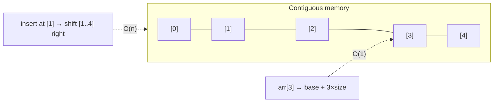

# Arrays & Strings

> The most fundamental data structure: a **contiguous block of memory** you index in O(1). Fast and
> cache-friendly to read, but costly to insert/delete in the middle — and that single trade-off
> explains when to use it and when not to.

## Top-down: where you already meet this
Every list/array you've used — a Python `list`, a JS `Array`, a row of pixels, a string of
characters — is this structure. When you write `arr[5]` and it's instant, that's the array's
superpower; when `.insert(0, x)` on a big list feels slow, that's its weakness showing.

## Problem
We need to store an ordered collection and access elements quickly. The simplest, fastest answer is
to lay them out **back-to-back in memory** so the address of element `i` is just `base + i × size` —
a single arithmetic step. That gives instant random access, but the contiguity that makes reads fast
makes structural change (insert/delete in the middle, grow) expensive. Knowing this trade-off is the
foundation for choosing every other structure.

## Core concepts
- **Contiguous layout → O(1) random access.** `arr[i]` is direct address arithmetic, and sequential
  scans are **cache-friendly** (the CPU prefetches neighbors) — often the real-world speed that
  Big-O hides.
- **Fixed vs. dynamic arrays.** A raw array has fixed size. A **dynamic array** (Python `list`,
  Java `ArrayList`, C++ `vector`, JS `Array`) grows automatically: when full, it allocates a bigger
  block (usually 2×) and copies. That copy is O(n), but it happens rarely, so **append is
  *amortized* O(1)** — a key idea (see [Big-O](../fundamentals/big-o-complexity.md)).
- **The cost of insert/delete in the middle: O(n).** Everything after the spot must shift. Inserting
  at the *front* of a big array is O(n) — which is exactly why a [queue wants a different structure](./linked-lists-stacks-queues.md).
- **Strings are arrays of characters** — and in most languages **immutable**, so "modifying" a
  string builds a new one. That's why repeatedly `+=`-ing in a loop is secretly O(n²); use a
  builder/`join` for O(n).



| Operation | Complexity | Why |
| --- | --- | --- |
| Access `arr[i]` | **O(1)** | Address arithmetic |
| Append (dynamic) | **O(1) amortized** | Occasional O(n) resize, rare |
| Insert/delete middle or front | **O(n)** | Shift the rest |
| Search (unsorted) | **O(n)** | Must scan |

## Essential terminology
| Term | Meaning |
| --- | --- |
| **Array** | Fixed-size contiguous block; O(1) indexing |
| **Dynamic array** | Auto-growing array (list/vector/ArrayList) — amortized O(1) append |
| **Amortized O(1)** | Average per-op cost over many ops, despite rare O(n) resizes |
| **Cache locality** | Contiguous data is fast because the CPU prefetches neighbors |
| **In-place** | Modifying the array without allocating a new one (O(1) extra space) |
| **Two-pointer / sliding window** | Classic O(n) array techniques using indices that move through it |

## Example
Why string concatenation in a loop is a hidden O(n²) — and the O(n) fix:

```python
# ⚠️ O(n²): strings are immutable, each += copies the whole growing string
s = ""
for chunk in chunks:
    s += chunk

# ✅ O(n): collect then join once
s = "".join(chunks)
```
And the **two-pointer** idiom — reverse in place, O(n) time, O(1) space:
```python
def reverse(a):
    i, j = 0, len(a) - 1
    while i < j:
        a[i], a[j] = a[j], a[i]      # swap ends, move inward
        i, j = i + 1, j - 1
```
Measure the array-vs-other trade-offs in [lab: measure Big-O](../../3-practice/lab-big-o-measure.md).

## Trade-offs
- ✅ Unbeatable for indexed access and sequential scans; minimal memory overhead; cache-friendly.
  The default container until you have a reason otherwise.
- ⚠️ Insert/delete anywhere but the end is O(n); fixed arrays need resizing logic; front operations
  are slow — reach for a [linked list / deque](./linked-lists-stacks-queues.md) when you mutate the
  front, or a [hash table](./hash-tables.md) when you need fast lookup by key.

## Real-world examples
- **Dynamic arrays are the default list** in every language (Python `list`, Go slices, JS arrays).
- **Two-pointer & sliding-window** algorithms (longest substring, sorted-array merge) are array
  techniques that turn O(n²) brute force into O(n) — interview and real-world staples.

## References
- [Big-O & complexity](../fundamentals/big-o-complexity.md) · [Linked lists, stacks & queues](./linked-lists-stacks-queues.md) · [Hash tables](./hash-tables.md)
