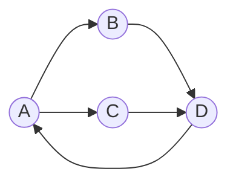

# Graphs

> The structure for **relationships** — anything that's "things connected to other things":
> networks, maps, dependencies, social follows. A graph is nodes (vertices) joined by edges, and
> most real-world connectivity problems are graph problems in disguise.

## Top-down: where you already meet this
Your social network (people → friendships), a road map (intersections → roads), package
dependencies (`npm`/`pip` install order), the web (pages → links), a state machine — all graphs.
When a problem says "shortest", "reachable", "connected", "cycle", or "order things by dependency,"
it's almost always a graph problem.

## Problem
[Trees](./trees-and-heaps.md) capture strict hierarchies (one parent), but most relationships aren't
hierarchical — a city connects to many cities, a person to many friends, a task to many
prerequisites, possibly with cycles. We need a structure for *arbitrary* connections, plus a way to
represent it efficiently and traverse it. That's the graph.

## Core concepts
A **graph** = a set of **vertices** (nodes) + **edges** (connections). The key variations:
- **Directed vs. undirected** — edges one-way (Twitter follows, task dependencies) or mutual
  (Facebook friends, roads).
- **Weighted vs. unweighted** — edges carry a cost (distance, latency) or not.
- **Cyclic vs. acyclic** — a **DAG** (directed acyclic graph) has no cycles and models dependencies/
  schedules (build order, Git commit history, task pipelines).



### Two ways to store one (the trade-off)
| Representation | Space | "Is A–B connected?" | Best when |
| --- | --- | --- | --- |
| **Adjacency list** (each node → list of neighbors) | O(V + E) | O(degree) | **Sparse** graphs (most real ones) |
| **Adjacency matrix** (V×V grid of 0/1) | O(V²) | O(1) | **Dense** graphs / constant-time edge checks |

Most real graphs are **sparse** (each node connects to a few others), so the **adjacency list** is
the default — a [hash table](./hash-tables.md) of node → neighbor list.

### Traversal is the foundation
Almost everything you do with a graph starts with visiting its nodes systematically — **BFS** (level
by level, uses a [queue](./linked-lists-stacks-queues.md)) or **DFS** (deep first, uses a
[stack](./linked-lists-stacks-queues.md)/recursion). Those, plus shortest-path and topological sort,
are the [graph algorithms](../algorithms/graph-algorithms.md) doc — this doc is the *structure*; that
one is what you *do* with it.

## Essential terminology
| Term | Meaning |
| --- | --- |
| **Vertex / edge** | A node / a connection between two nodes |
| **Directed / undirected** | One-way edges / two-way edges |
| **Weighted** | Edges have a cost (distance, time, capacity) |
| **Degree** | Number of edges on a vertex (in-/out-degree if directed) |
| **Path / cycle** | A sequence of edges between nodes / a path back to the start |
| **DAG** | Directed Acyclic Graph — models dependencies & ordering |
| **Adjacency list / matrix** | The two standard representations (sparse / dense) |
| **Connected component** | A maximal set of mutually reachable nodes |

## Example
The default representation — an adjacency list as a dict of lists:

```python
graph = {                       # directed graph as adjacency list
    "A": ["B", "C"],
    "B": ["D"],
    "C": ["D"],
    "D": [],
}
graph["A"]          # ['B', 'C'] — A's neighbors, in O(1) to reach the list
```
This `dict → list` is what you'll traverse with BFS/DFS — build and explore it in
[lab: BFS & DFS](../../3-practice/lab-bfs-dfs.md).

## Trade-offs
- ✅ Graphs model *any* relationship and unlock a huge toolbox (shortest path, connectivity, cycle
  detection, topological order, matching, flow). If your data is "things linked to things," a graph
  is the right lens.
- ⚠️ They can be memory-heavy (dense graphs → O(V²)) and many graph algorithms are expensive or even
  NP-hard (e.g. traveling salesman); choosing the representation (list vs. matrix) materially affects
  performance. Massive graphs (billions of edges) need specialized graph databases/processing.
- Pick the representation by density and the operation you do most: sparse + traverse → list; dense +
  "edge exists?" → matrix.

## Real-world examples
- **Maps & navigation** — weighted graphs + [Dijkstra/A*](../algorithms/graph-algorithms.md) for
  shortest routes (the [shortest-path case study](../../2-case-studies/shortest-path-maps.md)).
- **Dependency resolution** — package managers and build tools topologically sort a DAG.
- **Social/web graphs** — friend recommendations, PageRank; **networks** themselves are graphs of
  [routers](../../../computer-networks/1-knowledge/network-layer/routing-and-forwarding.md).

## References
- [Graph algorithms (BFS/DFS, shortest paths, topological sort)](../algorithms/graph-algorithms.md) · [Trees & heaps](./trees-and-heaps.md) · [Big-O](../fundamentals/big-o-complexity.md)
