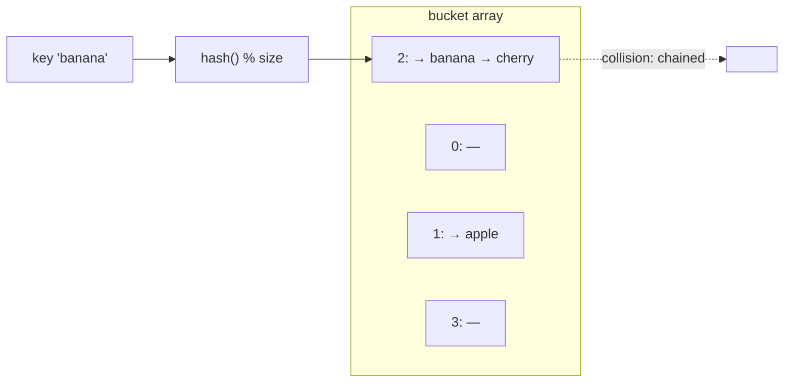

# Hash Tables

> The structure that makes "look it up by key" **O(1) on average** — and therefore the most useful
> data structure in everyday programming. Every dictionary, map, set, and cache is one.

## Top-down: where you already meet this
A Python `dict`, a JS object/`Map`, a Java `HashMap`, a `set` — all hash tables. Whenever you've
counted word frequencies, deduplicated a list, or cached results by key, you relied on the fact that
`d[key]` is essentially instant no matter how big `d` gets. That near-magic is the hash table.

## Problem
Finding an item by value in an [array](./arrays-and-strings.md) is O(n) — you scan. Keeping it sorted
gets you O(log n) lookup but O(n) inserts. For the extremely common task of "store and retrieve by a
key" we want **O(1)** for both. The hash table achieves it with a clever trick: turn the key into an
array index.

## Core concepts
- **Hash function → index.** A hash function maps any key to a number; take it modulo the table size
  to get a slot (bucket) in an underlying array. So `table[hash(key) % size]` is computed in O(1) —
  no scanning. A *good* hash spreads keys uniformly across buckets.
- **Collisions are inevitable** (different keys, same bucket — by the pigeonhole principle and the
  [birthday paradox](../../../distributed-systems/1-knowledge/time-order/logical-clocks.md), sooner than
  you'd think). Two standard fixes:
  - **Chaining** — each bucket holds a small [linked list](./linked-lists-stacks-queues.md) of
    entries; collisions append to it.
  - **Open addressing** — on collision, probe for the next free slot.
- **Load factor & resizing.** As entries/buckets (the *load factor*) rises, collisions grow and ops
  slow. The table **resizes** (e.g. doubles and re-hashes everything) to keep buckets short — an
  occasional O(n) rehash that keeps the *amortized* cost O(1).
- **Average O(1), worst O(n).** With a good hash and low load factor, lookups/inserts/deletes are
  O(1) average. In the pathological case (all keys collide, or an adversary crafts collisions) it
  degrades to O(n) — which is why modern languages use randomized/strong hashes.



| Operation | Average | Worst |
| --- | --- | --- |
| Insert / lookup / delete by key | **O(1)** | O(n) (all collide / rehash) |
| Iterate all entries | O(n) | O(n) |

> ⚠️ Hash tables are **unordered** (don't rely on iteration order — though Python `dict` preserves
> insertion order as an impl detail) and keys must be **hashable** (usually immutable). Need sorted
> keys or range queries? Use a [balanced tree](./trees-and-heaps.md) (O(log n)) instead.

## Essential terminology
| Term | Meaning |
| --- | --- |
| **Hash function** | Maps a key to an integer (ideally uniformly distributed) |
| **Bucket / slot** | An array position keys hash into |
| **Collision** | Two keys mapping to the same bucket |
| **Chaining / open addressing** | Collision strategies: list per bucket / probe for next slot |
| **Load factor** | entries ÷ buckets — triggers resize when too high |
| **Set vs. map** | Stores keys only / keys → values; both are hash tables underneath |

## Example
The two everyday superpowers — O(n) dedup and O(n) counting — both ride on O(1) lookup:

```python
# Deduplicate — a set is a hash table of keys
unique = set([3, 1, 3, 2, 1])          # {1, 2, 3}

# Count frequencies — O(n), one pass, O(1) lookups/updates
counts = {}
for word in text.split():
    counts[word] = counts.get(word, 0) + 1
```
This is why the [Big-O](../fundamentals/big-o-complexity.md) duplicate-finder dropped from O(n²) to
O(n): a `set` replaced the inner scan. Build a hash table from scratch (chaining + resize) in
[lab: implement a hash table](../../3-practice/lab-implement-hashtable.md).

## Trade-offs
- ✅ O(1)-average insert/lookup/delete — the go-to for membership tests, counting, caching, indexing
  by key, dedup, and joining data. Usually the first structure to reach for to kill an O(n²) loop.
- ⚠️ No ordering and no range queries; worst-case O(n); memory overhead (empty buckets + pointers);
  keys must be hashable; a bad hash or load factor wrecks performance. For ordered/range needs use a
  [tree](./trees-and-heaps.md).

## Real-world examples
- **Language built-ins**: Python `dict`/`set`, JS `Map`/`Object`, Java `HashMap` — hash tables.
- **Database indexes** sometimes use hash indexes for equality lookups (vs. B-trees for ranges) —
  see [indexing](../../../system-design/1-knowledge/data-storage/indexing.md).
- **Caches** ([caching](../../../system-design/1-knowledge/building-blocks/caching.md)) and
  **consistent hashing** ([consistent hashing](../../../system-design/1-knowledge/building-blocks/consistent-hashing.md))
  build on hashing to route keys to servers.

## References
- [Big-O & complexity](../fundamentals/big-o-complexity.md) · [Arrays](./arrays-and-strings.md) · [Trees & heaps](./trees-and-heaps.md)
