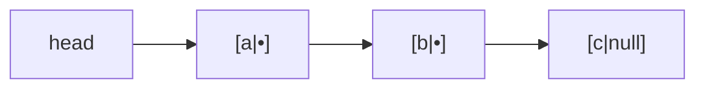
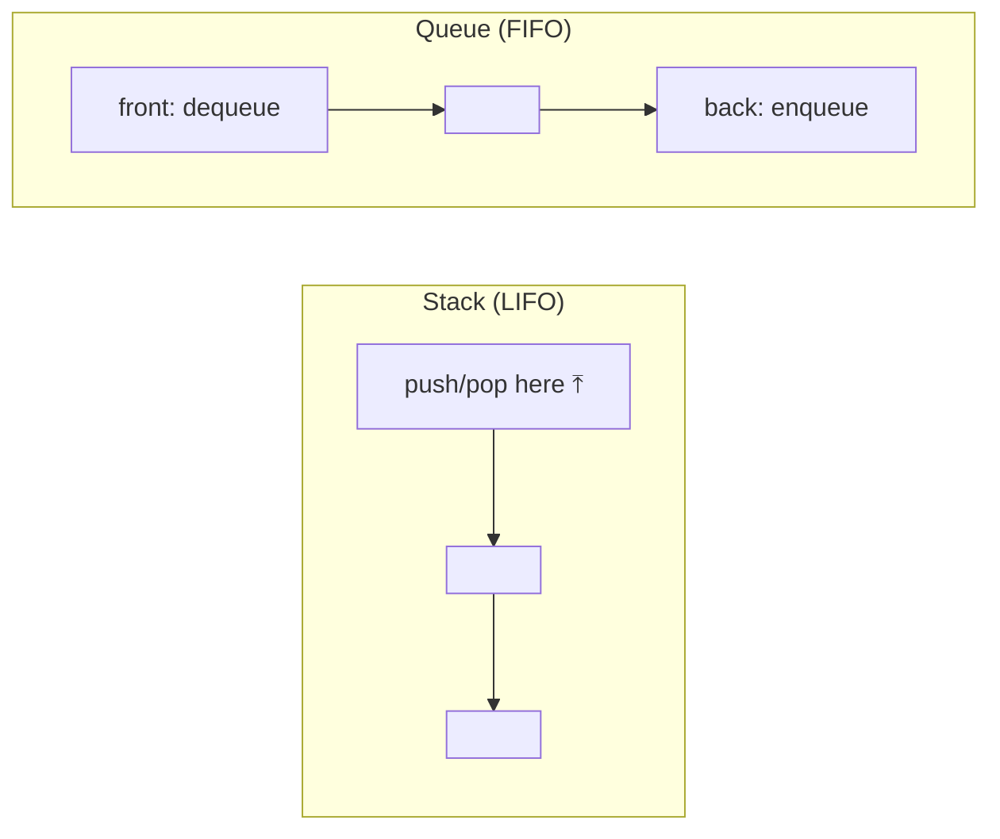

# Linked Lists, Stacks & Queues

> When you need cheap insert/delete at the ends (or a strict LIFO/FIFO discipline), these beat an
> [array](./arrays-and-strings.md). A **linked list** trades random access for O(1) edits; **stacks**
> and **queues** are restricted interfaces that show up everywhere.

## Top-down: where you already meet this
The browser **back button** (a stack), a **print queue** or task queue (a queue), undo/redo (two
stacks), the call stack your functions run on — you use these every day. They're less about storage
and more about *the order things come out*.

## Problem
[Arrays](./arrays-and-strings.md) make front/middle insertion O(n) because of contiguity. Sometimes
you need to add/remove at the ends constantly (a queue of requests) without that cost. And often you
don't want arbitrary access at all — you want to *enforce* an order discipline (last-in-first-out or
first-in-first-out) so the structure can't be misused. Linked lists solve the first; stacks and
queues solve the second.

## Core concepts
**Linked list** — nodes scattered in memory, each holding a value + a pointer to the next (and, in a
*doubly* linked list, the previous). No contiguity, so:
- Insert/delete *given a node* is **O(1)** (just relink pointers) — its whole point.
- But access by index is **O(n)** (you must walk the chain) and it's **cache-unfriendly** (nodes are
  scattered) — the opposite trade-off from arrays.



**Stack — LIFO (last in, first out).** `push` and `pop` at one end, both O(1). Think a stack of
plates. Powers function calls, undo, expression parsing, [DFS](../algorithms/graph-algorithms.md),
and backtracking.

**Queue — FIFO (first in, first out).** `enqueue` at the back, `dequeue` at the front, both O(1).
Think a line at a counter. Powers task scheduling, buffering, and [BFS](../algorithms/graph-algorithms.md).
A **deque** (double-ended queue) allows O(1) at both ends and is the practical way to build a queue.



| Structure | Fast ops | Complexity | Built on |
| --- | --- | --- | --- |
| Linked list | insert/delete at a known node | O(1) | nodes + pointers |
| Stack | push / pop (one end) | O(1) | array or linked list |
| Queue / deque | enqueue / dequeue (ends) | O(1) | linked list or ring buffer |

> ⚠️ Implementation note: a stack/queue is an *interface*, not a specific structure. In Python a
> `list` is a fine stack (`append`/`pop`), but a poor queue (`pop(0)` is O(n)) — use
> `collections.deque` for O(1) at both ends.

## Essential terminology
| Term | Meaning |
| --- | --- |
| **Node** | A linked-list element: value + pointer(s) to neighbor(s) |
| **Singly / doubly linked** | Pointer to next only / to next *and* previous |
| **LIFO / FIFO** | Last-in-first-out (stack) / first-in-first-out (queue) |
| **Deque** | Double-ended queue — O(1) push/pop at both ends |
| **Abstract data type (ADT)** | An interface (stack/queue) defined by behavior, not implementation |
| **Ring buffer** | A fixed array used circularly to implement a queue |

## Example
A stack solves "are these brackets balanced?" in O(n) — the canonical use:

```python
def balanced(s):
    pairs = {")": "(", "]": "[", "}": "{"}
    stack = []
    for c in s:
        if c in "([{":
            stack.append(c)                    # push openers
        elif c in pairs:
            if not stack or stack.pop() != pairs[c]:   # pop must match
                return False
    return not stack                            # leftovers = unbalanced

balanced("([]{})")   # True
balanced("([)]")     # False
```
The LIFO order naturally matches nested structure — no other structure does this as cleanly.

## Trade-offs
- ✅ **Linked list**: O(1) insert/delete at known positions, grows without resizing, no wasted
  capacity. **Stack/queue**: dead-simple, O(1), and *restrict* access so code can't misuse order.
- ⚠️ **Linked list**: O(n) indexing, extra memory per node (the pointers), poor cache locality —
  in practice a [dynamic array](./arrays-and-strings.md) often wins even for "list-like" work
  because of cache effects. Reach for a linked list when you genuinely insert/delete at ends a lot.
- Choose by *access pattern*: indexed/scanned → array; ends-only churn → linked list/deque; strict
  LIFO/FIFO discipline → stack/queue.

## Real-world examples
- **The call stack** (function frames), browser history, undo/redo — stacks.
- **Task/message queues** ([message queues](../../../system-design/1-knowledge/building-blocks/message-queues.md)),
  OS scheduler run-queues, BFS frontiers — queues.
- **LRU caches** combine a hash map with a doubly linked list — see the
  [LRU cache case study](../../2-case-studies/lru-cache.md).

## References
- [Arrays & strings](./arrays-and-strings.md) · [Graph algorithms (BFS/DFS use queues/stacks)](../algorithms/graph-algorithms.md) · [Big-O](../fundamentals/big-o-complexity.md)
