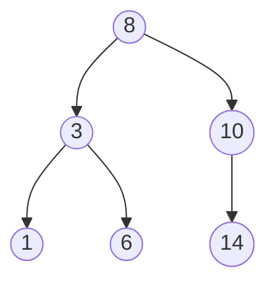

# Trees & Heaps

> When you need **ordered** data with fast lookup *and* fast insert (O(log n) both), or always-quick
> access to the min/max, you want a tree. Trees turn linear scans into logarithmic ones by
> structuring data hierarchically.

## Top-down: where you already meet this
A file system's folders, the DOM, a database index, your org chart, a JSON document — all trees.
And whenever something repeatedly gives you "the next most urgent task" (a scheduler, Dijkstra's
algorithm), a **heap** is usually underneath. Trees are how we keep data both *ordered* and
*fast to change*.

## Problem
[Arrays](./arrays-and-strings.md) give O(1) access but O(n) ordered insert; [hash tables](./hash-tables.md)
give O(1) lookup but **no order** (no "next biggest", no range queries). Many problems need both
order *and* speed: a sorted index you can also insert into, or repeatedly pulling the smallest item.
Trees provide O(log n) for these by halving the search space at each step instead of scanning.

## Core concepts
A **tree** is nodes connected parent→child with no cycles; one **root**, **leaves** at the bottom.
The two that matter most for a working engineer:

### Binary Search Tree (BST) — ordered lookup + insert
Each node has ≤ 2 children, with the invariant **left subtree < node < right subtree**. So searching
is like [binary search](../algorithms/sorting-and-searching.md): compare, go left or right, halve the
problem each step → **O(log n)** — *if balanced*.



> ⚠️ **The catch — balance.** Insert sorted data into a naive BST and it degenerates into a linked
> list: O(n). **Self-balancing trees** (red-black, AVL, B-trees) automatically rebalance to *guarantee*
> O(log n). This is why real systems use balanced trees, not raw BSTs.

### Heap — instant min or max
A **binary heap** is a complete binary tree with the **heap property**: every parent ≤ its children
(min-heap) or ≥ (max-heap). So the min/max is always the root — **O(1) to peek**, **O(log n) to
insert or pop**. It's the natural implementation of a **priority queue**. Neatly, it's stored in a
plain array (no pointers): children of `i` live at `2i+1`, `2i+2`.

| Structure | Lookup by key | Min/Max | Ordered/range | Insert |
| --- | --- | --- | --- | --- |
| Balanced BST | O(log n) | O(log n) | ✅ yes | O(log n) |
| Heap | O(n) (not its job) | **O(1) peek** | ❌ no | O(log n) |
| [Hash table](./hash-tables.md) | O(1) | ❌ | ❌ | O(1) |

### Tries & B-trees (worth knowing by name)
- **Trie (prefix tree)** — a tree keyed by characters; gives fast prefix lookup for autocomplete —
  see the [autocomplete case study](../../2-case-studies/autocomplete-trie.md).
- **B-tree / B+tree** — a balanced tree with many children per node, tuned for disk pages; it's what
  most [database indexes](../../../system-design/1-knowledge/data-storage/indexing.md) actually are.

## Essential terminology
| Term | Meaning |
| --- | --- |
| **Root / leaf / parent / child** | Top node / bottom nodes / the standard tree relations |
| **Height / depth** | Longest root-to-leaf path / a node's distance from root |
| **Binary tree** | Each node ≤ 2 children |
| **BST invariant** | left < node < right, enabling O(log n) search |
| **Balanced / self-balancing** | Height kept ~log n (AVL, red-black, B-tree) to guarantee O(log n) |
| **Heap property** | Parent ≤ (or ≥) children; root is the min (or max) |
| **Priority queue** | "Give me the most important item next" — implemented with a heap |

## Example
A heap-backed **priority queue** gives the smallest item in O(log n) — Python's built-in `heapq`:

```python
import heapq
tasks = []
heapq.heappush(tasks, (2, "email"))      # (priority, item)
heapq.heappush(tasks, (1, "page on-call"))
heapq.heappush(tasks, (3, "cleanup"))
heapq.heappop(tasks)     # (1, 'page on-call')  — always the min, in O(log n)
```
This is exactly how schedulers and [Dijkstra's shortest path](../algorithms/graph-algorithms.md)
pick "what's next." (`heapq` is a min-heap; negate priorities for a max-heap.)

## Trade-offs
- ✅ **Balanced BST**: ordered data with O(log n) search/insert/delete *and* range queries — the
  basis of database indexes and sorted maps (`std::map`, `TreeMap`). **Heap**: O(1) peek at min/max,
  O(log n) update — the priority queue.
- ⚠️ **Unbalanced BSTs degrade to O(n)** — always use a self-balancing variant in practice. Heaps
  *only* answer min/max (no efficient search or ordered iteration). Trees use more memory and have
  worse cache locality than arrays.
- Choose by need: equality lookup only → [hash table](./hash-tables.md); ordered/range → balanced
  tree; repeatedly need the extreme → heap.

## Real-world examples
- **Database & filesystem indexes** are B+trees — O(log n) lookups over disk
  ([indexing](../../../system-design/1-knowledge/data-storage/indexing.md)).
- **Priority queues / heaps** drive OS schedulers, event simulations, Dijkstra, and Huffman coding.
- **Tries** power autocomplete and IP routing tables.

## References
- [Big-O & complexity](../fundamentals/big-o-complexity.md) · [Sorting & searching](../algorithms/sorting-and-searching.md) · [Graph algorithms](../algorithms/graph-algorithms.md)
- Hands-on: [lab: implement a hash table](../../3-practice/lab-implement-hashtable.md) (the ordered-vs-unordered contrast)
