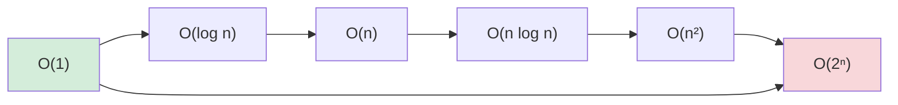

# Big-O & Complexity Analysis

> A way to predict how an algorithm **scales** — how its time/memory grows as the input grows —
> *without* running it. It's the vocabulary for "will this still work at a million users?" and the
> first thing senior engineers reach for when comparing approaches.

## Top-down: where you already meet this
You've written a loop that was instant on 10 items and froze on 10 million. You've heard "use a hash
map, it's O(1)" in a review. You've picked a database index to avoid a "full table scan." All of
those are complexity reasoning — Big-O is just the precise way to say "this approach scales and that
one doesn't."

## Problem
You usually have several ways to solve a problem, and the one that's fine on your laptop's tiny test
data can be catastrophically slow in production. Measuring wall-clock time is misleading — it
depends on the machine, the language, the input. You need a way to compare *algorithms* by how they
grow with input size **n**, independent of hardware. That's asymptotic analysis.

## Core concepts
**Big-O describes the growth rate** of an algorithm's cost as **n → ∞**, keeping only the dominant
term and dropping constants (because growth, not exact counts, decides scalability). `O(2n + 5)`
becomes `O(n)`.

| Complexity | Name | n=1,000 → n=1,000,000 means… | Typical source |
| --- | --- | --- | --- |
| **O(1)** | constant | same | hash lookup, array index |
| **O(log n)** | logarithmic | ~20 steps even at a million | [binary search](../algorithms/sorting-and-searching.md), balanced tree |
| **O(n)** | linear | 1000× more work | a single loop over the input |
| **O(n log n)** | linearithmic | ~20,000× | good [sorts](../algorithms/sorting-and-searching.md) (merge/quick) |
| **O(n²)** | quadratic | **1,000,000×** — often too slow | nested loops over the input |
| **O(2ⁿ)**, **O(n!)** | exponential/factorial | hopeless beyond ~30–40 | brute-force [recursion](../algorithms/recursion-and-divide-and-conquer.md), permutations |


*(left = scales beautifully, right = falls over fast)*

### The nuances that matter
- **Time *and* space.** The same analysis applies to memory. Often you trade one for the other —
  e.g. [dynamic programming](../algorithms/dynamic-programming.md) and
  [hash tables](../data-structures/hash-tables.md) spend O(n) memory to cut time.
- **Best / average / worst case.** Quicksort is O(n log n) *average* but O(n²) *worst*; a hash
  lookup is O(1) *average* but O(n) *worst* (all collisions). Engineers usually care about **worst
  and average** — know which you're quoting.
- **Big-O / Ω / Θ.** O is an *upper* bound, Ω a lower bound, Θ a tight bound. In practice people say
  "Big-O" loosely to mean the tight/typical bound.
- **Constants & n can lie at small scale.** O(n) with a huge constant can beat O(log n) for tiny n.
  Big-O is about *scaling*, not micro-benchmarks — measure when n is small and it matters.

## Essential terminology
| Term | Meaning |
| --- | --- |
| **n** | The size of the input (elements, characters, nodes) |
| **Asymptotic** | Behavior as n grows large (the only regime Big-O describes) |
| **Big-O / Ω / Θ** | Upper bound / lower bound / tight bound on growth |
| **Amortized** | Average cost per op over a sequence (e.g. [dynamic array](../data-structures/arrays-and-strings.md) append is amortized O(1)) |
| **Time vs. space complexity** | How runtime vs. memory grows with n |
| **Dominant term** | The fastest-growing part — the only one Big-O keeps |

## Example
The same task, two complexities — "is there a duplicate?":

```python
# O(n²): for each item, scan the rest — 1M items ≈ 10¹² comparisons (hours)
def has_dup_slow(items):
    for i in range(len(items)):
        for j in range(i + 1, len(items)):
            if items[i] == items[j]: return True
    return False

# O(n): one pass, remember what you've seen in a set (hash) — 1M items ≈ instant
def has_dup_fast(items):
    seen = set()
    for x in items:
        if x in seen: return True       # set membership is O(1) average
        seen.add(x)
    return False
```
Same answer; the second trades O(n) memory for a massive time win. *Measure* the gap yourself in
[lab: measure Big-O](../../3-practice/lab-big-o-measure.md).

## Trade-offs
- ✅ Big-O lets you choose the right approach *before* coding, compare designs objectively, and
  predict scaling — the core of technical-interview reasoning and real capacity planning.
- ⚠️ It hides constants and lower-order terms, so it can mislead at small n; it says nothing about
  cache behavior, I/O, or real wall-clock time. Use it to **rule out** non-scaling approaches, then
  measure the survivors.
- The everyday lesson: a nested loop over the input (O(n²)) is the most common accidental
  performance bug — reach for a [hash table](../data-structures/hash-tables.md) or sort to drop it
  to O(n)/O(n log n).

## Real-world examples
- **Database indexes** turn an O(n) full scan into an O(log n) B-tree lookup — see
  [indexing](../../../system-design/1-knowledge/data-storage/indexing.md).
- **"It's slow at scale" incidents** are usually an accidental O(n²) (a loop calling a query inside
  a loop — the N+1 problem) that was invisible on test data.

## References
- Cormen et al. — *Introduction to Algorithms* (CLRS); [Big-O Cheat Sheet](https://www.bigocheatsheet.com/)
- Next: [data structures](../data-structures/arrays-and-strings.md) · [sorting & searching](../algorithms/sorting-and-searching.md)
