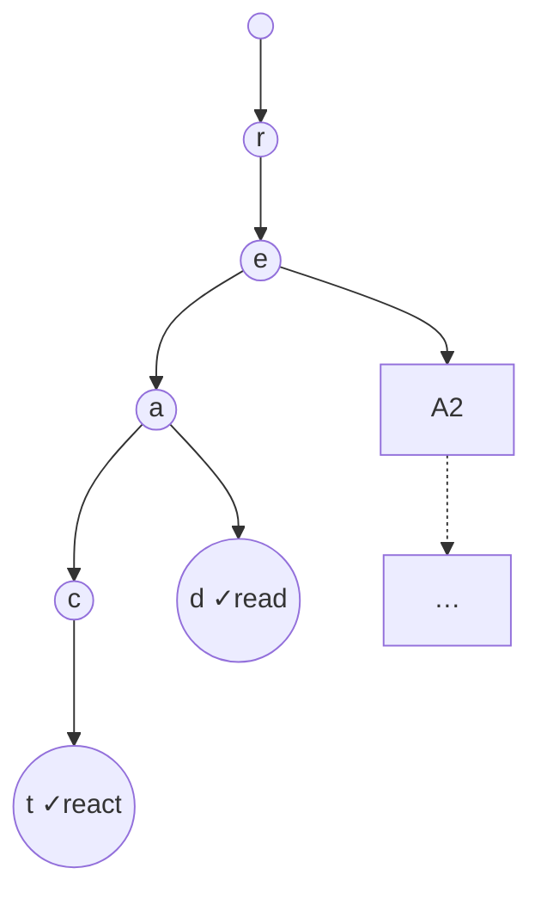

# Case Study: Autocomplete with a Trie

> How a search box suggests completions the instant you type — a **[trie](../1-knowledge/data-structures/trees-and-heaps.md)**
> (prefix tree) for "all words starting with…" plus a **[heap](../1-knowledge/data-structures/trees-and-heaps.md)**
> for "the top few." A clean lesson in choosing the structure that matches the query.

## The scenario
A search box must suggest completions as the user types each character — "rea" → "react", "read",
"realtor" — fast enough to feel instant (sub-100 ms) over a dictionary of millions of terms. You
need *prefix* lookup ("everything starting with this string"), then the *most popular* few of those.

## Requirements
1. Find all terms with a given **prefix** quickly — ideally independent of dictionary size.
2. Return the **top-k by popularity**, not just any matches.
3. Scale to millions of terms and many queries.

## How it works — the trie
A naive approach scans every term checking `startswith(prefix)` — **O(N × L)** over N terms, far too
slow. A **trie** stores terms by *sharing prefixes*: each node is a character, each root-to-node path
spells a prefix, and children branch on the next character.

- **Lookup a prefix** by walking one node per character: **O(L)** where L = prefix length —
  **independent of how many terms exist** (Req 1, 3). Reaching the "rea" node takes 3 steps whether
  the dictionary has a thousand or a billion words.
- **All completions** = everything in the subtree under that node.
- Shared prefixes save space and make the structure cache-coherent.

## Deep dives — the theory in action
- **Why a trie beats a [hash table](../1-knowledge/data-structures/hash-tables.md) here:** a hash map
  gives O(1) *exact* lookup but **can't do prefixes** (hashing destroys ordering/structure). A
  [sorted array](../1-knowledge/data-structures/arrays-and-strings.md) + [binary search](../1-knowledge/algorithms/sorting-and-searching.md)
  *can* find a prefix range in O(L + log N), which is a real alternative — but the trie makes prefix
  traversal natural and supports incremental typing. **Match the structure to the query shape** (Req 1).
- **Top-k with a [heap](../1-knowledge/data-structures/trees-and-heaps.md) (Req 2):** the subtree may
  hold thousands of completions; you want the 5 most popular. Walk the subtree and keep a
  **min-heap of size k** — O(M log k) for M candidates, far cheaper than sorting all M. (Production
  systems precompute and *cache* the top-k at each node so a query is nearly O(L).)
- **Subtree walk is [DFS](../1-knowledge/algorithms/graph-algorithms.md)** — a trie is a tree, so
  collecting completions is just traversal ([recursion](../1-knowledge/algorithms/recursion-and-divide-and-conquer.md)).

## Trade-offs & failure modes
- ✅ Prefix lookup in O(L), independent of dictionary size; natural fit for incremental typing;
  prefix-sharing saves space on common stems.
- ⚠️ **Memory overhead**: a naive trie has many nodes/pointers and poor cache locality; large
  alphabets blow up node size. Compressed tries (**radix/Patricia trees**) merge single-child chains
  to fix this.
- ⚠️ The top-k step dominates if subtrees are huge — hence precomputing/caching top-k per node, which
  trades memory and update cost for query speed (the usual [caching](../../system-design/1-knowledge/building-blocks/caching.md)
  bargain).

## Real systems
- **Search engines, IDEs, and phone keyboards** use tries (often compressed, often with cached
  top-k) for typeahead.
- **IP routing tables** use tries (longest-prefix match) to pick the route — see
  [routing & forwarding](../../computer-networks/1-knowledge/network-layer/routing-and-forwarding.md).

## References
- [Trees & heaps (trie, heap, priority queue)](../1-knowledge/data-structures/trees-and-heaps.md) · [Hash tables](../1-knowledge/data-structures/hash-tables.md) · [Graph algorithms (DFS)](../1-knowledge/algorithms/graph-algorithms.md)
- Related: [caching](../../system-design/1-knowledge/building-blocks/caching.md) · [search](../../system-design/1-knowledge/data-storage/search.md)
