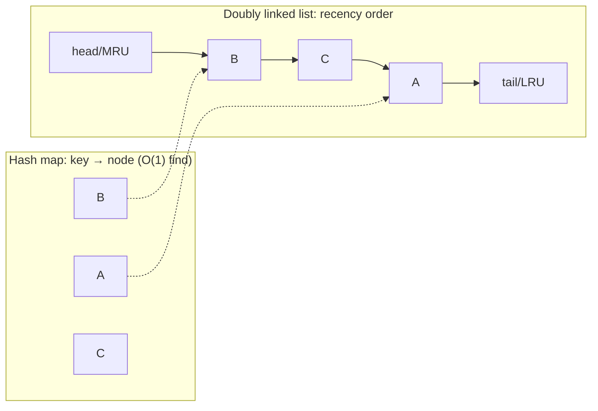

# Case Study: Designing an LRU Cache

> The interview classic that's also genuinely everywhere: combine a [hash table](../1-knowledge/data-structures/hash-tables.md)
> and a [doubly linked list](../1-knowledge/data-structures/linked-lists-stacks-queues.md) to get a
> cache with **O(1) get *and* put** — a perfect lesson in composing data structures.

## The scenario
A cache has limited memory, so when it's full and a new item arrives, you must **evict** something.
A good policy is **Least Recently Used** — throw out the item untouched for the longest, betting the
recently-used will be used again ([temporal locality](../../operating-systems/1-knowledge/memory/page-replacement.md)).
You need `get(key)` and `put(key, value)` to *both* run in **O(1)**, even while tracking usage order.

## Requirements
1. `get` and `put` in **O(1)** average time.
2. Track **recency** so the least-recently-used key is evictable instantly.
3. Evict exactly when capacity is exceeded.

## How it works — why one structure isn't enough
- A [hash table](../1-knowledge/data-structures/hash-tables.md) alone gives O(1) lookup but **no
  ordering** — you can't find the LRU item without scanning (O(n)).
- A [linked list](../1-knowledge/data-structures/linked-lists-stacks-queues.md) alone can track order
  (most-recent at the front) but **lookup is O(n)**.

**Combine them:** a hash map `key → node`, plus a **doubly linked list** holding the nodes in
recency order (most-recent at head, LRU at tail). Each gives the other its missing half:

- **`get(key)`** — hash map finds the node in O(1); unlink it and move it to the head (mark
  most-recent) in O(1) (doubly linked = O(1) removal given the node).
- **`put(key, value)`** — insert/update at the head; if over capacity, drop the **tail** node (the
  LRU) and delete its key from the map — all O(1).

The *doubly* linked list is essential: you must remove a node from the middle in O(1), which needs
a `prev` pointer.

## Deep dives — the theory in action
- **Each structure covers the other's weakness (Req 1):** hash map = O(1) access but unordered;
  linked list = ordered but O(n) access. Composed, you get O(1) for *both* operations — a textbook
  example of why you learn multiple [data structures](../1-knowledge/data-structures/hash-tables.md).
- **Why not an array or heap?** An array sorted by recency is O(n) to reorder on every access; a
  [heap](../1-knowledge/data-structures/trees-and-heaps.md) is O(log n), not O(1), and recency
  updates are awkward. The hash-map + DLL is the structure that hits O(1).
- **Eviction is just "remove the tail" (Req 2+3):** because the list is kept in recency order, the
  LRU victim is always at the tail — no search.
- Python's `collections.OrderedDict` (or `functools.lru_cache`) *is* this structure — a hash map with
  a linked list of insertion/access order — so `move_to_end` + `popitem(last=False)` give you LRU for
  free.

## Trade-offs & failure modes
- ✅ O(1) get/put with exact LRU eviction; bounded memory; the backbone of real caches.
- ⚠️ Two structures kept in sync = more code and more bugs (forget to unlink → memory leak; update
  one but not the other → corruption). Test the eviction path hard.
- ⚠️ LRU isn't always the best policy — it thrashes on a scan larger than the cache (one pass evicts
  everything useful). Alternatives (LFU, ARC, **W-TinyLFU**) exist; this is the same policy debate as
  OS [page replacement](../../operating-systems/1-knowledge/memory/page-replacement.md).

## Real systems
- **CPU caches, OS page caches, database buffer pools** use LRU/approx-LRU eviction.
- **Application caches** ([caching](../../system-design/1-knowledge/building-blocks/caching.md)) like
  Redis/Memcached offer LRU (and LFU) eviction policies built on exactly this idea.

## References
- [Hash tables](../1-knowledge/data-structures/hash-tables.md) · [Linked lists, stacks & queues](../1-knowledge/data-structures/linked-lists-stacks-queues.md)
- System Design: [caching](../../system-design/1-knowledge/building-blocks/caching.md) · OS: [page replacement](../../operating-systems/1-knowledge/memory/page-replacement.md)
