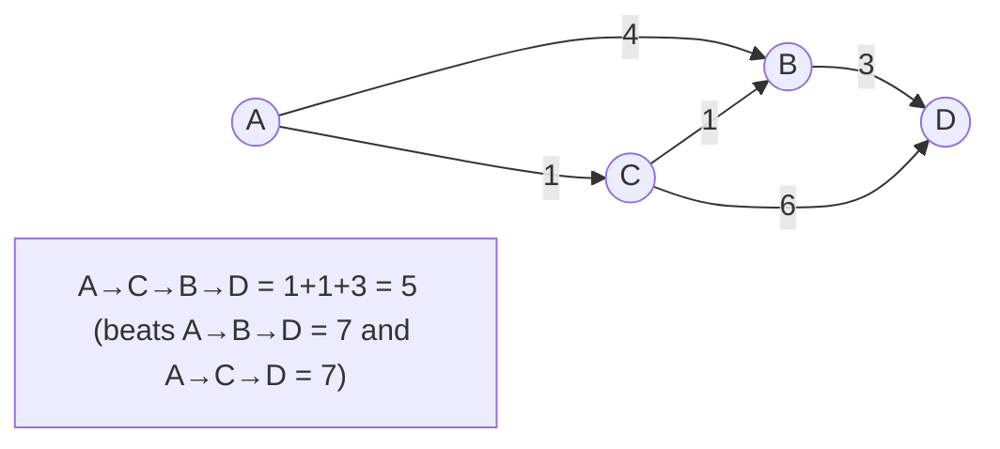

# Case Study: Shortest Paths in a Map

> How navigation apps compute the fastest route — model the map as a **weighted [graph](../1-knowledge/data-structures/graphs.md)**
> and run **Dijkstra** (BFS + a [heap](../1-knowledge/data-structures/trees-and-heaps.md)), then A*
> to make it fast enough for continent-scale maps.

## The scenario
A user asks for the fastest route from A to B across a road network with millions of intersections.
"Fastest" means least *total travel time*, where each road segment has a cost (length ÷ speed). You
need the minimum-cost path — quickly, repeatedly, at scale.

## Requirements
1. Find the **minimum-cost** path in a graph with **weighted** edges (not just fewest hops).
2. Handle a **huge** graph fast enough for interactive use.
3. Costs are non-negative (distances/times).

## How it works — from BFS to Dijkstra
Model intersections as [vertices](../1-knowledge/data-structures/graphs.md), roads as **weighted,
directed edges** (one-way streets, turn costs). Plain [BFS](../1-knowledge/algorithms/graph-algorithms.md)
finds fewest *hops* — wrong here, because a 2-hop highway route beats a 5-hop one but BFS prefers
fewer hops regardless of distance (Req 1 fails).

**Dijkstra** upgrades BFS for weights: instead of a FIFO queue, use a
**[min-heap](../1-knowledge/data-structures/trees-and-heaps.md) (priority queue)** keyed by
*cheapest-cost-so-far*, and always expand the closest unfinished node.

The heap guarantees that when a node is first popped, its cheapest cost is final (greedy choice,
valid because no negative edges — Req 3). Complexity **O(E log V)** — the `log V` is the heap, the
direct payoff of the [priority queue](../1-knowledge/data-structures/trees-and-heaps.md).

## Deep dives — the theory in action
- **The heap is what makes it efficient (Req 1):** Dijkstra is literally "BFS that pops the
  cheapest frontier node next" — impossible without an efficient
  [min-heap](../1-knowledge/data-structures/trees-and-heaps.md). Swap the queue for a heap and
  unweighted BFS becomes weighted Dijkstra.
- **A\* for scale (Req 2):** Dijkstra explores in all directions equally. **A\*** adds a *heuristic*
  (straight-line distance to the goal) to the priority, steering the search *toward* the destination
  — same correctness, far fewer nodes expanded. It's Dijkstra + a "compass."
- **Real maps go further:** continent-scale routing precomputes **contraction hierarchies** /
  shortcuts so a query touches a tiny fraction of the graph — the same
  [caching/precompute](../../system-design/1-knowledge/building-blocks/caching.md) trade-off
  (build-time work for query speed) seen across systems.
- **Negative weights break Dijkstra (Req 3):** the greedy "first pop is final" assumption fails; you'd
  need Bellman-Ford (a [dynamic-programming](../1-knowledge/algorithms/dynamic-programming.md) approach),
  slower at O(V·E). Road costs are non-negative, so Dijkstra/A* fit.

## Trade-offs & failure modes
- ✅ Dijkstra gives provably optimal shortest paths with non-negative weights in O(E log V); A* and
  preprocessing make it interactive on enormous graphs.
- ⚠️ Dijkstra fails with negative edges; on giant graphs raw Dijkstra is too slow without A*/
  preprocessing; live traffic means edge weights *change*, forcing recomputation or incremental
  updates.
- ⚠️ A*'s speedup depends entirely on a good, *admissible* heuristic (never overestimates) — a bad
  heuristic gives wrong answers or no speedup.

## Real systems
- **Google/Apple Maps, OSRM, GraphHopper** use A* / contraction hierarchies over weighted road
  graphs.
- **Network routing** ([routing & forwarding](../../computer-networks/1-knowledge/network-layer/routing-and-forwarding.md))
  runs shortest-path algorithms (OSPF uses Dijkstra) to pick packet routes.

## References
- [Graph algorithms (BFS, Dijkstra)](../1-knowledge/algorithms/graph-algorithms.md) · [Graphs](../1-knowledge/data-structures/graphs.md) · [Trees & heaps (priority queue)](../1-knowledge/data-structures/trees-and-heaps.md)
- Hands-on: [lab: BFS & DFS](../3-practice/lab-bfs-dfs.md) · related: [routing](../../computer-networks/1-knowledge/network-layer/routing-and-forwarding.md)
