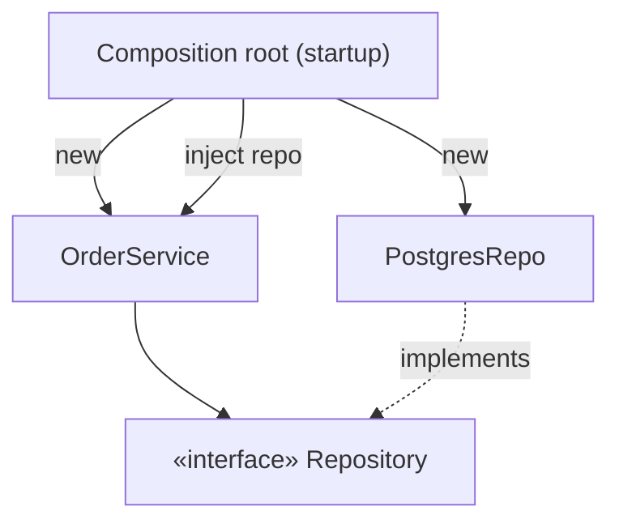

# Dependency Injection & Inversion of Control

> Don't let an object **create** its own collaborators — **give** them to it from outside. This
> one habit is what makes [Dependency Inversion](../fundamentals/solid-principles.md) and
> [hexagonal architecture](./layered-hexagonal-clean.md) actually work in code.

## Top-down: where you already meet this
You've written a class that does `self.db = PostgresClient()` in its constructor — and then
discovered you can't unit-test it without a real Postgres. Dependency injection is the fix you
probably reached for instinctively: pass the client *in* (`def __init__(self, db)`) so a test
can pass a fake. That tiny change is the whole pattern.

## Problem
When an object constructs its own dependencies, it's hard-wired to **concrete classes** — tight
[coupling](../fundamentals/coupling-and-cohesion.md), no way to substitute a test double, and
construction logic smeared across the codebase. We want objects to depend on *abstractions* and
let *someone else* decide which concrete implementation to supply. That "someone else" is
**Inversion of Control**: the object no longer controls where its collaborators come from.

## Core concepts
- **Inversion of Control (IoC)** — the general principle: a component hands off control of some
  decision (here, *which* dependency to use) to its surroundings. DI is IoC applied to
  *dependencies*.
- **Dependency Injection (DI)** — supply a component's dependencies from outside rather than
  having it build or look them up. Three flavors, in order of preference:

| Form | How | Use when |
| --- | --- | --- |
| **Constructor injection** | Pass dependencies as constructor args | Default — makes required deps explicit & objects immutable |
| **Setter/property injection** | Assign after construction | Optional dependencies |
| **Interface/method injection** | Pass per call | A dependency varies per operation |

- **Composition root** — the *one* place (app startup) where concrete adapters are created and
  wired into ports. Everywhere else just declares what it needs. This keeps the
  `new ConcreteThing()` calls out of your business logic and in a single, swappable spot.
- **DI container (optional)** — a library (Spring, .NET DI, Guice, `dependency-injector`) that
  builds the object graph for you from registrations. **You don't need a container to do DI** —
  passing arguments *is* DI. Containers help when the graph gets large.



## Essential terminology
| Term | Meaning |
| --- | --- |
| **IoC** | Inversion of Control — the framework/caller controls a decision the component used to make |
| **DI** | Dependency Injection — supplying dependencies from outside |
| **Composition root** | The single startup location where the concrete object graph is assembled |
| **Service locator** | An *anti-pattern alternative* to DI: objects pull deps from a global registry (hides dependencies) |
| **Test double** | A fake/mock/stub injected in place of a real dependency for testing |

## Example
Before — untestable, welded to Postgres:

```python
class OrderService:
    def __init__(self):
        self.repo = PostgresRepo(connect())   # ⚠️ hidden, hard-coded dependency
```

After — dependency injected through the constructor:

```python
class OrderService:
    def __init__(self, repo: Repository):     # ✅ depends on the interface, given from outside
        self.repo = repo

# composition root wires it once:
service = OrderService(PostgresRepo(connect()))   # production
service = OrderService(InMemoryRepo())            # test — no DB, no mocking framework
```

Same class, now testable and swappable — the seam that [hexagonal architecture](./layered-hexagonal-clean.md)
and the [Factory pattern](../design-patterns/creational-patterns.md) rely on.

## Trade-offs
- ✅ Loose coupling, trivial substitution for tests, dependencies made explicit in signatures,
  and one place to reconfigure the whole app.
- ⚠️ Constructor injection can produce long parameter lists — usually a sign a class has too many
  responsibilities ([SRP](../fundamentals/solid-principles.md)), not a reason to abandon DI.
- ⚠️ **Containers add magic**: auto-wiring and runtime resolution can make the object graph hard
  to follow and errors appear late. Prefer plain constructor injection; add a container only when
  the wiring genuinely hurts. Avoid the **service locator** disguise — it hides dependencies
  instead of declaring them.

## Real-world examples
- **Spring / .NET Core / Angular** are built around DI containers and a composition root.
- **Python/Go** communities often skip containers — explicit constructor injection (and `pytest`
  fixtures supplying fakes) is idiomatic.
- Test suites that "inject a mock repository" are doing DI; it's the practical reason the pattern
  is everywhere.

## References
- Martin Fowler — [Inversion of Control Containers and the Dependency Injection pattern](https://martinfowler.com/articles/injection.html)
- [SOLID — Dependency Inversion](../fundamentals/solid-principles.md) · [Hexagonal/Clean architecture](./layered-hexagonal-clean.md) · [Creational patterns](../design-patterns/creational-patterns.md)
