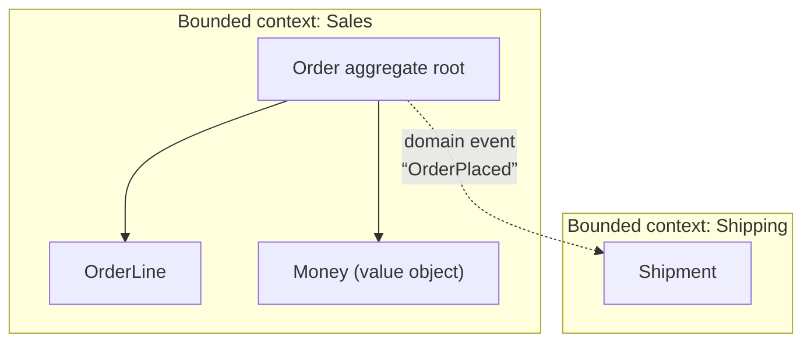

# Domain-Driven Design (DDD)

> Model the software around the **business domain and its language**, and split a big domain
> into well-bounded pieces — so the code reflects how the business actually thinks.

## Top-down: where you already meet this
You've sat in a meeting where "user," "customer," and "account" meant three different things to
three people — and the bugs that followed. You've seen a single `User` table grow 60 columns
because every team bolted on its own fields. DDD is the response: name things the way the
business does, and **draw hard boundaries** so "order" in Shipping can differ from "order" in
Billing without collision.

## Problem
As a domain grows, two failures appear: (1) the code's vocabulary drifts from the business's, so
every conversation needs translation and rules hide in the wrong places; and (2) one giant model
tries to mean everything to everyone, becoming a [low-cohesion, high-coupling](../fundamentals/coupling-and-cohesion.md)
ball of mud. DDD (Eric Evans, 2003) tackles both with **strategic** design (carving the domain
into contexts) and **tactical** patterns (modeling within one context).

## Core concepts
**Strategic — the high-value part:**
- **Ubiquitous language** — one shared vocabulary used identically in conversations *and* code.
  If the business says "shipment," the class is `Shipment`, not `DeliveryDTO`.
- **Bounded context** — an explicit boundary within which a model and its language are
  consistent. The *same word can mean different things in different contexts* — and that's fine,
  because the boundary keeps them apart. This is the most important DDD idea, and it maps
  directly onto service/module boundaries (and often onto
  [microservices](../../../system-design/1-knowledge/patterns/monolith-vs-microservices.md)).

**Tactical — patterns inside one context:**
| Building block | What it is |
| --- | --- |
| **Entity** | An object with a distinct identity that persists over time (`Order #42`) |
| **Value object** | Defined only by its attributes, immutable (`Money(10, "USD")`, `Address`) |
| **Aggregate** | A cluster of entities/values with one **root**; the only consistency boundary you save/load as a unit |
| **Repository** | A collection-like interface to load/store aggregates (a [hexagonal port](./layered-hexagonal-clean.md)) |
| **Domain service / event** | Behavior that doesn't belong to one entity / a fact that "happened" in the domain |



## Essential terminology
| Term | Meaning |
| --- | --- |
| **Ubiquitous language** | The single domain vocabulary shared by code and team |
| **Bounded context** | A boundary inside which one model/language is consistent |
| **Aggregate (root)** | A consistency boundary loaded/saved as a whole, accessed via its root entity |
| **Context map** | How bounded contexts relate (shared kernel, customer/supplier, anti-corruption layer) |
| **Anti-corruption layer** | An [adapter](../design-patterns/structural-patterns.md) that translates another context's model so it can't pollute yours |

## Example
A **value object** makes an illegal state unrepresentable and gives the language a home:

```python
@dataclass(frozen=True)
class Money:                       # value object: immutable, compared by value
    amount: Decimal
    currency: str
    def __add__(self, other):
        if self.currency != other.currency:
            raise ValueError("currency mismatch")   # a domain rule, in the model
        return Money(self.amount + other.amount, self.currency)
```

`Money` lives in the [domain core](./layered-hexagonal-clean.md), independent of any database.
See the full modeling walkthrough in the [DDD case study](../../2-case-studies/ddd-ecommerce-domain.md).

## Trade-offs
- ✅ Code mirrors the business, so rules are findable and changes are localized; bounded contexts
  give you principled module/service seams; aggregates make consistency rules explicit.
- ⚠️ Heavy for simple/CRUD or data-pipeline apps — the ceremony (aggregates, repositories,
  context maps) only pays off when the **domain is genuinely complex** and central to the
  business. Tactical patterns without the strategic thinking is cargo-cult DDD.
- Getting bounded contexts *wrong* is costly — premature splits create chatty, coupled contexts.

## Real-world examples
- **Microservice boundaries** are most successful when drawn along bounded contexts rather than
  technical layers — DDD is the usual decomposition tool. See
  [monolith vs. microservices](../../../system-design/1-knowledge/patterns/monolith-vs-microservices.md).
- **Event-driven systems** publish *domain events* (`OrderPlaced`) across contexts — the bridge
  to [event-driven architecture](../../../system-design/1-knowledge/patterns/event-driven.md)
  and [CQRS/event sourcing](../../../system-design/1-knowledge/patterns/cqrs-event-sourcing.md).

## References
- Eric Evans — *Domain-Driven Design* (2003); Vaughn Vernon — *Implementing DDD* (2013)
- [Hexagonal/Clean architecture](./layered-hexagonal-clean.md) · [Coupling & cohesion](../fundamentals/coupling-and-cohesion.md)
