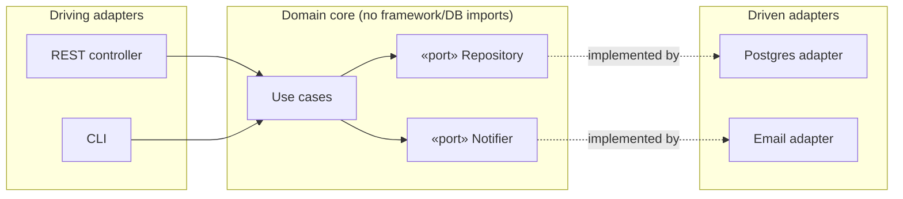

# Layered, Hexagonal & Clean Architecture

> One idea, three named forms: **keep your business logic at the center and push the details
> (DB, web, vendors) to the edges**, with all dependencies pointing inward.

## Top-down: where you already meet this
You've probably written a "service layer" sitting between controllers and the database — that's
**layered architecture**. Hexagonal and Clean are what happens when you take that instinct
seriously and *invert the database dependency* so your core logic doesn't import the DB at all.
The payoff: you can test the core with no database, and swap Postgres for an in-memory store
without touching a line of business logic.

## Problem
The default structure — business rules calling the ORM, the ORM calling the DB, the web
framework calling the rules — couples your *policy* (what the app means) to *details* (which DB,
which framework). Then the framework's choices leak everywhere, tests need real infrastructure,
and replacing any detail is surgery. These styles exist to **protect the core from the details**
by applying the [Dependency Inversion Principle](../fundamentals/solid-principles.md) at the
architecture level.

## Core concepts
**Layered (n-tier)** — the starting point. Stack: Presentation → Application/Service → Domain →
Data. Each layer depends only on the one below. Simple and familiar, but the domain still ends
up depending *downward* on the data layer.

**Hexagonal (Ports & Adapters, Cockburn)** — the key move: the domain defines **ports**
(interfaces it needs, e.g. `OrderRepository`, `EmailSender`) and the outside world provides
**adapters** that implement them (a Postgres adapter, an SMTP adapter). Dependencies now point
*inward* — details depend on the core, never the reverse.

**Clean / Onion (Martin / Palermo)** — the same inward-dependency rule drawn as concentric
rings (Entities → Use Cases → Interface Adapters → Frameworks). The **Dependency Rule**: source
code dependencies point only *inward*; inner rings know nothing of outer ones.

They're the same principle at increasing formality. Learn **hexagonal** — it captures the whole
idea with the least ceremony.



## Essential terminology
| Term | Meaning |
| --- | --- |
| **Port** | An interface the core *owns*, expressing what it needs from the outside |
| **Adapter** | An outer-layer class implementing a port (DB, HTTP client, queue, etc.) |
| **Driving vs. driven** | Driving adapters call *into* the core (UI, API); driven adapters are called *by* it (DB, email) |
| **Dependency Rule** | Source dependencies point only inward, toward higher-level policy |
| **Domain core** | Business rules with **zero** dependencies on frameworks, DBs, or I/O |

## Example
The domain declares the port; it never imports a database:

```python
class OrderRepository(Protocol):          # port — owned by the core
    def save(self, order: Order) -> None: ...
    def get(self, id: str) -> Order: ...

class PlaceOrder:                          # use case — pure policy
    def __init__(self, repo: OrderRepository): self.repo = repo
    def __call__(self, order): self.repo.save(order)

# adapters live outside and plug in:
PlaceOrder(PostgresOrderRepo(conn))   # production
PlaceOrder(InMemoryOrderRepo())       # tests — no DB needed
```

Swapping persistence or testing the rule changes *zero* domain code. Build this end-to-end in
[lab: Hexagonal port & adapter](../../3-practice/lab-hexagonal-port-adapter.md) and see a real
refactor in the [hexagonal case study](../../2-case-studies/refactoring-to-hexagonal.md).

## Trade-offs
- ✅ Business logic is testable without infrastructure; details (DB, vendor, framework) are
  replaceable; the core stays readable and stable as the edges churn.
- ⚠️ More interfaces, indirection, and mapping code (domain objects ↔ DB rows). For a small CRUD
  app this ceremony can outweigh the benefit — a straightforward layered design is fine.
- Apply it where the **domain is rich and long-lived**; skip the full ports/adapters treatment
  for thin data-shuffling services.

## Real-world examples
- **DDD codebases** almost always sit on hexagonal/clean foundations — see
  [domain-driven design](./domain-driven-design.md).
- **Testability culture** — teams that mock the DB at a repository interface are doing ports &
  adapters whether they call it that or not.
- Wiring adapters into ports at startup is the job of [dependency injection](./dependency-injection.md).

## References
- Alistair Cockburn — [Hexagonal Architecture](https://alistair.cockburn.us/hexagonal-architecture/)
- Robert C. Martin — [The Clean Architecture](https://blog.cleancoder.com/uncle-bob/2012/08/13/the-clean-architecture.html)
- [SOLID (Dependency Inversion)](../fundamentals/solid-principles.md) · [Dependency injection](./dependency-injection.md) · [DDD](./domain-driven-design.md)
