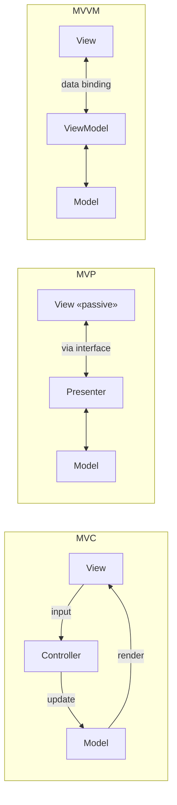

# MVC, MVP & MVVM — Presentation Patterns

> Every UI tangles three things: the **data/rules**, what's **on screen**, and the **glue** that
> reacts to input. These three patterns all split them apart the same way — they differ only in *how
> the glue and the screen talk to each other*.

## Top-down: where you already meet this
You've written a Django view, a Rails controller, a Spring `@Controller`, or bound a Vue/SwiftUI
component to some state. Each framework pushed you to put the database stuff in one place, the HTML/
screen in another, and the "when the user clicks, do X" logic in a third. That separation *is* MVC
and its descendants — the most common architecture a working developer actually touches, because
it's baked into the framework you already use.

## Problem
UI code is a magnet for tangling. Put business rules, rendering, and input handling in one class and
you get the "fat controller" / massive-view-controller: impossible to unit-test (you'd need a real
screen), impossible to reuse the logic, and every change risks breaking the layout. These patterns
separate **presentation** from the **domain** so each can be tested and changed independently — the
[Separation of Concerns](../fundamentals/core-design-principles.md) principle applied to the UI edge.

## Core concepts
All three share a **Model** (the data + domain rules, ideally delegating to a
[hexagonal core](./layered-hexagonal-clean.md)) and a **View** (what's rendered). They differ in the
**mediator** between them — and that difference is driven by *how the View reports user actions back*:

**MVC — Controller.** The **Controller** receives input, updates the Model, and selects the View to
render. Classic for request/response web frameworks: a request hits the controller, it loads/changes
models, picks a template. (Note "MVC" drifted — Smalltalk's original View observed the Model directly;
server-side "MVC" like Rails/Django is really controller-mediated, and Django renames it **MVT**.)

**MVP — Presenter.** The View becomes **passive**: a dumb interface (`showError()`, `setItems()`)
with *no* logic. The **Presenter** holds all presentation logic and drives the View through that
interface. Because the View is an interface, you can test the Presenter with a fake View and no UI at
all. Common in classic Android and WinForms.

**MVVM — ViewModel.** The **ViewModel** exposes observable state (properties, commands); the View
**binds** to it declaratively, and a **data-binding** engine syncs them automatically — no manual
`setText`. Needs framework binding support (WPF, Angular, Vue, SwiftUI). The ViewModel never
references the View, so it's pure and testable.



The throughline: **same Model/View split, different coupling on the mediator** — manual selection
(Controller) → manual via interface (Presenter) → automatic via binding (ViewModel). You pick based on
what your framework supports, not on which is "best."

## Essential terminology
| Term | Meaning |
| --- | --- |
| **Model** | Data + domain rules; ideally a thin facade over the real [domain core](./domain-driven-design.md) |
| **View** | The rendered UI — should hold no business logic |
| **Controller** | Handles input, mutates the model, picks the view (MVC) |
| **Presenter** | Holds presentation logic, drives a *passive* view via an interface (MVP) |
| **ViewModel** | Exposes bindable observable state; the view syncs to it automatically (MVVM) |
| **Data binding** | Framework machinery that keeps view and view-model in sync without manual code |
| **Passive view** | A view with zero logic, fully driven by its presenter — maximally testable |

## Example
The same "show a username, uppercased" in MVC vs. MVVM — note where the wiring lives:

```python
# MVC: controller explicitly pushes data into the view each request
class UserController:
    def show(self, user_id):
        user = self.model.get(user_id)          # update from model
        return render("profile.html", name=user.name.upper())   # controller selects+feeds view
```
```js
// MVVM: view-model exposes state; the view BINDS — no manual push
class UserViewModel {
  user = observable(null)
  get displayName() { return this.user?.name.toUpperCase() ?? "" }  // view auto-updates on change
}
// template:  <span>{{ displayName }}</span>   ← binding engine re-renders when `user` changes
```
MVC's controller hands data to the view on each request; MVVM's view re-renders itself the moment the
observable changes. Same separation, different mechanism.

## Trade-offs
- ✅ Presentation logic becomes testable without a UI (Presenter/ViewModel are plain objects), and
  the View stays swappable (web ↔ mobile) over the same logic.
- ⚠️ Indirection and boilerplate — full MVP/MVVM on a trivial screen is over-engineering; a simple
  MVC action is plenty.
- ⚠️ **These organize the *presentation layer only*.** The Model must still delegate to a real
  [domain/hexagonal core](./layered-hexagonal-clean.md) — putting business rules in controllers/
  view-models just relocates the spaghetti. They're complementary, not a substitute.
- Pick by framework: request/response web → MVC; rich data-binding UI (desktop/mobile/SPA) → MVVM.

## Real-world examples
- **Rails / Django / Spring MVC / ASP.NET MVC** — server-side MVC (Django calls it MVT).
- **Android** moved from MVP to **MVVM** (Jetpack ViewModel + data binding); **WPF, Angular, Vue,
  SwiftUI** are MVVM via binding. **React** is its own unidirectional-data-flow model — related goal
  (separate state from view), different shape.

## References
- [Layered, Hexagonal & Clean architecture](./layered-hexagonal-clean.md) (the Model's home) · [Core design principles (SoC)](../fundamentals/core-design-principles.md) · [Dependency injection](./dependency-injection.md)
- Martin Fowler — [GUI Architectures](https://martinfowler.com/eaaDev/uiArchs.html)
