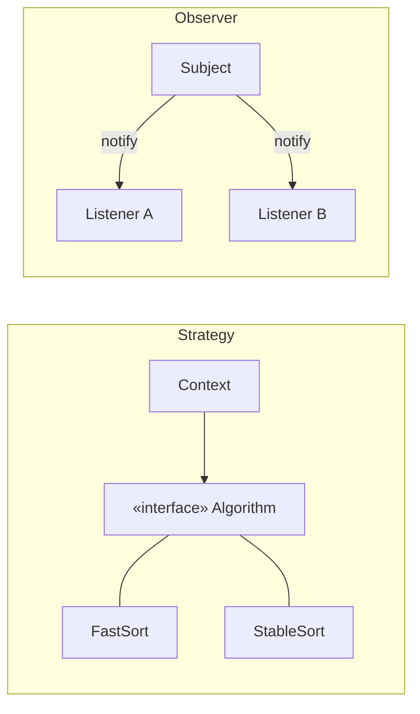

# Behavioral Patterns

> Patterns for **how objects interact and divide responsibility** — who does what, and how they
> talk, without hard-wiring themselves to each other.

## Top-down: where you already meet this
You passed a comparison function to `sort` (Strategy). You registered a listener that fires when
state changes (Observer). You queued "undoable" actions as objects (Command). You let a base
class define the skeleton and overrode one step (Template Method). Behavioral patterns name the
recurring ways objects *collaborate*.

## Problem
Logic that decides "what happens next" loves to congeal into giant conditionals and tangled
call graphs: a `switch` over types, an object that knows everyone it must notify, request
handling fused to the request itself. That's low [cohesion](../fundamentals/coupling-and-cohesion.md)
and high coupling. Behavioral patterns factor the *interaction* out so behavior can vary and be
extended independently.

## Core concepts — the four to know first
| Pattern | Intent | Replaces |
| --- | --- | --- |
| **Strategy** | Make an algorithm interchangeable at runtime | a `switch`/`if` over "kinds of how" |
| **Observer** | Notify many dependents when one object changes | objects hard-calling each other |
| **Command** | Turn a request into an object (so you can queue, log, undo it) | direct method calls you can't capture |
| **Template Method** | Fix the skeleton of an algorithm, let subclasses fill steps | copy-pasted procedures with one differing step |

**Strategy** is the workhorse — it's [Open/Closed](../fundamentals/solid-principles.md) and
[Dependency Inversion](../fundamentals/solid-principles.md) in pattern form, and in languages
with first-class functions it's often just "pass a function." (GoF list more — State, Iterator,
Chain of Responsibility, Mediator, Visitor — same spirit: isolate one axis of behavior.)



## Essential terminology
| Term | Meaning |
| --- | --- |
| **Strategy** | A family of interchangeable algorithms behind one interface, chosen at runtime |
| **Observer / Subject** | Subject keeps a list of observers and notifies them on change (push or pull) |
| **Command** | A request reified as an object with `execute()` (often `undo()`) — enables queues, history, retries |
| **Callback / handler** | The lightweight, function-level form of Strategy/Observer/Command |
| **Hook (Template Method)** | An overridable step in an otherwise fixed algorithm skeleton |

## Example
**Strategy** kills a branching mess and makes new behavior additive:

```python
shipping = {"flat": lambda w: 5.0, "weight": lambda w: 2.0 + 0.5 * w}

def quote(weight, method):           # no if/elif chain; method is the strategy
    return shipping[method](weight)

quote(10, "weight")  # → 7.0
```

Add a strategy → add a key, edit nothing else ([Open/Closed](../fundamentals/solid-principles.md)).
Build Strategy in [lab: Strategy & Factory](../../3-practice/lab-strategy-factory.md) and Observer
in [lab: Observer event bus](../../3-practice/lab-observer-event-bus.md).

## Trade-offs
- ✅ Behavior becomes pluggable and testable in isolation; conditionals shrink; new variants are
  additive, not invasive.
- ⚠️ Indirection: the behavior that runs is decided elsewhere, so a simple flow can become "where
  does control actually go?" Observer especially can create surprising cascades and ordering
  bugs. Use them where behavior genuinely *varies*, not to dress up a single straight-line case.

## Real-world examples
- **Strategy** — `sorted(key=...)`, pluggable auth/storage backends, retry policies.
- **Observer** — DOM/UI events, `EventEmitter`, reactive frameworks; at system scale it becomes
  [event-driven architecture](../../../system-design/1-knowledge/patterns/event-driven.md).
- **Command** — undo/redo stacks, task queues, CQRS commands, transactional outboxes.
- **Template Method** — framework lifecycle hooks (`setUp`/`tearDown`, Django `form_valid`).

## References
- GoF — *Design Patterns*, Behavioral chapter · [refactoring.guru: behavioral](https://refactoring.guru/design-patterns/behavioral-patterns)
- [Patterns overview](./patterns-overview.md) · [Creational](./creational-patterns.md) · [Structural](./structural-patterns.md)
