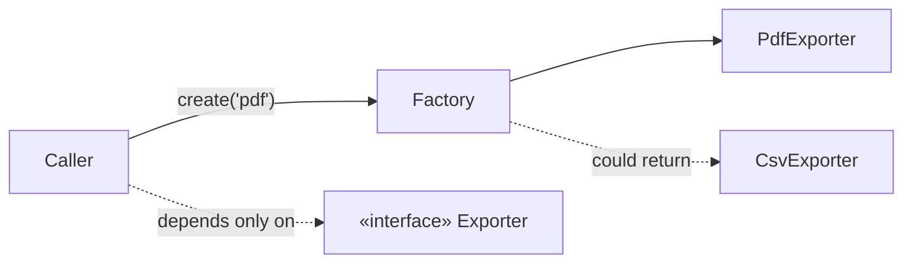

# Creational Patterns

> Patterns that decouple code from **how objects are constructed**, so *what* you use isn't
> welded to *how it's made*.

## Top-down: where you already meet this
Every `new Thing(...)` or `Thing()` call hard-codes a concrete class and its construction
recipe. The moment you want to choose the class at runtime, build it in steps, or share one
instance, that scattered `new` becomes a liability. Creational patterns pull construction into
one place you control.

## Problem
Construction logic tends to leak everywhere: callers know exact class names, required
constructor arguments, and assembly order. That's tight [coupling](../fundamentals/coupling-and-cohesion.md)
to *concretions* — the opposite of the [Dependency Inversion Principle](../fundamentals/solid-principles.md).
Creational patterns isolate the "how to make it" so the "how to use it" stays simple and stable.

## Core concepts — the three you'll actually use
| Pattern | Intent | Reach for it when |
| --- | --- | --- |
| **Factory Method / Factory** | Decide *which* concrete class to create behind one call | The right type depends on input/config and you don't want callers branching on it |
| **Builder** | Construct a complex object **step by step** | Many optional fields / invalid intermediate states (telescoping constructors hurt) |
| **Singleton** | Ensure **one** shared instance | A genuinely single resource (a connection pool) — *use sparingly*, see trade-offs |

(The GoF also list Abstract Factory and Prototype; they're variations on "centralize creation" —
learn the three above first.)



## Essential terminology
| Term | Meaning |
| --- | --- |
| **Factory** | A function/class whose job is to *return* an object of some interface, hiding the concrete type |
| **Telescoping constructor** | The anti-pattern Builder fixes: constructors with many optional params (`Thing(a, b, null, null, true)`) |
| **Fluent interface** | Method chaining (`b.with_x().with_y().build()`) — common Builder style |
| **Singleton** | One globally accessible instance; often a disguised global variable (a smell) |

## Example
A **Factory** removes a `type` branch from callers and gives them one stable seam:

```python
EXPORTERS = {"pdf": PdfExporter, "csv": CsvExporter, "html": HtmlExporter}

def make_exporter(fmt: str) -> Exporter:        # one place knows the concrete classes
    return EXPORTERS[fmt]()                      # add a format → edit only this map

report.export(make_exporter(user_choice))        # caller depends on Exporter, not classes
```

Adding a format touches one dict — that's the [Open/Closed Principle](../fundamentals/solid-principles.md)
paying off. Build this in [lab: Strategy & Factory](../../3-practice/lab-strategy-factory.md).

## Trade-offs
- ✅ Callers depend on interfaces, not concrete classes; construction logic lives in one place;
  swapping/mocking implementations (for tests) is trivial.
- ⚠️ **Singleton is the usual mistake.** A single instance + global access = hidden coupling,
  order-dependent bugs, and tests that can't isolate. Prefer passing the instance in via
  [dependency injection](../architectural-styles/dependency-injection.md); reserve true
  Singletons for unavoidable single resources.
- ⚠️ Don't wrap a one-line `new` in a Factory "just in case" — add the seam when real variation
  exists.

## Real-world examples
- **Factory** — `logging.getLogger(name)`, Django's `DEFAULT_AUTO_FIELD`, SQLAlchemy engine creation.
- **Builder** — `StringBuilder`, query builders, HTTP request builders, Kubernetes manifest helpers.
- **Singleton** — connection pools, app config — usually better expressed as a DI-managed
  single instance than a classic Singleton.

## References
- GoF — *Design Patterns*, Creational chapter · [refactoring.guru: creational](https://refactoring.guru/design-patterns/creational-patterns)
- [Patterns overview](./patterns-overview.md) · [Structural](./structural-patterns.md) · [Behavioral](./behavioral-patterns.md)
