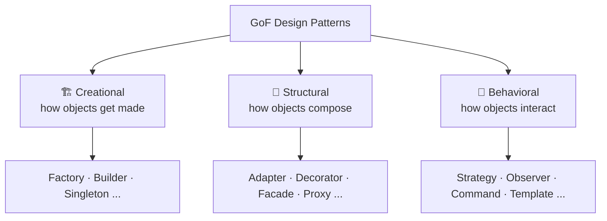

# Design Patterns — Overview

> Named, reusable solutions to problems that recur in object-oriented design. A **shared
> vocabulary**, not a library to install — and not goals in themselves.

## Top-down: where you already meet this
You've reinvented patterns without knowing their names: a function that picks an algorithm at
runtime (Strategy), a callback list that fires on change (Observer), a wrapper that adds logging
around a call (Decorator). Patterns just give those recurring shapes **names** so a team can say
"use a Strategy here" and everyone pictures the same structure.

## Problem
Certain design problems show up again and again — "I need to create objects without hard-coding
their class," "I need to add behavior to objects without subclassing an explosion of them." In
1994 the *Gang of Four* (GoF) catalogued 23 proven solutions. Their value isn't the code (it's a
few lines) — it's **communication** and **avoiding re-derivation**: a teammate who hears "Adapter"
instantly knows the intent, structure, and trade-offs.

> ⚠️ A pattern is a tool for a problem you *have*, not a feature to add. Forcing patterns
> ("pattern-itis") is a classic source of over-engineering — see [trade-offs](#trade-offs).

## Core concepts
The 23 GoF patterns split into **three families** by what problem they solve:



| Family | The question it answers | Read |
| --- | --- | --- |
| **Creational** | How are objects created? (decouple *use* from *construction*) | [Creational patterns](./creational-patterns.md) |
| **Structural** | How are objects composed into bigger structures? | [Structural patterns](./structural-patterns.md) |
| **Behavioral** | How do objects communicate & divide responsibility? | [Behavioral patterns](./behavioral-patterns.md) |

Underneath, almost every pattern applies the same two GoF maxims, which are really
[SOLID](../fundamentals/solid-principles.md) restated:
- **"Program to an interface, not an implementation"** → low [coupling](../fundamentals/coupling-and-cohesion.md).
- **"Favor composition over inheritance"** → flexibility without rigid class hierarchies.

## Essential terminology
| Term | Meaning |
| --- | --- |
| **Intent** | The one-line problem a pattern solves — the part worth memorizing |
| **GoF** | "Gang of Four" — the four authors of the 1994 book that named the 23 patterns |
| **Idiom** | A language-specific micro-pattern (e.g. Python context managers) vs. a general design pattern |
| **Anti-pattern** | A *common* solution that looks helpful but causes harm (e.g. God Object, Singleton-as-global) |

## Example
The smallest pattern, **Strategy**, in three lines — swap an algorithm without touching the
caller:

```python
def checkout(cart, shipping):       # `shipping` is a strategy: any fn cost(weight) -> price
    return cart.total() + shipping(cart.weight)

checkout(cart, flat_rate)           # pick the behavior at the call site
checkout(cart, by_distance)
```

In a language with first-class functions, many patterns *collapse* to "pass a function" — which
is itself the lesson: patterns are intent, not boilerplate.

## Trade-offs
- ✅ Shared vocabulary, proven structures, and a nudge toward loose coupling and testable seams.
- ⚠️ **Over-application is the main risk.** A `FactoryFactory`, a Singleton used as a global, or
  five interfaces for one implementation add indirection without value. Patterns earn their keep
  when there's *real* variation or change to absorb.
- Many GoF patterns are **workarounds for missing language features** — first-class functions
  (Strategy/Command), modules (Singleton), mixins (Decorator) make them near-invisible. Know the
  *intent*; let the language pick the mechanism.

## Real-world examples
- **Strategy/Template** — sort comparators, Django's pluggable backends.
- **Decorator** — Python `@decorators`, web framework middleware.
- **Observer** — UI event listeners, reactive state (RxJS), pub/sub.
- **Adapter/Facade** — SDKs that wrap a messy API in a clean one.

## References
- Gamma, Helm, Johnson, Vlissides — *Design Patterns* (GoF, 1994)
- [refactoring.guru/design-patterns](https://refactoring.guru/design-patterns) — modern illustrated guide
- Next: [Creational](./creational-patterns.md) · [Structural](./structural-patterns.md) · [Behavioral](./behavioral-patterns.md)
