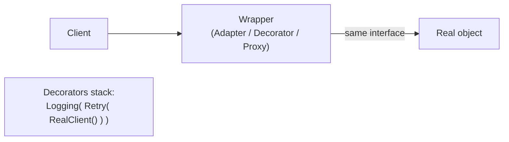

# Structural Patterns

> Patterns for **composing objects into larger structures** while keeping the pieces loosely
> coupled — mostly by *wrapping* one object in another.

## Top-down: where you already meet this
You wrote a thin class that translates a clunky third-party API into the shape your code wants —
that's an Adapter. You added retry/logging *around* a function without changing it — Decorator.
You exposed one simple entry point over a tangle of subsystems — Facade. Structural patterns are
the everyday art of making objects fit together.

## Problem
Real systems glue together parts you don't control (libraries, legacy code, remote services)
and parts that grow new responsibilities over time. Modifying those parts directly is risky or
impossible. Structural patterns solve this by putting an object *between* the caller and the
thing — a wrapper that adapts, extends, simplifies, or guards — preserving low
[coupling](../fundamentals/coupling-and-cohesion.md).

## Core concepts — the four that matter most
| Pattern | Intent | The wrapper… |
| --- | --- | --- |
| **Adapter** | Make an incompatible interface fit the one you expect | …*translates* call shapes |
| **Decorator** | Add behavior to an object **without subclassing** | …*adds* and forwards |
| **Facade** | Give a simple front door to a complex subsystem | …*simplifies* |
| **Proxy** | Stand in for an object to control access (lazy load, cache, auth, remote) | …*guards / defers* |

All four share a structure: the wrapper **implements the same interface** as what it wraps, so
callers can't tell the difference — that's what makes them composable.



## Essential terminology
| Term | Meaning |
| --- | --- |
| **Adapter (wrapper)** | Converts class A's interface into the interface clients expect |
| **Decorator** | Wraps an object to add behavior, exposing the *same* interface so it can stack |
| **Facade** | A single simplified API hiding many collaborating classes |
| **Proxy** | A surrogate controlling access to a real subject (virtual, protection, remote, caching) |
| **Composition** | Building behavior by *holding* another object, not inheriting — the family's core idea |

## Example
**Decorator** — add retry to any client without editing it, and stack more on top:

```python
class RetryClient:
    def __init__(self, inner): self.inner = inner          # wraps same interface
    def get(self, url):
        for _ in range(3):
            try:    return self.inner.get(url)
            except TimeoutError: continue
        raise

client = RetryClient(LoggingClient(HttpClient()))           # stack: retry → log → http
client.get("/orders")                                       # caller sees just .get()
```

Each layer adds one concern; the caller's code is unchanged. This is exactly how web
**middleware** works — build it in [lab: Decorator middleware](../../3-practice/lab-decorator-middleware.md).

## Trade-offs
- ✅ Extend and integrate without modifying existing/third-party code; combine concerns by
  stacking; isolate the rest of the system from a volatile or ugly dependency.
- ⚠️ Layers of wrappers make stack traces deep and behavior harder to trace ("where did this
  header get added?"). Too many tiny decorators can obscure the real flow.
- Adapter vs. Facade vs. Proxy differ by **intent**, not structure — name them by *why* the
  wrapper exists, so readers know what to expect.

## Real-world examples
- **Adapter** — ORMs adapting SQL rows to objects; payment SDKs unifying Stripe/PayPal behind one interface.
- **Decorator** — Python `@functools.lru_cache`, Express/Django middleware, Java I/O streams (`BufferedReader(new FileReader(...))`).
- **Facade** — `requests` over `urllib`; a `PaymentService` hiding gateway, fraud, and ledger calls.
- **Proxy** — ORM lazy-loading, API gateways, caching/auth proxies. (At the *network* tier this becomes [proxies & gateways](../../../system-design/1-knowledge/building-blocks/proxies-gateways.md).)

## References
- GoF — *Design Patterns*, Structural chapter · [refactoring.guru: structural](https://refactoring.guru/design-patterns/structural-patterns)
- [Patterns overview](./patterns-overview.md) · [Creational](./creational-patterns.md) · [Behavioral](./behavioral-patterns.md)
