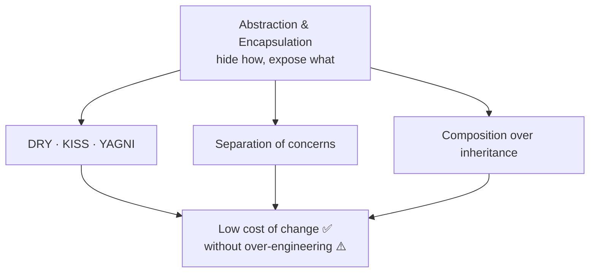

# Core Design Principles

> The short, language-agnostic maxims you cite in code reviews every day — **DRY, KISS, YAGNI,
> separation of concerns, composition over inheritance** — and the two bedrock ideas
> (abstraction, encapsulation) they rest on. [SOLID](./solid-principles.md) is the OO-specific
> set; these apply to *any* code.

## Top-down: where you already meet this
You've said "do we really need this abstraction yet?" (YAGNI), "can we not copy-paste this?"
(DRY), or "this class is doing two jobs" (separation of concerns). These principles are just
those instincts named, so a review comment can be one word instead of a paragraph — and so you
know *why* the instinct is right.

## Problem
[Coupling & cohesion](./coupling-and-cohesion.md) and [SOLID](./solid-principles.md) explain
*structure*, but a lot of day-to-day design is smaller, faster judgment calls: should I extract
this? add this layer? generalize now? Without shared heuristics, every such call is re-argued
from scratch. These principles are the compressed wisdom that settles them — and, crucially,
each has a *failure mode when over-applied*, so they're guides, not commandments.

## Core concepts
| Principle | Says | Cures | Over-applied → |
| --- | --- | --- | --- |
| **DRY** (Don't Repeat Yourself) | Every piece of *knowledge* has one authoritative home | Edit-in-N-places bugs | Wrong abstraction: merging code that's only *coincidentally* similar |
| **KISS** (Keep It Simple) | Prefer the simplest thing that works | Cleverness nobody can maintain | Over-flattening: simplistic code that ignores real complexity |
| **YAGNI** (You Aren't Gonna Need It) | Don't build for imagined futures | Speculative generality, dead code | Painting yourself into a corner by ignoring *known* near-term needs |
| **Separation of concerns** | One module = one concern (UI vs. logic vs. data) | Tangled code where a change touches everything | Fragmentation into anemic pieces with no clear owner |
| **Composition over inheritance** | Build behavior by *combining* objects, not deep class trees | Rigid, fragile hierarchies | Over-indirection when a simple subclass would do |

Two ideas sit underneath all of them:
- **Abstraction** — expose *what* something does, hide *how*. A function name, an interface, a
  module boundary are all abstractions: they let you use a thing without knowing its internals.
- **Encapsulation** — bundle data with the behavior that governs it, and hide the internals so
  they can't be misused or depended on. It's what makes [low coupling](./coupling-and-cohesion.md)
  enforceable rather than merely hoped-for.



### DRY is about *knowledge*, not *characters*
The most-abused principle. DRY means a single source of truth for a *rule* — a tax rate, a
validation, a business policy. Two functions that happen to look alike but encode **different**
rules are *not* a DRY violation; merging them couples things that should change independently.
The rule of thumb: deduplicate when the pieces must *always change together*, otherwise leave
the duplication. (Sandi Metz: *"duplication is far cheaper than the wrong abstraction."*)

### YAGNI and KISS push back on patterns
[Design patterns](../design-patterns/patterns-overview.md) and [SOLID](./solid-principles.md)
add structure; YAGNI and KISS are the counterweight that stops you adding it *speculatively*. The
healthy loop: build the simple thing → when real change/variation arrives, refactor to the
pattern that absorbs it. Add abstraction in response to pain, not in anticipation of it.

## Essential terminology
| Term | Meaning |
| --- | --- |
| **DRY / single source of truth** | One authoritative place for each piece of knowledge |
| **WET** | "Write Everything Twice" — the (sometimes correct) opposite: tolerate duplication over a bad abstraction |
| **Abstraction** | A simplified view that hides detail (function, interface, module) |
| **Encapsulation** | Hiding internal state/representation behind a controlled surface |
| **Composition** | Assembling behavior by holding/combining objects rather than inheriting |
| **Speculative generality** | The smell YAGNI prevents: flexibility built for needs that never come |

## Example
**Composition over inheritance** — a class explosion vs. combining behaviors. Inheritance forces
one rigid axis:

```python
# ⚠️ inheritance: a new class for every combination
class Logger: ...
class FileLogger(Logger): ...
class TimestampFileLogger(FileLogger): ...      # ...and EncryptedTimestampFileLogger, etc.
```

```python
# ✅ composition: combine independent pieces at runtime
log = Timestamped(Encrypted(FileSink("app.log")))   # mix & match, no new classes
```

That's the [Decorator pattern](../design-patterns/structural-patterns.md) — most patterns are
this principle made concrete. Build it in [lab: Decorator middleware](../../3-practice/lab-decorator-middleware.md).

## Trade-offs
- ✅ Used together they keep code simple *and* changeable: DRY/SoC localize change, KISS/YAGNI
  stop you over-building, composition keeps you flexible.
- ⚠️ Each has an over-applied failure mode (see the table). The principles even **pull against
  each other** — aggressive DRY can fight KISS (a clever generalization), and SoC can fight YAGNI
  (premature layers). Design is *balancing* them for the situation, not maximizing any one.
- The meta-rule: apply a principle when you feel the pain it cures. A reviewer citing "DRY!" on
  two-line coincidental duplication is misusing it.

## Real-world examples
- **DRY** — config/constants in one module; a shared validation library; database schema as the
  single source of truth (vs. rules duplicated in app code).
- **YAGNI** — agile/lean teams ship the thin slice and refactor later, rather than building a
  plugin framework for one use case.
- **Composition over inheritance** — Go and Rust have *no* class inheritance by design; React
  favors composing components over extending them; the [Strategy](../design-patterns/behavioral-patterns.md)
  and [Decorator](../design-patterns/structural-patterns.md) patterns are composition in action.

## References
- Hunt & Thomas — *The Pragmatic Programmer* (DRY, orthogonality)
- Sandi Metz — [The Wrong Abstraction](https://sandimetz.com/blog/2016/1/20/the-wrong-abstraction)
- [SOLID principles](./solid-principles.md) · [Coupling & cohesion](./coupling-and-cohesion.md) · [Design patterns overview](../design-patterns/patterns-overview.md)
