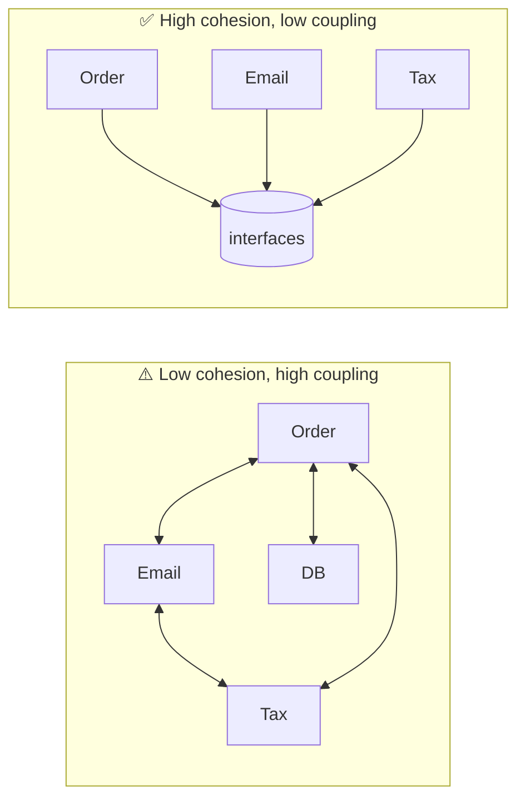

# Coupling & Cohesion

> The two forces under *every* design rule: keep related things **together** (cohesion) and
> keep unrelated things **apart** (coupling). Almost everything else is a corollary.

## Top-down: where you already meet this
Two codebases of the same size. In one, you fix a bug by editing one obvious file. In the other,
the same fix ripples through five modules and breaks a test in a sixth. The difference isn't
talent or line count — it's **coupling and cohesion**. They're the vocabulary for *why* one
design is easy to change and another fights you.

## Problem
"Good design" is vague advice. We need a measurable-ish way to say what makes structure good.
Coupling and cohesion are that lens: they predict the thing we actually care about — how a
change in one place forces changes in others (the [cost of change](./what-is-software-architecture.md)).

## Core concepts
**Cohesion = how focused one module is.** High cohesion means everything in a module works
toward one job. Low cohesion is a `utils.py` grab-bag or a `Manager` class that does ten
unrelated things. High cohesion is the goal — it makes modules easy to name, understand, and
reuse.

**Coupling = how much modules depend on each other.** Low (loose) coupling means a module knows
as little as possible about others — ideally only an interface. High (tight) coupling means a
module reaches into another's internals, so the two must change together. Low coupling is the
goal — it lets parts evolve, be tested, and be replaced independently.

The two pull in the same direction: **high cohesion within, low coupling between.** Split a god
class and cohesion goes up; depend on an interface instead of a concrete class and coupling goes
down.



### Kinds of coupling (loosest → tightest)
You don't need the full taxonomy, just the intuition: depending on a **stable interface** is
loose; depending on another module's **internal data or order of operations** is tight. The
worst is *content coupling* (one module mutates another's internals); the goal is *data
coupling* (modules pass simple data through a clear interface).

## Essential terminology
| Term | Meaning |
| --- | --- |
| **Cohesion** | Degree to which a module's parts belong together (high = good) |
| **Coupling** | Degree to which modules depend on each other (low = good) |
| **Afferent / efferent** | How many things depend *on* you vs. how many *you* depend on |
| **Connascence** | A finer model of coupling: two pieces of code are connascent if changing one forces changing the other |
| **Law of Demeter** | "Don't talk to strangers" — call your own collaborators, not their internals (`a.b.c.do()` is a smell) |

## Example
Tight coupling — `Report` reaches *through* `Order` into its parts (a Law of Demeter violation):

```python
class Report:
    def total(self, order):
        return sum(line.product.price.amount for line in order.lines)  # knows Order's whole shape
```

Change how `Order` stores lines or prices, and `Report` breaks. Loosen it by giving `Order` a
cohesive responsibility — *know its own total* — and exposing only that:

```python
class Order:
    def total(self):                      # cohesion: Order owns its own math
        return sum(l.subtotal() for l in self._lines)

class Report:
    def total(self, order):
        return order.total()              # coupling: depends only on a small, stable method
```

Now `Order`'s internals can change freely; `Report` only depends on the `total()` contract.

## Trade-offs
- ✅ Loose coupling + high cohesion = independent change, isolated tests, easy reuse and
  replacement. It's the payoff behind [SOLID](./solid-principles.md), [design patterns](../design-patterns/patterns-overview.md),
  and [hexagonal architecture](../architectural-styles/layered-hexagonal-clean.md).
- ⚠️ You can't drive coupling to zero — modules must collaborate. **Over-decoupling** (an
  interface for every class, events everywhere) trades direct, readable calls for indirection
  that's hard to follow. Loosen the couplings that *change*, not all of them.

## Real-world examples
- **Microservices** push coupling and cohesion to the deployment level: each service should be
  cohesive (one business capability) and loosely coupled (talk over APIs/events). The same
  failure mode — a *distributed* ball of mud — appears when they're not. See
  [monolith vs. microservices](../../../system-design/1-knowledge/patterns/monolith-vs-microservices.md).
- **Connascence** is used in real refactoring to rank *which* couplings to fix first
  (coupling on meaning/position is worse than on name).

## References
- Constantine & Yourdon — *Structured Design* (origin of the terms)
- [Connascence.io](https://connascence.io/) — the modern coupling model
- [SOLID principles](./solid-principles.md) · [What is software architecture?](./what-is-software-architecture.md)
