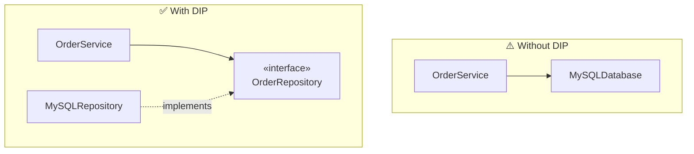

# SOLID Principles

> Five rules of thumb for object-oriented design that all serve one goal: make code you can
> **change without fear**. They're [coupling & cohesion](./coupling-and-cohesion.md) turned
> into actionable guidance.

## Top-down: where you already meet this
You've seen the symptoms SOLID prevents: a class you're scared to touch because it does too
much; a `switch` over types that you must edit every time a new type appears; a "reusable"
class you can't reuse because it drags half the system with it. SOLID names the design moves
that avoid each of those.

## Problem
"Write loosely coupled, cohesive code" is correct but abstract. Developers needed concrete,
repeatable heuristics they could apply while writing a class. Robert C. Martin packaged five of
them under the acronym **SOLID**. They're not laws — they're forces to balance, and each one is
really about *where dependencies point* and *what a unit is responsible for*.

## Core concepts
| Letter | Principle | One-line intuition |
| --- | --- | --- |
| **S** | Single Responsibility | A class should have **one reason to change** — one owner/concern |
| **O** | Open/Closed | Open for **extension**, closed for **modification** — add behavior without editing existing code |
| **L** | Liskov Substitution | A subtype must be usable **anywhere** its base type is, without surprises |
| **I** | Interface Segregation | Many small, focused interfaces beat one fat one — don't force clients to depend on methods they don't use |
| **D** | Dependency Inversion | Depend on **abstractions**, not concretions; high-level policy shouldn't depend on low-level details |

The one that drives architecture most is **D (Dependency Inversion)** — it's the principle
behind [hexagonal/clean architecture](../architectural-styles/layered-hexagonal-clean.md) and
[dependency injection](../architectural-styles/dependency-injection.md): point your dependencies
at interfaces you own, so the volatile details (DB, framework, vendor) plug into your core
instead of your core depending on them.



## Essential terminology
| Term | Meaning |
| --- | --- |
| **Responsibility** | A reason to change — ideally one actor/stakeholder per class (SRP) |
| **Extension point** | A seam (interface, override) where new behavior plugs in without editing old code (OCP) |
| **Substitutability (LSP)** | A subclass honors its parent's contract — same inputs accepted, same promises kept |
| **Abstraction** | An interface/protocol the details depend on, not the other way round (DIP) |

## Example
A pricing service that violates **Open/Closed** — every new customer type edits this method:

```python
def discount(customer):
    if customer.type == "regular":  return 0.0
    elif customer.type == "vip":    return 0.1
    elif customer.type == "staff":  return 0.3   # ...and you edit here forever
```

Refactor to obey OCP (and DIP) with a small interface — new types *extend*, they don't *modify*:

```python
class DiscountPolicy(Protocol):
    def rate(self) -> float: ...

class Vip:    rate = lambda self: 0.1
class Staff:  rate = lambda self: 0.3
# add a new policy class → zero edits to existing code

def price(amount, policy: DiscountPolicy):
    return amount * (1 - policy.rate())
```

This is the [Strategy pattern](../design-patterns/behavioral-patterns.md) — most design patterns
are just SOLID made concrete. Build it hands-on in [lab: Strategy & Factory](../../3-practice/lab-strategy-factory.md).

## Trade-offs
- ✅ Applied judiciously, SOLID localizes change, enables substitution/mocking for tests, and
  keeps classes small and nameable.
- ⚠️ Applied dogmatically, it breeds **over-abstraction**: an interface per class, factories for
  one implementation, indirection that obscures a simple flow. SRP especially is easy to
  over-split into anemic fragments.
- Treat them as *smells to check against*, not boxes to tick. Reach for a principle when you
  feel the pain it cures (fear of change, copy-paste, untestable code) — not pre-emptively.

## Real-world examples
- **Dependency injection frameworks** (Spring, .NET DI, Guice) exist to make DIP the default:
  wire concrete adapters into interfaces at startup.
- **Plugin systems** are OCP at scale — pytest, VS Code, and webpack let you add behavior
  without modifying the core. See the [plugin architecture case study](../../2-case-studies/plugin-architecture.md).

## References
- Robert C. Martin — *Clean Architecture* and the original [SOLID papers](https://en.wikipedia.org/wiki/SOLID)
- [Core design principles](./core-design-principles.md) (DRY/KISS/YAGNI) · [Coupling & cohesion](./coupling-and-cohesion.md) · [Design patterns overview](../design-patterns/patterns-overview.md) · [Dependency injection](../architectural-styles/dependency-injection.md)
