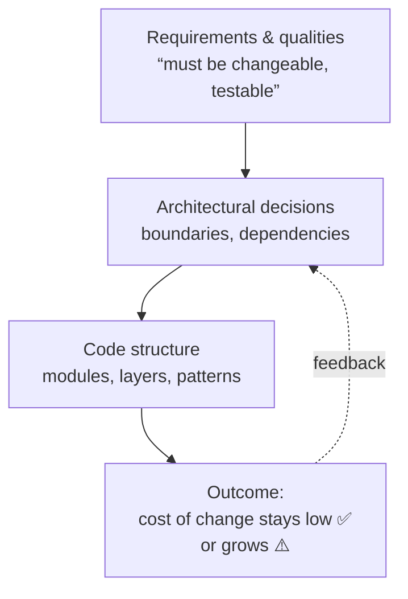

# What Is Software Architecture?

> Architecture is the set of decisions that are **expensive to change later** — the shape of
> a system, not its line-by-line details.

## Top-down: where you already meet this
You've felt architecture without naming it. A codebase where adding a field means touching
twelve files; a "small" change that breaks an unrelated feature; a service you can't test
without a real database. None of those are *bug* problems — they're **structure** problems.
Architecture is the discipline of choosing that structure on purpose instead of by accident.

## Problem
Any program that works *can* be written as one giant function. It runs fine — until people
need to **change** it. Software lives for years and is read far more than it's written, so the
real cost isn't making it work once; it's keeping it changeable, testable, and understandable
as requirements churn and the team grows. Architecture exists to keep the **cost of change**
from exploding over time.

> The classic definition (Ralph Johnson, via Martin Fowler): *"Architecture is the stuff that's
> hard to change."* If a decision is cheap to reverse, it's a detail; if it's expensive, it's
> architecture — so spend your design effort there.

## Core concepts
- **Components & boundaries.** Architecture is mostly about *where you draw lines* — what's
  inside a module/service and what's outside — and what crosses each line (the interface).
- **Dependencies have a direction.** A depends on B means a change in B can force a change in A.
  Good architecture points dependencies toward **stable**, abstract things and away from
  volatile details (databases, frameworks, UI). See [coupling & cohesion](./coupling-and-cohesion.md)
  and the [Dependency Inversion Principle](./solid-principles.md).
- **Functional vs. non-functional.** Features are *what* the system does; architecture mostly
  serves the **-ilities** — change*ability*, testability, scalability, reliability — the
  qualities that don't show up in a demo but decide whether the project survives.
- **Levels.** The same thinking applies at every zoom level: classes & modules (this area),
  and whole services & their runtime topology ([System Design](../../../system-design/)). This
  area is the **inside-a-service** view; System Design is the **between-services** view.



## Essential terminology
| Term | Meaning |
| --- | --- |
| **Component / module** | A unit with a clear responsibility and a defined interface |
| **Boundary** | The line between "inside" and "outside" a component; crossing it costs something |
| **Coupling** | How much one part depends on another — see [coupling & cohesion](./coupling-and-cohesion.md) |
| **-ilities** | Non-functional qualities: changeability, testability, scalability, etc. |
| **Architectural decision** | A choice that's expensive to reverse (vs. an implementation detail) |
| **Big ball of mud** | The default "architecture" you get with no boundaries: everything depends on everything |

## Example
A first version of an invoicing feature, all in one file:

```python
def create_invoice(order_id):
    row = db.query("SELECT * FROM orders WHERE id=%s", order_id)  # tied to a specific DB
    total = row["amount"] * 1.2                                   # tax rule buried inline
    sendgrid.send(row["email"], f"You owe ${total}")              # tied to a specific vendor
```

It works. But every *kind of change* is a structural risk: switch databases → rewrite this;
change the tax rule → hunt through business logic mixed with SQL; test it → you need a real DB
and a real SendGrid key. The architecture work is to separate the **policy** (tax, invoicing
rules) from the **details** (which DB, which email vendor) behind boundaries — exactly what
[SOLID](./solid-principles.md) and [hexagonal architecture](../architectural-styles/layered-hexagonal-clean.md)
formalize.

## Trade-offs
- ✅ Good architecture keeps the cost of change roughly flat as the system grows; lets parts be
  tested, replaced, and understood in isolation.
- ⚠️ Structure isn't free: boundaries add indirection and code. **Over-architecting** a small or
  short-lived program (speculative layers, patterns nobody needs) costs more than it saves.
- The skill is matching effort to the *expected rate and cost of change* — not maximizing
  abstraction. YAGNI ("you aren't gonna need it") is an architectural principle too.

## Real-world examples
- **Frameworks** (Spring, Django, Rails) are opinionated architectures: they pre-draw the
  boundaries (controllers, services, repositories) so teams don't reinvent them each time.
- **Microservices vs. modular monolith** is an architectural decision about *where* the hardest
  boundaries go — across the network or within one deployable. See
  [monolith vs. microservices](../../../system-design/1-knowledge/patterns/monolith-vs-microservices.md)
  in System Design.

## References
- Martin Fowler — [Who Needs an Architect?](https://martinfowler.com/ieeeSoftware/whoNeedsArchitect.pdf)
- Robert C. Martin — *Clean Architecture* (2017)
- [Coupling & cohesion](./coupling-and-cohesion.md) · [SOLID](./solid-principles.md) · [Architectural styles](../architectural-styles/layered-hexagonal-clean.md)
