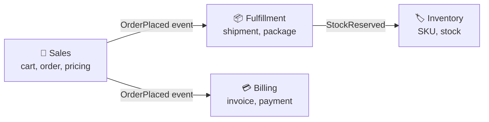

# Case Study: Modeling an E-Commerce Domain with DDD

> Carve a sprawling "online store" into [bounded contexts](../1-knowledge/architectural-styles/domain-driven-design.md),
> then model one of them with aggregates and value objects — and show why those boundaries
> become natural service seams.

## The scenario
An e-commerce team has one `orders` table and one `OrderService` that handles the cart, pricing,
payment, inventory reservation, shipping labels, and refund accounting. The class is 2,000 lines;
"order" means subtly different things to each concern, and a change to shipping logic keeps
breaking billing. Classic symptoms of **one model trying to mean everything** — the problem
[strategic DDD](../1-knowledge/architectural-styles/domain-driven-design.md) exists to solve.

## Requirements
1. Split the domain so each part has a **consistent language and model**.
2. Make business rules (e.g. "can't ship an unpaid order") explicit and enforced in the model.
3. Boundaries should be candidates for independent modules/services later.

## How it works — strategic design first
Talk to the business and find the **bounded contexts** — the places where the language and rules
genuinely differ:



The word **"order"** is different in each context: in *Sales* it's a cart being priced; in
*Billing* it's an invoice with line amounts; in *Fulfillment* it's a list of items to pack. DDD's
insight: **don't unify them** — let each context keep its own model and communicate via
[domain events](../../system-design/1-knowledge/patterns/event-driven.md). That single decision
dissolves most of the coupling.

## Deep dives — tactical modeling inside *Sales*
**Aggregate with a root.** `Order` is the aggregate root; you only load/save the whole cluster
through it, and it enforces invariants:

```python
@dataclass(frozen=True)
class Money:                                  # value object — immutable, compared by value
    amount: Decimal; currency: str

class Order:                                  # aggregate root — guards its own rules
    def __init__(self, id): self.id, self._lines, self._status = id, [], "draft"
    def add_line(self, sku, qty, price: Money):
        if self._status != "draft":
            raise InvalidState("can't modify a placed order")   # invariant in the model
        self._lines.append(OrderLine(sku, qty, price))
    def place(self):
        if not self._lines: raise InvalidState("empty order")
        self._status = "placed"
        return OrderPlaced(self.id, self.total())               # emits a domain event
    def total(self) -> Money:
        return Money(sum(l.subtotal for l in self._lines), "USD")
```

- **The root is the only entry point** — external code can't append a line directly and bypass
  the `draft` check. That's how an aggregate guarantees consistency (Req 2).
- **`Money` and `OrderLine` are value objects** — no identity, immutable, defined by their
  attributes; they make illegal states (mismatched currency, negative qty) easy to forbid.
- **`OrderPlaced` is a domain event** — the only thing crossing into Billing and Fulfillment, so
  those contexts stay decoupled from Sales' internal model (Req 1, 3).
- **Repository as a [port](../1-knowledge/architectural-styles/layered-hexagonal-clean.md):**
  `OrderRepository.save(order)` persists the whole aggregate; the domain never sees SQL.

## From contexts to services
Because each bounded context already owns its model, language, and data, it's a ready-made
**module — and a strong candidate for a [microservice](../../system-design/1-knowledge/patterns/monolith-vs-microservices.md)**
when scaling demands it. The events between them become messages on a queue, and consistency
across contexts goes from a single DB transaction to a
[saga](../../system-design/1-knowledge/patterns/saga.md). DDD gives you the *where* to cut;
System Design gives you the *how* to run the pieces.

## Trade-offs & failure modes
- ✅ Each context is cohesive and independently changeable; rules live in the model; boundaries
  scale from modules to services without a rewrite.
- ⚠️ **Wrong boundaries are expensive.** Cut too fine and contexts become chatty and coupled;
  cut along technical layers instead of business capabilities and you get distributed spaghetti.
  Start with a **modular monolith** and split only when a context proves it needs to.
- ⚠️ Tactical patterns (aggregates everywhere) without strategic context mapping is cargo-cult
  DDD — heavy ceremony, little payoff. The bounded contexts are the high-value part.
- ⚠️ Cross-context consistency is now *eventual* — accept it and design for it
  ([eventual consistency](../../distributed-systems/1-knowledge/replication/eventual-consistency-crdts.md)).

## References
- [Domain-Driven Design](../1-knowledge/architectural-styles/domain-driven-design.md) · [Hexagonal/Clean](../1-knowledge/architectural-styles/layered-hexagonal-clean.md)
- Eric Evans — *Domain-Driven Design*; Vaughn Vernon — *Implementing DDD*
- System Design: [monolith vs. microservices](../../system-design/1-knowledge/patterns/monolith-vs-microservices.md) · [event-driven](../../system-design/1-knowledge/patterns/event-driven.md) · [saga](../../system-design/1-knowledge/patterns/saga.md)
