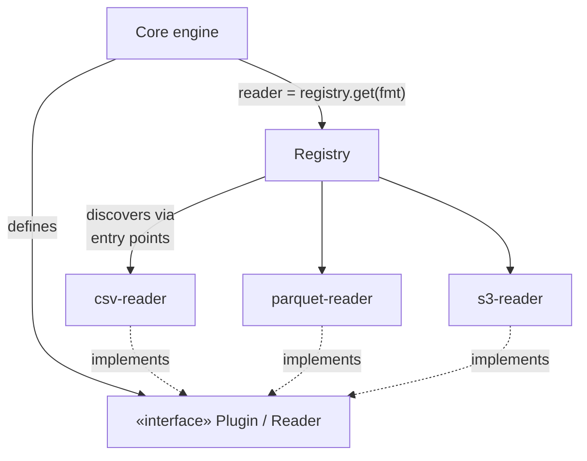

# Case Study: A Plugin Architecture

> How extensible tools (pytest, VS Code, webpack, Jenkins) let strangers add features **without
> editing the core** — the [Open/Closed Principle](../1-knowledge/fundamentals/solid-principles.md)
> realized with a handful of [design patterns](../1-knowledge/design-patterns/patterns-overview.md).

## The scenario
You're building a data-processing CLI. Today it reads CSV and writes JSON. Tomorrow users will
want Parquet, S3, encryption, custom validators — formats and steps you can't predict. If every
new capability means editing core source, the project becomes a bottleneck and a merge-conflict
factory. You want third parties to add behavior by **dropping in a package**, with no change to
your code.

## Requirements
1. **Add a format/step without modifying the core** (Open/Closed).
2. **Discover plugins at runtime** — no hard-coded import list.
3. **Core depends on a contract, never on a specific plugin** (Dependency Inversion).
4. Plugins can hook into well-defined lifecycle points.

## How it works
Three ideas combine: a **port** (the plugin contract), a **registry/factory** (discovery), and
**hooks** (lifecycle events the core fires).



**1 — The contract is a port.** The core publishes an interface; that's *all* it depends on:
```python
class Reader(Protocol):
    name: str
    def read(self, path: str) -> Iterable[dict]: ...
```

**2 — Discovery via a registry (Factory + entry points).** Plugins register themselves; the core
looks them up by name — the classic [Factory](../1-knowledge/design-patterns/creational-patterns.md)
backed by Python packaging *entry points*:
```python
# a plugin package declares in pyproject.toml:
# [project.entry-points."mytool.readers"]
# parquet = "mytool_parquet:ParquetReader"
import importlib.metadata as md
READERS = {ep.name: ep.load() for ep in md.entry_points(group="mytool.readers")}

def get_reader(fmt: str) -> Reader:
    return READERS[fmt]()        # core never imports ParquetReader directly
```
Installing `pip install mytool-parquet` makes Parquet appear — **zero core edits** (Req 1–3).

**3 — Lifecycle hooks (Observer + Template Method).** The core fires events; plugins subscribe:
```python
for hook in registry.hooks("before_write"):
    record = hook(record)        # validators, encryptors, etc. transform the pipeline
```

## Deep dives — the patterns in action
- **Strategy / Factory** — selecting a `Reader` by name is Strategy chosen via a Factory; the
  pipeline behavior varies without conditionals in the core.
- **Observer** — the `before_write`/`after_read` hooks are an in-process
  [Observer/event bus](../1-knowledge/design-patterns/behavioral-patterns.md): the core doesn't
  know who listens.
- **Decorator** — chaining transform hooks (`encrypt(validate(record))`) is
  [Decorator](../1-knowledge/design-patterns/structural-patterns.md) stacking.
- **Inversion of Control** — plugins don't call the core; the **core calls them**. That's the
  defining inversion of a plugin system (the "Hollywood Principle": *don't call us, we'll call
  you*).

## Real systems
| Tool | Plugin mechanism |
| --- | --- |
| **pytest** | `pytest11` entry points + `hookspec`/`hookimpl` (the `pluggy` library) |
| **VS Code** | Extensions register `contributes` points; the editor calls activation events |
| **webpack** | Loaders (Strategy per file type) + plugins tapping into compiler **hooks** (Observer) |
| **Jenkins / Grafana** | Drop-in plugin jars/packages discovered at startup |

## Trade-offs & failure modes
- ✅ Ecosystem scales without core changes; the core stays small and stable; third parties move
  independently.
- ⚠️ **Stable contract is now a hard constraint** — changing the `Reader` interface breaks every
  plugin. Version the contract and deprecate carefully.
- ⚠️ Trust & isolation: third-party code runs in your process. Failures, slow hooks, and security
  are real concerns (sandboxing, timeouts, capability limits).
- ⚠️ Discovery magic (entry points, auto-loading) makes "why is this running?" harder to debug —
  provide a `list-plugins` command.

## References
- [SOLID — Open/Closed & Dependency Inversion](../1-knowledge/fundamentals/solid-principles.md) · [Behavioral](../1-knowledge/design-patterns/behavioral-patterns.md) · [Structural](../1-knowledge/design-patterns/structural-patterns.md)
- [pluggy](https://pluggy.readthedocs.io/) (pytest's plugin engine) · Python [entry points](https://packaging.python.org/en/latest/specifications/entry-points/)
- Hands-on: [lab: Observer event bus](../3-practice/lab-observer-event-bus.md)
