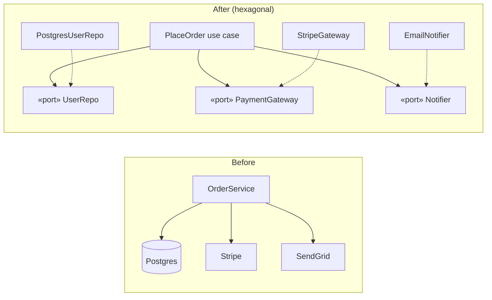

# Case Study: Refactoring a Tangled Service to Hexagonal

> Take a typical "it works but we can't test or change it" order service and walk it to
> [ports & adapters](../1-knowledge/architectural-styles/layered-hexagonal-clean.md) step by
> step — showing exactly which pain each move removes.

## The scenario
A startup's `OrderService` started as 80 lines and grew to 800. It places orders by talking
directly to Postgres, Stripe, and SendGrid inside its methods. Symptoms the team reports:
- A unit test for "apply discount" requires a live database and real Stripe keys.
- Switching from SendGrid to SES means editing business logic.
- Nobody can find the actual *pricing rules* — they're interleaved with SQL and HTTP calls.

This is a [low-cohesion, high-coupling](../1-knowledge/fundamentals/coupling-and-cohesion.md)
core fused to volatile details — the exact problem hexagonal architecture targets.

## Requirements
1. **Test business rules with no infrastructure** (no DB, no network).
2. **Swap any external detail** (DB, payment, email) without touching business logic.
3. **No behavior change** — pure refactor, guarded by tests.

## The starting point
```python
class OrderService:
    def place(self, cart, user_id):
        row = db.query("SELECT tier FROM users WHERE id=%s", user_id)   # DB
        rate = 0.1 if row["tier"] == "vip" else 0.0                     # rule (buried)
        total = cart.total() * (1 - rate)
        stripe.Charge.create(amount=total, source=cart.token)          # vendor
        db.execute("INSERT INTO orders ...", total)                    # DB
        sendgrid.send(row["email"], f"Paid ${total}")                  # vendor
```
Every concern is welded together; the rule (`0.1 if vip`) can't be tested without the world.

## How it works — the refactor in four moves



**1 — Extract ports.** Name the things the core *needs* as interfaces it owns:
```python
class UserRepo(Protocol):       def tier(self, uid) -> str: ...
class PaymentGateway(Protocol): def charge(self, amount, token) -> None: ...
class Notifier(Protocol):       def notify(self, to, msg) -> None: ...
```

**2 — Isolate the policy.** The use case now depends only on ports — it's pure logic:
```python
class PlaceOrder:
    def __init__(self, users: UserRepo, pay: PaymentGateway, notify: Notifier):
        self.users, self.pay, self.notify = users, pay, notify
    def __call__(self, cart, user_id):
        rate  = 0.1 if self.users.tier(user_id) == "vip" else 0.0   # the rule, alone & visible
        total = cart.total() * (1 - rate)
        self.pay.charge(total, cart.token)
        self.notify.notify(user_id, f"Paid ${total}")
        return total
```

**3 — Write adapters** that implement the ports against the real world (`StripeGateway`,
`PostgresUserRepo`, `EmailNotifier`) — thin translation classes, no business logic.

**4 — Wire at the [composition root](../1-knowledge/architectural-styles/dependency-injection.md):**
```python
place = PlaceOrder(PostgresUserRepo(conn), StripeGateway(key), EmailNotifier(sg))
```

## Deep dives — the theory in action
- **The discount rule is now a 5-line unit test** with fakes — Requirement 1 met:
  ```python
  def test_vip_discount():
      total = PlaceOrder(FakeUsers(tier="vip"), SpyGateway(), NullNotifier())(cart_of(100), "u1")
      assert total == 90
  ```
- **Swapping SendGrid → SES** is a new `SesNotifier` adapter and a one-line change at the
  composition root — Requirement 2 met. The use case never knew which vendor it used
  ([Dependency Inversion](../1-knowledge/fundamentals/solid-principles.md)).
- **Each adapter is now independently testable** against its real dependency, separately from
  the rules.

## Trade-offs & failure modes
- ✅ Rules are testable in milliseconds; details are pluggable; the core reads like the business.
- ⚠️ More files and an explicit mapping layer (domain ↔ rows). For a CRUD endpoint this is
  overkill — apply it where the logic is rich, as here.
- ⚠️ **Anemic refactor risk:** if adapters start holding business rules ("just a little logic in
  the repo"), the boundary rots. Keep policy in the core, translation in adapters.
- ⚠️ Do it **under test**: add characterization tests around the old behavior *first*, or the
  "pure refactor" can silently change semantics.

## References
- [Hexagonal/Clean architecture](../1-knowledge/architectural-styles/layered-hexagonal-clean.md) · [Dependency injection](../1-knowledge/architectural-styles/dependency-injection.md)
- Hands-on: [lab: Hexagonal port & adapter](../3-practice/lab-hexagonal-port-adapter.md)
- Michael Feathers — *Working Effectively with Legacy Code* (characterization tests)
