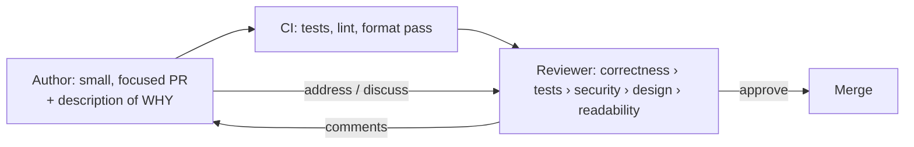

# Code Reviews

> A second pair of eyes on every change before it merges — the cheapest way to catch bugs, spread
> knowledge, and keep a codebase coherent. Done well it's a conversation; done badly it's a
> bottleneck or a battleground.

## Top-down: where you already meet this
You've opened a pull request and waited for an approval, or left a comment on someone else's. That
gate — "another engineer reads this before it ships" — is code review. Its value isn't just
bug-catching; it's how the *whole team* stays aware of the code and how standards actually get
enforced (a [linter](./readable-code.md) can't judge whether a design makes sense).

## Problem
The author of a change is the worst person to spot its flaws — they have the context that hides the
gap, the typo, the missed edge case. And in a team, code written by one person is *maintained by
everyone*. Code review addresses both: a fresh reader catches what the author can't, and reviewing
spreads knowledge of the code so there's no single point of failure. The challenge is doing it
*without* becoming a slow, ego-bruising bottleneck.

## Core concepts
**What a reviewer should actually look for** (in priority order):
1. **Correctness** — does it do what it claims? Edge cases, error paths, off-by-ones, concurrency.
2. **Tests** — is the behavior covered? Would a regression be caught? (See [testing](../testing/testing-fundamentals.md).)
3. **Security** — input validation, authz, secrets, injection (see [secure coding](../security/secure-coding.md)).
4. **Design fit** — does it match the codebase's patterns and the right [coupling/cohesion](../../../architecture-patterns/1-knowledge/fundamentals/coupling-and-cohesion.md)? Is it the simplest thing?
5. **Readability** — will the next person understand it? Naming, clarity (see [readable code](./readable-code.md)).

Crucially, *not* the reviewer's job: rewriting it their way, or nitpicking style a
[formatter](./readable-code.md) should auto-fix. **Automate the mechanical, review the judgment.**



**The single biggest lever: small PRs.** Review quality falls off a cliff with size — a focused
200-line PR gets real scrutiny; a 2,000-line PR gets "LGTM." Keep changes small (a
[version-control](../version-control/git-and-workflows.md) habit) and reviews stay effective.

### The human side (where reviews go wrong)
- **Comment on the code, not the coder.** "This function could be simpler" not "you wrote this
  badly." Ask questions ("what happens if `x` is null?") rather than issue commands.
- **Distinguish blocking from optional.** Prefix nits (`nit:`) so the author knows what's required
  vs. nice-to-have. Don't block a merge on taste.
- **Be timely.** A PR blocked for two days kills momentum; review within hours, not days.
- **Authors: make it reviewable.** Small, self-explanatory diff, a description of *why*, and
  respond graciously — reviews are about the code, not your worth.

## Essential terminology
| Term | Meaning |
| --- | --- |
| **PR / MR** | Pull/Merge Request — the change proposed for review |
| **LGTM** | "Looks good to me" — approval |
| **Nit** | A minor, non-blocking suggestion (style/taste) |
| **Blocking comment** | Must be resolved before merge |
| **Bikeshedding** | Wasting review on trivial issues while ignoring the important ones |
| **Rubber-stamping** | Approving without really reading (the failure mode of big PRs) |

## Example
The same feedback, ineffective vs. effective:

```text
❌ "This is wrong. Rewrite it."
✅ "If `items` is empty this divides by zero (line 12) — add a guard or test for the empty case?"

❌ "Bad variable name."
✅ "nit: `d` → `daysElapsed` would read clearer. Non-blocking."
```
Specific, kind, actionable, and clear about what blocks merge. See review + PR craft applied
end-to-end in the [anatomy of a good PR case study](../../2-case-studies/anatomy-of-a-good-pr.md).

## Trade-offs
- ✅ Catches bugs early and cheaply, spreads knowledge (bus-factor insurance), enforces standards,
  and keeps the codebase coherent.
- ⚠️ Can become a **bottleneck** (slow reviews block everyone) or **toxic** (harsh, nitpicky
  reviews hurt morale and slow people down). Big PRs cause both — keep them small.
- ⚠️ Reviews catch *some* bugs, not all — they complement, never replace,
  [automated tests](../testing/testing-fundamentals.md) and CI. Don't review what a tool can check.

## Real-world examples
- **GitHub/GitLab PRs** with required approvals + green CI before merge are the industry default.
- **Google's** review culture (readability certifications, "send small CLs") is a well-documented
  model; its engineering practices docs are widely cited.

## References
- Google — [Engineering Practices: Code Review](https://google.github.io/eng-practices/review/)
- [Version control & workflows](../version-control/git-and-workflows.md) · [Testing fundamentals](../testing/testing-fundamentals.md) · [Readable code](./readable-code.md)
