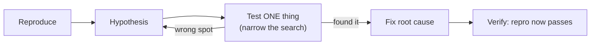

# Debugging

> Debugging is finding **where reality diverges from your mental model** of the code — and it's a
> systematic discipline, not luck. The single most-used daily skill in engineering, yet rarely taught
> on purpose.

## Top-down: where you already meet this
You've dropped a `print("HERE")` into a function to see why it misbehaves. That instinct *is*
debugging — but done ad hoc, it's slow and frustrating. The difference between an engineer who fixes
a bug in five minutes and one who flails for two hours is rarely talent; it's **method**. Debugging
is the scientific method applied to code, and it's learnable.

## Problem
Your code does something you didn't intend. Somewhere, the program's actual behavior parts ways from
what you believe it does — and that gap could be anywhere across thousands of lines, libraries, and
state. Guessing ("maybe it's this?") and changing things at random is slow and often *adds* bugs. The
goal is to **shrink the search space methodically** until the divergence point is cornered, then fix
the *root cause* — not the symptom.

## Core concepts
**1. Reproduce it first.** A bug you can't trigger on demand, you can't fix or verify. Pin down the
exact inputs/steps that cause it. The gold standard: capture it as a **failing
[test](../testing/testing-fundamentals.md)** — now you have a one-command repro *and* proof when it's
fixed.

**2. Read the error — it's a map, not noise.** A stack trace names the failing line and the chain of
calls that reached it. Read it **bottom-up** to the deepest frame *in your code*; the exception type
and message usually name the problem. Most "I'm stuck" moments are skipped stack traces.

**3. Form a hypothesis, then test *one* thing.** State a specific, falsifiable guess ("the list is
empty when `total()` runs"), predict what you'd observe if it's true, then check exactly that.
Changing several things at once means you won't know which one mattered — **change one variable at a
time**, like a science experiment.

**4. Binary-search the bug.** Don't read every line — *halve* the suspect region. Does the value look
right at the midpoint? If yes, the bug is downstream; if no, upstream. A handful of halvings corners
a bug in a huge codebase. The same idea across *commits* is
[`git bisect`](../version-control/git-and-workflows.md) — find the commit that introduced a
regression in `log₂(n)` steps.



**5. Reach for the right tool.** A **debugger** (breakpoints, stepping, inspecting live state) beats
scattering prints when state is complex — you pause time and look around. Quick checks or
hard-to-pause systems (async, production) often favor **logging**. **Rubber-duck debugging** —
explaining the code aloud, line by line — works because articulating your assumptions exposes the
wrong one.

## Essential terminology
| Term | Meaning |
| --- | --- |
| **Reproduction (repro)** | The minimal, reliable steps that trigger the bug |
| **Stack trace** | The call chain + line where an error occurred — read bottom-up to your code |
| **Breakpoint** | A marked line where the debugger pauses so you can inspect state |
| **Step over / into** | Run the next line / descend into the function it calls |
| **Bisection** | Halving the search space (code region or commit history) to localize a fault |
| **Regression** | A bug newly introduced by a change to previously-working code |
| **Root cause** | The actual origin of a bug, vs. the symptom it shows |
| **Heisenbug** | A bug that vanishes when you observe it (timing/ordering-dependent) |

## Example
Read the trace bottom-up — it points straight at the culprit:

```
Traceback (most recent call last):
  File "app.py", line 42, in <module>      #  ← where it started
    print(average(scores))
  File "app.py", line 7, in average
    return sum(values) / len(values)       #  ← deepest frame in MY code: the real scene
ZeroDivisionError: division by zero        #  ← the WHAT
```
The trace hands you the file, line, and cause: `average([])` divided by `len([]) == 0`. No guessing —
hypothesis confirmed by reading three lines. The fix targets the root cause (guard the empty case),
and you'd lock it in with a failing-then-passing test `average([]) == 0`.

## Common tools
| Tool | What it is | Use it for |
| --- | --- | --- |
| `pdb` / `gdb` / IDE debugger | Interactive breakpoints + state inspection | Complex state, "how did it get here?" |
| Browser DevTools | JS debugger + network/DOM inspector | Front-end behavior, failed requests |
| `git bisect` | Binary-search commit history | Finding which commit caused a regression |
| Logging | Recorded events with context/levels | Async, production, intermittent bugs |
| `print` / `console.log` | Ad-hoc value dumps | Fast, throwaway checks |

## Trade-offs
- ✅ A debugger shows *all* live state at a paused moment — unbeatable for tangled logic — ⚠️ but is
  awkward across async boundaries, multiple processes, or production.
- ✅ Logging works where you can't pause (prod, concurrency) and leaves a durable trail — ⚠️ but you
  only see what you thought to log, and noise drowns signal.
- ⚠️ The anti-pattern is **debugging by random mutation** — changing code hoping it helps. It wastes
  time and breeds new bugs. Always: reproduce → hypothesize → test one thing.
- Fixing the **symptom** (catch the error, hide it) instead of the **root cause** just relocates the
  bug. Ask *why* until you reach the origin.

## Real-world examples
- **`git bisect`** routinely localizes a regression to one commit across thousands — the industry's
  standard move when "it worked last week."
- **Observability** ([logs, metrics, traces](../../../devops-infrastructure/1-knowledge/observability/observability.md))
  is debugging scaled to distributed systems you can't pause — the production counterpart of a
  breakpoint.

## References
- [Testing fundamentals](../testing/testing-fundamentals.md) (a failing test is the best repro) · [Git & workflows](../version-control/git-and-workflows.md) (`git bisect`) · [Writing readable code](./readable-code.md) (clear code is easier to debug)
- David Agans — *Debugging: The 9 Indispensable Rules*; Andreas Zeller — *Why Programs Fail*
