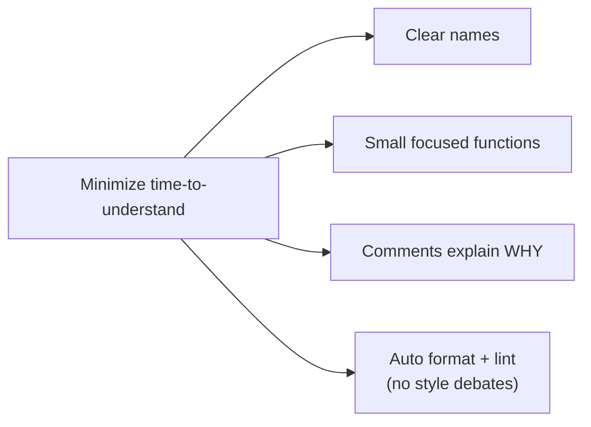

# Writing Readable Code

> Code is read far more than it's written, so optimize for the **reader**: clear names, small
> focused functions, and comments that explain *why*. This is the small-scale craft —
> [Architecture & Patterns](../../../architecture-patterns/) owns the *design*; this owns the
> line-by-line clarity.

## Top-down: where you already meet this
You've opened a file and instantly understood it — or stared at `for (i=0;i<n;i++){d(x[i],t)}`
wondering what any of it means. The difference is rarely cleverness; it's whether the author wrote
for the next reader (often *future you*). Readable code is a learnable craft, separate from being
"smart."

## Problem
A line of code is written once and read dozens of times — during debugging, reviews, extensions,
onboarding. Code optimized to be quick to *write* (cryptic names, giant functions, cleverness) is
expensive to *read*, and reading is where the time actually goes. Worse, unclear code hides bugs.
The goal is to minimize the time it takes a competent stranger to understand and safely change your
code.

> 🔗 **Scope:** this is about *local clarity* — naming, function size, comments. The bigger
> structural rules ([SOLID](../../../architecture-patterns/1-knowledge/fundamentals/solid-principles.md),
> [coupling/cohesion](../../../architecture-patterns/1-knowledge/fundamentals/coupling-and-cohesion.md),
> [DRY/KISS/YAGNI](../../../architecture-patterns/1-knowledge/fundamentals/core-design-principles.md))
> live in Architecture & Patterns. Read both; don't confuse "tidy lines" with "good design."

## Core concepts
- **Names are the most important comments.** A good name removes the need for explanation. Reveal
  *intent* (`daysUntilExpiry`, not `d`); avoid abbreviations and "meaningless" names (`data`,
  `tmp`, `manager`); make them searchable and pronounceable. Renaming for clarity is one of the
  highest-leverage edits you can make.
- **Small, single-purpose functions.** A function should do one thing at one level of abstraction
  and you should be able to read it top-to-bottom like prose. Long functions and deep nesting are
  where bugs hide; extract and use **guard clauses** (early returns) to flatten them.
- **Comments explain *why*, not *what*.** The code says what it does; comments capture the
  *reason*, the gotcha, the link to a ticket — context the code can't. A comment restating the code
  (`i += 1  # increment i`) is noise; a comment that explains a non-obvious workaround is gold.
  **The best comment is often a better name** that made the comment unnecessary.
- **Consistency > personal taste.** Match the surrounding code's style. **Automate formatting**
  (Prettier, Black, gofmt) and **linting** (ESLint, Ruff, Pylint) so style is never argued in
  [review](./code-reviews.md) — the machine handles it, humans discuss substance.



## Essential terminology
| Term | Meaning |
| --- | --- |
| **Self-documenting code** | Code clear enough that names/structure explain it without comments |
| **Guard clause** | An early return that handles an edge case up front, flattening nesting |
| **Linter** | Static tool flagging likely bugs/smells (unused vars, shadowing) |
| **Formatter** | Tool that auto-applies a canonical style (Black, Prettier, gofmt) |
| **Cyclomatic complexity** | A count of branches in a function — high = hard to read & test |
| **Code smell** | A surface symptom (long function, deep nesting) hinting at a deeper problem |

## Example
Same logic, optimized for the writer vs. the reader:

```python
# ⚠️ written fast — cryptic names, nested, a redundant comment
def p(u, o):
    if u:                       # check user
        if o > 0:
            return o * 0.9
    return o
```
```python
# ✅ written for the reader — intent-revealing names + a guard clause
MEMBER_DISCOUNT = 0.10

def price_for(is_member: bool, order_total: float) -> float:
    if not is_member or order_total <= 0:        # guard clause: handle the trivial case first
        return order_total
    return order_total * (1 - MEMBER_DISCOUNT)
```
No comment needed — the names and the named constant *are* the documentation.

## Trade-offs
- ✅ Readable code is faster to debug, review, extend, and onboard into — it pays back every time
  the code is read (which is constantly).
- ⚠️ Don't over-rotate: extracting every two lines into a micro-function can *hurt* readability
  (you chase definitions across files); "self-documenting" is not an excuse to delete genuinely
  helpful comments. Clarity is the goal, not a rule count.
- ⚠️ Readability ≠ good design. Beautifully-named code can still be
  [tightly coupled](../../../architecture-patterns/1-knowledge/fundamentals/coupling-and-cohesion.md)
  and unmaintainable — this craft is necessary, not sufficient.

## Real-world examples
- **Style guides** (Google's per-language guides, PEP 8, Airbnb JS) codify these conventions so
  whole orgs read consistently.
- **CI lint/format gates** (`black --check`, `ruff`, `eslint`) reject unformatted code
  automatically — see [continuous integration](../../../devops-infrastructure/1-knowledge/ci-cd/continuous-integration.md).

## References
- Robert C. Martin — *Clean Code*; Kernighan & Plauger — *The Elements of Programming Style*
- [Code reviews](./code-reviews.md) · [Architecture & Patterns: core design principles](../../../architecture-patterns/1-knowledge/fundamentals/core-design-principles.md)
