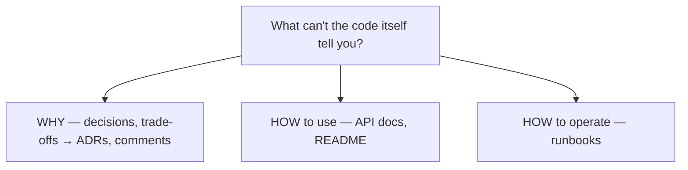

# Documentation

> Code says *what* the system does today; documentation captures what code can't — *why* it's built
> this way, *how* to use it, and the decisions behind it. The goal isn't "more docs," it's the
> *right* docs that stay true.

## Top-down: where you already meet this
You've landed in a new repo and lived or died by its README. You've `git blame`d a weird line
wishing someone had written *why*. You've used an API by reading its docs, not its source. Each is
documentation doing the job code can't — onboarding, explaining intent, and exposing a usable
surface.

## Problem
Knowledge that lives only in one engineer's head, or only in the code, doesn't scale: people leave,
context evaporates, and the *reasons* behind decisions are invisible in the diff. But docs have a
fatal failure mode — they **drift** out of sync with code and become actively misleading. So the
real problem is twofold: document the things code *can't* express, and keep those docs *close to
the code and cheap to maintain* so they stay true.

## Core concepts — the kinds of docs and who they serve
| Doc | Answers | Audience | Lives… |
| --- | --- | --- | --- |
| **README** | "What is this & how do I run it?" | Anyone landing in the repo | Repo root |
| **API docs / docstrings** | "How do I call this function/endpoint?" | Callers/consumers | In code, often auto-generated |
| **ADR** (Architecture Decision Record) | "*Why* did we choose X over Y?" | Future maintainers | In-repo, dated, immutable |
| **Runbook** | "It's 3am and it's broken — what do I do?" | On-call ops | Ops wiki / repo |
| **Inline comments** | "*Why* this non-obvious line?" | The next code reader | Next to the code ([readable code](../code-quality/readable-code.md)) |

The most under-used and highest-value is the **ADR**: a short, dated note recording a decision, the
options considered, and the *why*. It answers the question that haunts every codebase a year later —
"why on earth is it done this way?" — and it's cheap (a markdown file per decision).



### Keep docs alive (the hard part)
- **Closer to code = truer.** Docstrings and in-repo markdown get updated in the same PR as the
  code; a separate wiki rots. Put docs where the change happens.
- **Document the *why*, let code show the *what*.** Auto-generate API references from code/types;
  hand-write only what can't be derived (intent, rationale, gotchas).
- **Treat docs as part of "done."** A feature isn't finished until its README/API doc is updated —
  enforce it in [code review](../code-quality/code-reviews.md).
- **Less, but accurate, beats exhaustive but stale.** A wrong doc is worse than no doc.

## Essential terminology
| Term | Meaning |
| --- | --- |
| **README** | The repo's front door: purpose, setup, usage, run/test commands |
| **ADR** | Architecture Decision Record — a dated note on *why* a decision was made |
| **Docstring** | In-code documentation of a function/class/module (often tool-extracted) |
| **Runbook** | Step-by-step ops guide for operating/recovering a system |
| **Doc drift / rot** | Docs falling out of sync with the code they describe |
| **Docs-as-code** | Docs in version control, reviewed and CI-checked like code |

## Example
A docstring documents the *contract* (and doubles as a usage example tests can run):

```python
def transfer(account_from, account_to, amount):
    """Move `amount` between accounts atomically.

    Why a single transaction: a partial transfer would create or destroy money.
    Raises InsufficientFunds if `account_from` lacks the balance.

    >>> transfer(a, b, 50)   # this example is checkable via doctest
    """
```
And an **ADR** stub — the format that saves future-you:
```markdown
# ADR 007: Use Postgres over MongoDB for the orders service
Status: accepted · Date: 2026-06-09
Context: orders need multi-row transactions & strong consistency.
Decision: Postgres. Considered Mongo (rejected: weaker multi-doc txns at the time).
Consequences: relational schema migrations; no native horizontal sharding (revisit at scale).
```

## Trade-offs
- ✅ Docs scale knowledge beyond individuals, slash onboarding time, preserve the *why*, and make
  APIs usable without reading source.
- ⚠️ **Drift is the killer** — stale docs mislead and erode trust. Minimize hand-written prose that
  duplicates code; auto-generate what you can; keep the rest in-repo and reviewed.
- ⚠️ Over-documentation is its own waste: nobody reads (or updates) a 50-page design doc for a small
  service. Match doc weight to the audience and the cost of getting it wrong.

## Real-world examples
- **ADRs** (popularized by Michael Nygard) are now common in-repo (`docs/adr/0001-*.md`) — the
  swedocs `_TEMPLATE.md` + per-area READMEs are themselves docs-as-code.
- **Docstring tooling** (Sphinx, JSDoc, Javadoc, OpenAPI/Swagger) auto-builds reference docs from
  code so the *what* never drifts from the source.

## References
- Michael Nygard — [Documenting Architecture Decisions](https://cognitect.com/blog/2011/11/15/documenting-architecture-decisions) · [adr.github.io](https://adr.github.io/)
- [Readable code](../code-quality/readable-code.md) · [Code reviews](../code-quality/code-reviews.md)
