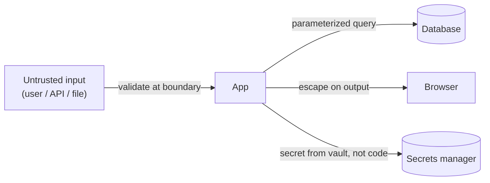

# Secure Coding

> Most breaches aren't exotic — they're the *same handful of mistakes* repeated: trusting user
> input, leaking secrets, weak authz. Secure coding is the developer's share of security: build
> these habits in so the common attacks just don't work.

## Top-down: where you already meet this
You've concatenated a user value into a SQL query, rendered user text into HTML, or committed an
API key "just temporarily." Each is a textbook vulnerability. Secure coding is recognizing those
moments and reaching for the safe pattern automatically — it's a *coding* concern, not just the
security team's job.

## Problem
Any input from outside your trust boundary (users, other services, files) is potentially hostile,
and a single overlooked spot can expose all your data or hand over control. The same classes of bug
dominate breach reports year after year (the **OWASP Top 10**), which is good news: defending
against a known, finite list of patterns is tractable. The goal is to make the secure way the
*default* way you write code.

> 🔗 This is **application/code-level** security. Infrastructure-level security lives in neighbours:
> [TLS/HTTPS](../../../computer-networks/1-knowledge/security/tls-https.md) &
> [network attacks](../../../computer-networks/1-knowledge/security/network-attacks-and-defenses.md)
> (Networks), [IAM/least-privilege](../../../devops-infrastructure/1-knowledge/cloud/aws-iam.md)
> (DevOps), and [OS access control](../../../operating-systems/1-knowledge/security/protection-access-control.md).

## Core concepts — the recurring bugs and their fixes
| Vulnerability | The mistake | The habit that prevents it |
| --- | --- | --- |
| **Injection** (SQL, command, etc.) | Building a query/command by string-concatenating input | **Parameterized queries** / safe APIs — never concatenate input into code |
| **XSS** (cross-site scripting) | Rendering user input as HTML/JS | **Escape/encode on output**; use a templating engine that auto-escapes |
| **Broken auth / access control** | Trusting client-supplied identity/role; missing checks | Check authz **server-side, on every request**; deny by default |
| **Secrets in code** | API keys/passwords in source or commits | **Secret managers / env vars**; never commit secrets; rotate on leak |
| **Vulnerable dependencies** | Using libs with known CVEs | Scan deps (`npm audit`, Dependabot); patch promptly |
| **Sensitive data exposure** | Plaintext passwords, logging PII | Hash passwords (bcrypt/argon2), encrypt in transit & at rest |

Three principles sit under all of them:
- **Never trust input — validate & sanitize at the boundary.** Treat everything from outside as
  hostile until proven safe (allow-lists beat deny-lists).
- **Separate code from data.** Injection happens when input is interpreted as code; parameterization
  keeps the two apart. This is *the* root cause of the #1 class of bugs.
- **Least privilege & defense in depth.** Every component gets the *minimum* access it needs, and
  you assume any single layer can fail — so there's another behind it.



## Essential terminology
| Term | Meaning |
| --- | --- |
| **OWASP Top 10** | The canonical list of the most critical web app security risks |
| **Injection** | Untrusted input interpreted as code/commands (SQLi, command injection) |
| **Parameterized query** | Query with placeholders; the driver keeps data ≠ code (kills SQLi) |
| **XSS** | Injecting scripts into pages other users view |
| **AuthN vs. AuthZ** | *Who you are* (authentication) vs. *what you may do* (authorization) |
| **Least privilege** | Grant the minimum access necessary, nothing more |
| **Defense in depth** | Multiple independent layers, so one failure isn't fatal |

## Example
The #1 vulnerability and its one-line fix — **never build SQL by concatenation**:

```python
# ❌ SQL injection: input "x'; DROP TABLE users; --" becomes executable SQL
cur.execute("SELECT * FROM users WHERE name = '" + name + "'")

# ✅ parameterized: the driver sends data separately from the query — input can never be code
cur.execute("SELECT * FROM users WHERE name = ?", (name,))
```
Find and fix injection, command-exec, and a hardcoded secret hands-on in
[lab: find the vulnerabilities](../../3-practice/lab-find-vulnerabilities.md); see a breach traced
to bad code in the [OWASP case study](../../2-case-studies/preventing-owasp-top-bugs.md).

## Trade-offs
- ✅ A handful of habits (parameterize, escape, validate, least-privilege, no secrets in code)
  eliminate the *majority* of real-world breaches at near-zero cost.
- ⚠️ Security is a **spectrum, not a checkbox** — these stop the common attacks, not a determined,
  well-resourced adversary; high-stakes systems need threat modeling, pen-testing, and audits.
- ⚠️ Don't roll your own crypto/auth — use vetted libraries and standards (OAuth/OIDC, argon2). The
  most dangerous security code is the clever bespoke kind.
- Secure-by-default *frameworks* help enormously (auto-escaping templates, ORMs that parameterize) —
  use the safe path the framework gives you instead of going around it.

## Real-world examples
- **SQL injection** still causes major breaches decades after the fix was known — because someone
  concatenated input. Parameterized queries are non-negotiable.
- **Leaked credentials** in public Git repos are scraped within minutes by bots — hence secret
  scanning (GitHub secret scanning, `gitleaks`) and immediate rotation.

## References
- [OWASP Top 10](https://owasp.org/www-project-top-ten/) · [OWASP Cheat Sheet Series](https://cheatsheetseries.owasp.org/)
- Neighbours: [TLS/HTTPS](../../../computer-networks/1-knowledge/security/tls-https.md) · [AWS IAM](../../../devops-infrastructure/1-knowledge/cloud/aws-iam.md) · [code reviews](../code-quality/code-reviews.md)
