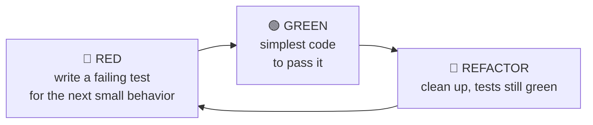

# Test Doubles & Test-Driven Development

> Two techniques that make [unit testing](./testing-fundamentals.md) practical: **test doubles**
> (stand-ins for real dependencies, so you can test in isolation) and **TDD** (write the test
> *first*, let it drive the design).

## Top-down: where you already meet this
You've wanted to test "what happens when the payment API times out" without actually calling
Stripe, or "does it email the user" without sending real email. You need a *fake* in place of the
real thing — a test double. And you've felt the difference between code written test-first (clean,
decoupled) and code you tried to bolt tests onto afterward (a fight). TDD is the discipline that
produces the former.

## Problem
Real units depend on things that are slow, costly, non-deterministic, or have side effects — a
database, a network call, the clock, a random generator, sending email. A [unit test](./testing-fundamentals.md)
must be **fast, isolated, and deterministic**, so it can't use the real ones. *Test doubles* solve
that. Separately: testing *after* the fact often reveals the code is hard to test (tightly
coupled) — *TDD* flips the order so testability (and thus good design) is baked in from the start.

## Core concepts
### Test doubles — the five kinds (Meszaros)
All replace a real dependency; they differ by *what they help you check*:

| Double | What it does | Use to… |
| --- | --- | --- |
| **Dummy** | Passed but never used (fills a parameter) | Satisfy a signature |
| **Stub** | Returns canned answers | Control *inputs* ("the API returns 500") |
| **Fake** | A working but lightweight impl (in-memory DB) | Replace heavy infra realistically |
| **Spy** | A stub that also records how it was called | Verify a call happened, after the fact |
| **Mock** | Pre-programmed with expectations, asserts them | Verify *interactions* ("`charge()` was called once") |

In casual use everyone says "mock" for all of these — but the distinction matters: **stubs verify
*state* (the return value), mocks verify *behavior* (the interaction).** Over-using mocks couples
tests to implementation; prefer stubs/fakes where you can.

### TDD — red, green, refactor

Tiny cycles, minutes each. The tests come *first*, so: (1) you only write code that's needed,
(2) the code is testable by construction (forces [loose coupling / DI](../../../architecture-patterns/1-knowledge/architectural-styles/dependency-injection.md)),
and (3) you get a regression suite for free. The famous discipline is **"write no production code
without a failing test."**

## Essential terminology
| Term | Meaning |
| --- | --- |
| **Test double** | Any stand-in for a real dependency in a test (umbrella term) |
| **Stub vs. mock** | Returns canned data (state) vs. asserts it was called a certain way (behavior) |
| **Fake** | A real-ish lightweight implementation (e.g. in-memory repository) |
| **TDD** | Test-Driven Development: red → green → refactor |
| **Seam** | A place you can substitute a double — usually an injected interface |
| **Over-mocking** | So many mocks the test just restates the code; passes while reality is broken |

## Example
Test the "payment times out" path with a **stub**, and verify a receipt is sent with a **mock** —
using Python's built-in `unittest.mock` (no install):

```python
from unittest.mock import Mock
import unittest

class Checkout:
    def __init__(self, gateway, mailer):    # dependencies injected → testable seams
        self.gateway, self.mailer = gateway, mailer
    def pay(self, order):
        self.gateway.charge(order.total)
        self.mailer.send_receipt(order)

class TestCheckout(unittest.TestCase):
    def test_timeout_is_not_swallowed(self):
        gateway = Mock()
        gateway.charge.side_effect = TimeoutError      # STUB the failure
        with self.assertRaises(TimeoutError):
            Checkout(gateway, Mock()).pay(Mock(total=100))

    def test_receipt_sent_after_charge(self):
        mailer = Mock()
        order = Mock(total=100)
        Checkout(Mock(), mailer).pay(order)
        mailer.send_receipt.assert_called_once_with(order)   # MOCK: verify the interaction
```
Build a feature test-first in [lab: a TDD kata](../../3-practice/lab-tdd-kata.md) and practice
doubles in [lab: test doubles](../../3-practice/lab-test-doubles.md).

## Trade-offs
- ✅ Doubles make slow/unpredictable dependencies testable; TDD yields decoupled, well-covered,
  minimal code and a fast feedback loop.
- ⚠️ **Over-mocking** is the cardinal sin: mock everything and your test just mirrors the code —
  it passes even when the real integration is broken. Prefer **fakes/stubs**, and back unit tests
  with a few [integration tests](./testing-fundamentals.md) that use the real thing.
- ⚠️ TDD has a learning curve and isn't dogma — for exploratory/spike code, test-after is fine.
  The goal is *fast feedback + testable design*, not ritual.

## Real-world examples
- **In-memory fakes** (a `FakeUserRepo` behind a [repository port](../../../architecture-patterns/1-knowledge/architectural-styles/layered-hexagonal-clean.md))
  are the standard way to unit-test business logic with no database — see the
  [hexagonal refactor case study](../../../architecture-patterns/2-case-studies/refactoring-to-hexagonal.md).
- **TDD katas** (FizzBuzz, String Calculator, Bowling) are how teams practice the rhythm.

## References
- Gerard Meszaros — *xUnit Test Patterns* (the test-double vocabulary)
- Kent Beck — *Test-Driven Development: By Example*
- [Testing fundamentals](./testing-fundamentals.md) · [Dependency injection](../../../architecture-patterns/1-knowledge/architectural-styles/dependency-injection.md)
