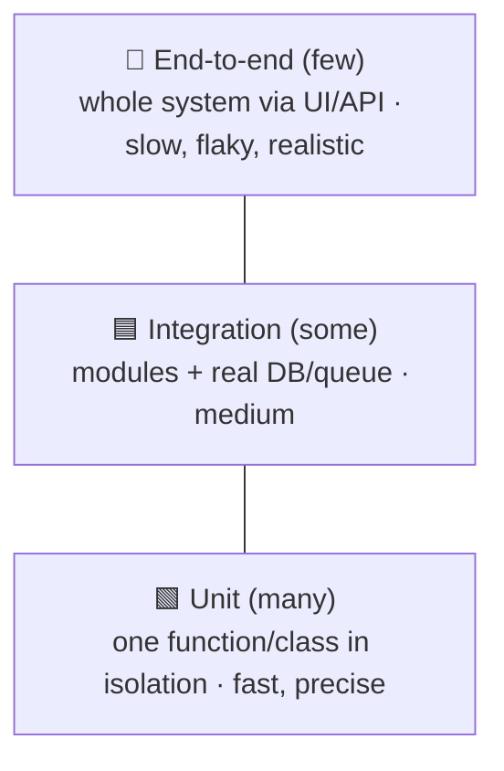

# Testing Fundamentals

> Tests are how you **change code without fear**. They're an executable spec that catches your
> mistakes in seconds instead of in production — the safety net every other practice (refactoring,
> CI/CD, code review) leans on.

## Top-down: where you already meet this
You've manually re-clicked through an app after a change to "make sure nothing broke," and you've
shipped a fix that quietly broke something else. Automated tests are that manual checking, written
once and run forever — so the machine catches regressions instead of your users.

## Problem
Software is changed constantly and read far more than written. Every change risks breaking
something that *was* working. Without automated tests, the only safety net is manual checking
(slow, incomplete, gets skipped under pressure) and production incidents (expensive, late). The
later a bug is found, the more it costs — a bug caught by a unit test is cents; the same bug in
production is hours of debugging plus customer trust. Testing exists to **shift bug-discovery as
early as possible** and make change safe.

## Core concepts — the test pyramid
Tests come in layers that trade **speed/isolation** against **realism**:



| Layer | Tests… | Speed | When it fails you know… |
| --- | --- | --- | --- |
| **Unit** | One function/class, dependencies faked | Milliseconds | *Exactly* which unit is wrong |
| **Integration** | Several parts together (code + real DB, two services) | Seconds | The wiring/contract between parts broke |
| **End-to-end (E2E)** | The whole system as a user hits it | Seconds–minutes | "Something" in a real flow broke (but not precisely what) |

**The pyramid rule:** have *many* fast unit tests, *some* integration tests, *few* E2E tests. The
common anti-pattern is the **ice-cream cone** (mostly slow E2E tests) — a suite that's slow,
flaky, and tells you little when it fails.

### What makes a good test
- **Fast** — runs in milliseconds so you run it constantly (the basis of [TDD](./test-doubles-and-tdd.md)).
- **Isolated & deterministic** — no shared state, no network/clock/random; same result every run.
  A test that fails intermittently (**flaky**) is worse than none — people learn to ignore it.
- **Tests behavior, not implementation** — assert *what* the code does (its contract), not *how*,
  so refactoring doesn't break the test.
- **Readable** — Arrange-Act-Assert; one logical reason to fail; a name that states the expectation.

## Essential terminology
| Term | Meaning |
| --- | --- |
| **Unit / integration / E2E** | The three pyramid layers (isolated → wired → whole-system) |
| **Regression test** | A test added to lock in a bug fix so it can't come back |
| **Flaky test** | Passes/fails non-deterministically — erodes trust in the suite |
| **Coverage** | % of code executed by tests — useful signal, *terrible* target (see trade-offs) |
| **Arrange-Act-Assert (AAA)** | The 3-part shape of a clean test: set up, do the thing, check the result |
| **Test fixture** | Shared setup/teardown for a group of tests |

## Example
A unit test in Python's built-in `unittest` — Arrange, Act, Assert:

```python
import unittest

def discount(price, is_member):
    return price * 0.9 if is_member else price

class TestDiscount(unittest.TestCase):
    def test_members_get_10_percent_off(self):
        result = discount(100, is_member=True)     # Arrange + Act
        self.assertEqual(result, 90)               # Assert

    def test_non_members_pay_full(self):
        self.assertEqual(discount(100, is_member=False), 100)
```
```bash
python3 -m unittest -v       # runs in milliseconds, tells you exactly what broke
```
Practice driving code *from* tests in [lab: a TDD kata](../../3-practice/lab-tdd-kata.md).

## Trade-offs
- ✅ Tests enable fearless change, document behavior by example, catch regressions, and are the
  gate in [CI/CD](../../../devops-infrastructure/1-knowledge/ci-cd/continuous-integration.md).
- ⚠️ **Coverage as a target is a trap** — 100% coverage of trivial getters proves nothing;
  Goodhart's law applies. Use coverage to *find untested risk*, not as a KPI.
- ⚠️ Over-testing implementation details makes refactoring painful (tests break on safe changes);
  over-mocking makes tests pass while the real integration is broken. Test *behavior* and keep the
  pyramid balanced.
- Testable code is well-designed code: hard-to-test usually means tightly coupled — which is why
  testing and [dependency injection](../../../architecture-patterns/1-knowledge/architectural-styles/dependency-injection.md)
  go hand in hand.

## Real-world examples
- **CI gates** run the unit+integration suite on every push; a red suite blocks merge — see the
  [CI/CD pipeline case study](../../../devops-infrastructure/2-case-studies/ci-cd-pipeline.md).
- **Google's** testing culture popularized the pyramid and "no flaky tests" hygiene at scale.

## References
- Martin Fowler — [TestPyramid](https://martinfowler.com/bliki/TestPyramid.html) · [Test Coverage](https://martinfowler.com/bliki/TestCoverage.html)
- Next: [Test doubles & TDD](./test-doubles-and-tdd.md) · [Code reviews](../code-quality/code-reviews.md)
