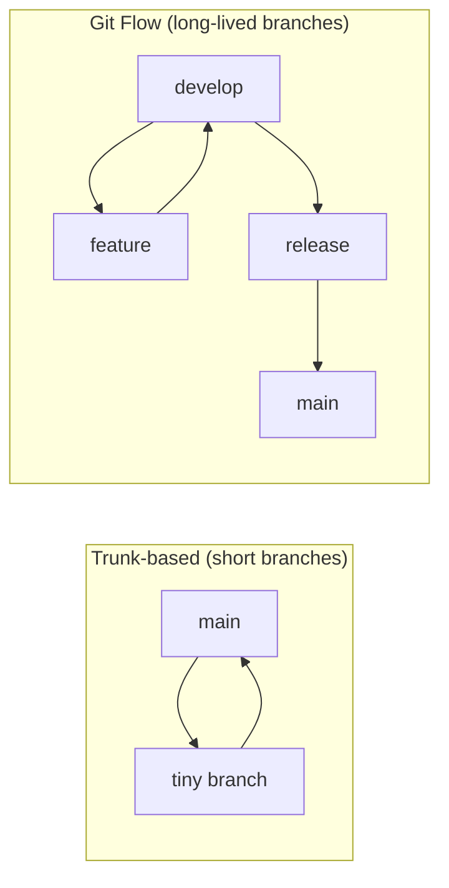

# Version Control & Git Workflows

> Version control is the **time machine and collaboration layer** for code — and *how your team
> agrees to use it* (branching, commits, PRs) is the difference between smooth shipping and merge
> hell. Git is the tool; the workflow is the practice.

## Top-down: where you already meet this
You've done `git commit`, hit a merge conflict, and opened a pull request. What you may not have
named is the *workflow* — the team's rules for how branches are created, reviewed, and merged.
Two teams using the same Git can have wildly different experiences depending on that agreement.

## Problem
Multiple people change the same codebase simultaneously and need to: never lose work, understand
*why* a change was made, integrate changes without clobbering each other, and ship safely while
work-in-progress exists. Git provides the mechanism (a full history, cheap branches); but without a
shared **workflow** you get long-lived divergent branches, painful merges, and an unreadable
history. The practice is choosing and following conventions that keep integration cheap.

## Core concepts
**Git's model in one line:** the history is a graph of **commits** (immutable snapshots, each
pointing to its parent); a **branch** is just a movable pointer to a commit; merging combines two
lines of history. Branches are cheap, which is what makes the workflows below possible.

### Branching strategies — the main spectrum


| Strategy | How | Best for |
| --- | --- | --- |
| **Trunk-based** | Short-lived branches merged to `main` *daily*; `main` always releasable | CI/CD, frequent deploys (most modern teams) |
| **GitHub Flow** | One branch per feature → PR → merge to `main` → deploy | Web apps / continuous deployment |
| **Git Flow** | Long-lived `develop`+`release`+`hotfix` branches | Versioned/released software (slower cadence) |

The clear modern trend is **trunk-based / short-lived branches**: the longer a branch lives, the
more it diverges and the worse the merge. This pairs directly with
[continuous integration](../../../devops-infrastructure/1-knowledge/ci-cd/continuous-integration.md)
— "integrate continuously" *means* short branches.

### Good commits & PRs (the craft)
- **Atomic commits** — one logical change each; the build passes at every commit. Easy to review,
  revert, and `bisect`.
- **Meaningful messages** — *why*, not just *what*. A common convention is
  [Conventional Commits](https://www.conventionalcommits.org/) (`feat:`, `fix:`, `refactor:`).
- **Small PRs** — a 200-line PR gets a real review; a 2,000-line PR gets a rubber stamp. Small,
  focused PRs are the highest-leverage habit for [code review](../code-quality/code-reviews.md).

## Essential terminology
| Term | Meaning |
| --- | --- |
| **Commit** | An immutable snapshot + message + parent pointer(s) |
| **Branch** | A movable pointer to a commit (cheap to create) |
| **Merge vs. rebase** | Combine histories preserving both / replay your commits onto a new base for a linear history |
| **Pull/Merge Request (PR)** | A proposed merge, opened for review & CI before integrating |
| **Trunk-based development** | Everyone integrates to `main` via short-lived branches, ≥ daily |
| **`bisect`** | Binary-search the history to find the commit that introduced a bug |
| **Conflict** | Two branches changed the same lines; Git asks a human to reconcile |

## Example
A short-lived feature-branch flow (GitHub Flow), the everyday loop:

```bash
git switch -c fix/cart-total          # branch off main
# ...make a small, focused change...
git add -p                            # stage hunks deliberately (review your own diff)
git commit -m "fix: correct tax rounding on cart total"
git push -u origin fix/cart-total     # open a PR from here → review → CI → merge → delete branch
```
Practice the full loop (branch, atomic commits, conflict, merge) in
[lab: a Git feature workflow](../../3-practice/lab-git-workflow.md).

## Trade-offs
- ✅ Full history (nothing lost), safe parallel work, blame/bisect for debugging, PRs as a review
  + CI gate.
- ⚠️ **Long-lived branches are the enemy** — they maximize merge conflicts and delay integration;
  the whole point of trunk-based is to avoid them.
- ⚠️ **Rebase rewrites history** — great for a clean *local* branch, dangerous on *shared* branches
  (don't rebase what others have pulled). "Merge for shared, rebase for local" is the usual rule.
- Heavy strategies (Git Flow) add ceremony that only pays off for versioned releases; for a web
  app deploying many times a day it's overkill.

## Real-world examples
- **Open source on GitHub** runs on fork + PR + review — the workflow *is* the collaboration model.
- **Google/Meta** use trunk-based development in a monorepo with heavy CI — short-lived changes,
  always-green trunk, at massive scale.

## References
- [Pro Git book](https://git-scm.com/book) (free) · [GitHub Flow](https://docs.github.com/get-started/quickstart/github-flow)
- [Continuous integration](../../../devops-infrastructure/1-knowledge/ci-cd/continuous-integration.md) · [Code reviews](../code-quality/code-reviews.md)
