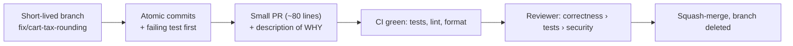

# Case Study: Anatomy of a Good Pull Request

> Follow one change from idea to merge and see [version control](../1-knowledge/version-control/git-and-workflows.md),
> [code review](../1-knowledge/code-quality/code-reviews.md), [testing](../1-knowledge/testing/testing-fundamentals.md),
> and [documentation](../1-knowledge/documentation/documentation.md) work *together* — and contrast
> it with the PR that wastes everyone's day.

## The scenario
Two engineers fix the same bug — "cart tax is rounded wrong." One opens a PR that merges in an hour
with a real review; the other opens one that sits for three days and gets a rubber-stamp. Same fix,
opposite outcomes. The difference is entirely *process craft*, and it's learnable.

## Requirements (what "good" optimizes for)
1. **Reviewable** — a human can actually understand and vet it quickly.
2. **Safe** — it can't silently break things; a regression is caught.
3. **Traceable** — six months later, *why* this change exists is obvious.

## How it works — the good PR, step by step

**1 — A focused branch & atomic commits.** One concern (`fix/cart-tax-rounding`), off an up-to-date
`main` ([trunk-based](../1-knowledge/version-control/git-and-workflows.md)). First commit: a
**failing test** that reproduces the bug ([regression test](../1-knowledge/testing/testing-fundamentals.md));
second: the fix that makes it pass. The build is green at each commit.

**2 — Small and self-explanatory.** ~80 lines touching the pricing module and its test — reviewable
in one sitting. The PR **description states the *why***: *"Tax was floored instead of rounded
half-up, undercharging by 1¢ on ~3% of carts (BUG-1234). Fix + regression test."*

**3 — CI gates before a human looks.** Tests, linter, and formatter all pass automatically — so the
reviewer never wastes time on style or "did you run the tests?" ([readable code](../1-knowledge/code-quality/readable-code.md)
automation + [CI](../../devops-infrastructure/1-knowledge/ci-cd/continuous-integration.md)).

**4 — A substantive review.** The reviewer checks what *matters* — is the rounding direction
correct? does the test actually cover the boundary? any other call sites? — and leaves specific,
kind comments, marking nits as non-blocking ([code review](../1-knowledge/code-quality/code-reviews.md)).
Approved within hours; merged; branch deleted.

## Deep dives — contrast with the bad PR
| | ✅ Good PR | ❌ Bad PR |
| --- | --- | --- |
| **Size** | 80 lines, one concern | 1,500 lines, fix + refactor + rename |
| **Tests** | Failing test first, then fix | "Tested locally" |
| **Description** | The *why* + ticket link | "fix stuff" |
| **CI** | Green before review | Reviewer finds it's broken |
| **Review** | Substantive, hours | Rubber-stamped (too big to read), 3 days |
| **History** | Clear, bisectable | One giant commit, unrevertable |

The bad PR fails **all three requirements**: too big to review (R1), no regression test (R2), and a
useless message + tangled history (R3). Notice the root cause is almost always **size** — the
single highest-leverage habit is keeping changes small.

## Trade-offs & failure modes
- ✅ Small, tested, well-described PRs merge fast, catch bugs, and leave a history you can debug
  with `git bisect` years later.
- ⚠️ "Small PRs" can fragment a coherent change across many reviews — use a stacked-PR or a tracking
  issue to keep the narrative. Balance, don't dogmatize.
- ⚠️ Process can't save a bad *design* — review and tests catch defects, not "this shouldn't exist."
  Pair this with [Architecture & Patterns](../../architecture-patterns/) judgment.

## References
- [Version control & workflows](../1-knowledge/version-control/git-and-workflows.md) · [Code reviews](../1-knowledge/code-quality/code-reviews.md) · [Testing fundamentals](../1-knowledge/testing/testing-fundamentals.md)
- Hands-on: [lab: a Git feature workflow](../3-practice/lab-git-workflow.md)
