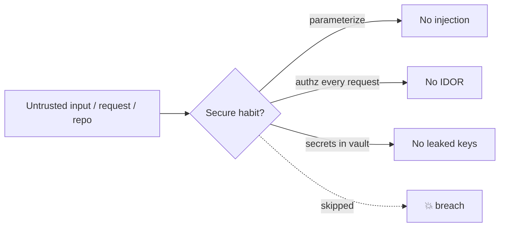

# Case Study: Preventing the OWASP Top Bugs

> Trace three real-world breaches to the exact line of code that caused them — and the one habit
> that would have stopped each. The [secure-coding](../1-knowledge/security/secure-coding.md)
> principles, shown as cause → consequence → fix.

## The scenario
A small SaaS ships a user-facing app. Over a year it suffers three incidents: a full database dump,
user accounts hijacked, and its cloud bill weaponized by a leaked key. None involved a
sophisticated attacker — each was a **known, preventable coding mistake**. This is how the
[OWASP Top 10](../1-knowledge/security/secure-coding.md) actually plays out.

## Requirements (what secure code must guarantee)
1. Untrusted input can **never** become executable code or commands.
2. Identity and permissions are enforced **server-side, every request**.
3. Secrets never live in source, and a leak is survivable.

## How it works — three incidents, three root causes

### Incident 1 — SQL injection → full DB dump
```python
# the vulnerable line:
cur.execute(f"SELECT * FROM users WHERE email = '{email}'")
```
An attacker submits `' OR '1'='1' --` as the email and the query returns every user; a crafted
`UNION SELECT` dumps password hashes. **Root cause:** input concatenated into a query, so *data
became code* (violates Req 1).
**Fix — parameterize, always:**
```python
cur.execute("SELECT * FROM users WHERE email = %s", (email,))   # driver keeps data ≠ code
```

### Incident 2 — broken access control → account takeover
```python
@app.get("/api/orders/<order_id>")
def get_order(order_id):
    return db.orders.find(order_id)        # returns ANY order by id — no ownership check
```
A user changes the `order_id` in the URL and reads other people's orders (an **IDOR** —
insecure direct object reference). **Root cause:** authentication ≠ authorization — being logged in
isn't permission to see *this* resource (violates Req 2).
**Fix — check ownership server-side, deny by default:**
```python
order = db.orders.find(order_id)
if order.user_id != current_user.id:       # authorization, on every request
    abort(403)
```

### Incident 3 — hardcoded secret → hijacked cloud account
```python
AWS_SECRET = "AKIA....realkey...."         # committed to a public repo
```
Bots scrape public Git within minutes; the key is used to spin up crypto-mining instances.
**Root cause:** a secret in source (and in Git history forever) (violates Req 3).
**Fix — secret from the environment / a vault, never code:**
```python
AWS_SECRET = os.environ["AWS_SECRET"]      # injected at runtime; rotate immediately on any leak
```



## Deep dives — the patterns behind the patches
- **Separate code from data (Req 1):** injection of *every* kind (SQL, OS command, LDAP) is the same
  bug — input interpreted as instructions. Parameterized APIs and safe libraries enforce the
  separation so you can't get it wrong.
- **AuthN vs. AuthZ (Req 2):** the app authenticated the user but never *authorized* the action.
  "Deny by default, check ownership on every request" is the rule; never trust an ID or role the
  client supplied.
- **Assume leaks, limit blast radius (Req 3):** secrets out of code is step one; **least privilege**
  (that key should never have had broad permissions — see [IAM](../../devops-infrastructure/1-knowledge/cloud/aws-iam.md))
  and fast rotation are defense in depth.
- **Catch it earlier:** secret scanning, dependency scanning, and a security pass in
  [code review](../1-knowledge/code-quality/code-reviews.md) would have caught all three *before*
  merge.

## Trade-offs & failure modes
- ✅ Three cheap habits (parameterize, authorize-every-request, secrets-in-vault) close the most
  common breach vectors entirely.
- ⚠️ These stop *common* attacks, not a determined adversary — high-value targets still need threat
  modeling, pen-tests, and audits ([secure coding § trade-offs](../1-knowledge/security/secure-coding.md)).
- ⚠️ A secret committed once is in Git history *forever* — fixing the code isn't enough; you must
  **rotate the secret**. Many teams learn this the expensive way.

## References
- [Secure coding](../1-knowledge/security/secure-coding.md) · [OWASP Top 10](https://owasp.org/www-project-top-ten/)
- Hands-on: [lab: find the vulnerabilities](../3-practice/lab-find-vulnerabilities.md) · related: [AWS IAM / least privilege](../../devops-infrastructure/1-knowledge/cloud/aws-iam.md)
