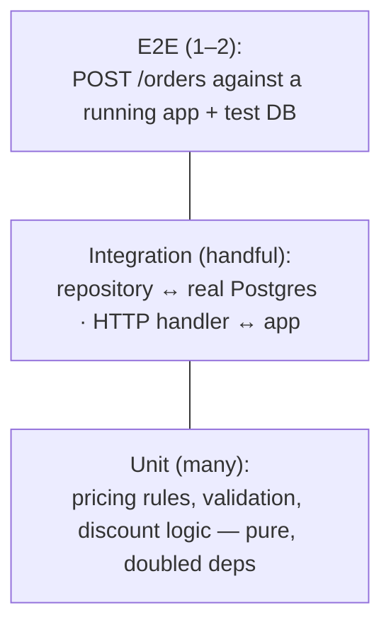

# Case Study: A Testing Strategy for a Real API

> Apply the [test pyramid](../1-knowledge/testing/testing-fundamentals.md) to a concrete service —
> deciding *what* to test at *which* layer, where to use [doubles](../1-knowledge/testing/test-doubles-and-tdd.md),
> and how it all gates [CI](../../devops-infrastructure/1-knowledge/ci-cd/continuous-integration.md).

## The scenario
You own an **orders API**: `POST /orders` validates a cart, applies pricing rules, charges a payment
gateway, writes to Postgres, and emails a receipt. The team has "some tests" but they're slow,
flaky, and a green run still lets bugs through. You need a deliberate strategy: confidence that's
fast enough to run on every push.

## Requirements
1. **Fast feedback** — the bulk of tests run in seconds on every commit.
2. **Real confidence** — catch both logic bugs *and* wiring/integration bugs.
3. **No flakiness** — deterministic, no real network/payment calls in the fast suite.

## How it works — assign each concern to a layer


**Unit (many, milliseconds).** The *pricing and validation rules* are pure logic — test them
exhaustively in isolation, with the payment gateway and DB replaced by [doubles](../1-knowledge/testing/test-doubles-and-tdd.md):
```python
def test_vip_gets_10_percent():
    order = PlaceOrder(repo=FakeRepo(), gateway=Mock(), mailer=Mock())
    assert order(cart_of(100), user=vip).total == 90        # no DB, no network, instant
```
Edge cases live here: empty cart, negative quantity, currency mismatch, gateway timeout (a
*stubbed* `side_effect=TimeoutError`).

**Integration (some, seconds).** Test the *seams* the unit tests faked: does the repository
actually persist and read back from a **real** (disposable) Postgres? Does the HTTP layer parse and
route correctly? These catch the bugs mocks hide — a wrong SQL query, a serialization mismatch.

**E2E (one or two, slower).** A single happy-path `POST /orders` against a running instance + test
database confirms the whole chain wires together. You don't test every edge case here — that's what
the fast layers are for.

## Deep dives — the decisions that matter
- **Where to draw the unit/integration line (Req 1+2):** mock *external* and *slow* things
  (payment gateway, email, third-party APIs); use the *real* thing for things you own and that are
  cheap to run (your DB, via a container). Mocking your own database is the classic mistake — it
  makes tests pass while the real query is broken.
- **Determinism kills flakiness (Req 3):** no real payment calls (stub them), freeze the clock and
  seed randomness, give each test its own isolated data (transaction rollback or fresh schema). A
  flaky test gets *quarantined or fixed*, never ignored.
- **The CI gate:** unit+integration run on every push and **block merge** if red; the slow E2E runs
  pre-deploy. This is the pyramid serving [CI/CD](../../devops-infrastructure/1-knowledge/ci-cd/continuous-integration.md) —
  fast tests gate fast, slow tests gate less often.
- **Coverage as a flashlight, not a target:** use it to find the untested pricing branch, not to
  chase a 100% number on trivial getters.

## Trade-offs & failure modes
- ✅ Fast suite gives sub-minute feedback; integration catches wiring; one E2E proves the whole flow
  — confidence proportional to cost.
- ⚠️ **Ice-cream cone** (mostly E2E) → slow, flaky, uninformative; **over-mocking** → fast but
  false confidence. The pyramid balance is the whole point.
- ⚠️ Integration tests need real infra (a test DB container) — slightly more setup, far more
  realism. Worth it for the layer that catches the bugs unit tests can't.

## References
- [Testing fundamentals](../1-knowledge/testing/testing-fundamentals.md) · [Test doubles & TDD](../1-knowledge/testing/test-doubles-and-tdd.md)
- Hands-on: [lab: TDD kata](../3-practice/lab-tdd-kata.md) · [lab: test doubles](../3-practice/lab-test-doubles.md) · gate: [CI/CD pipeline](../../devops-infrastructure/2-case-studies/ci-cd-pipeline.md)
