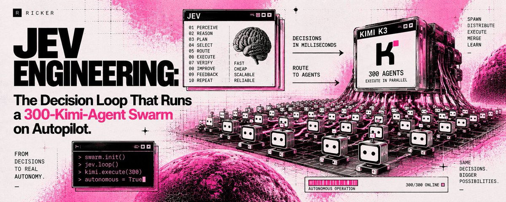
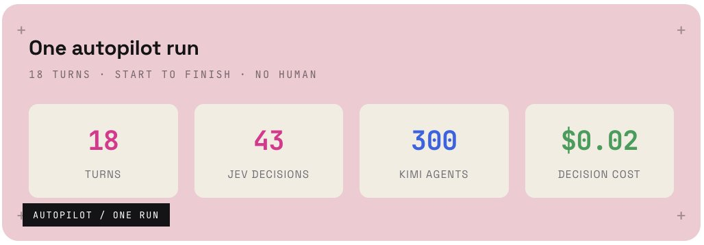
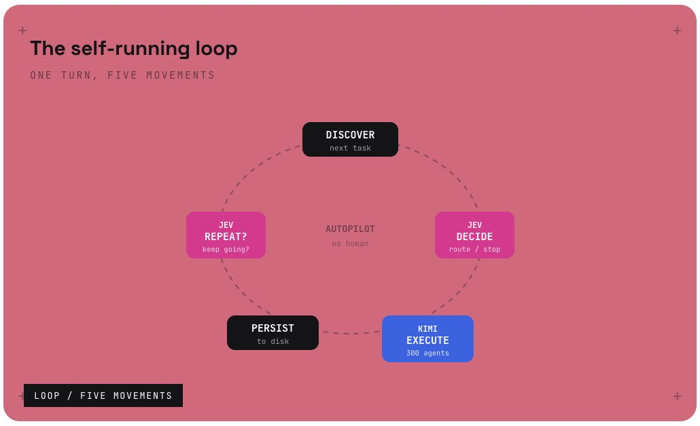
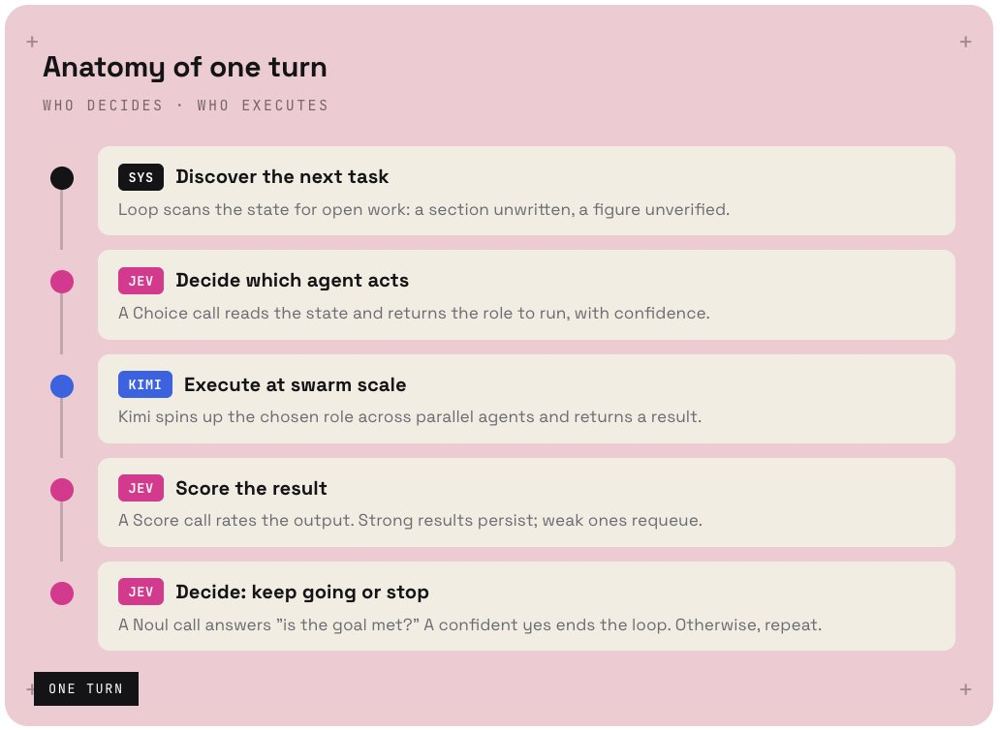
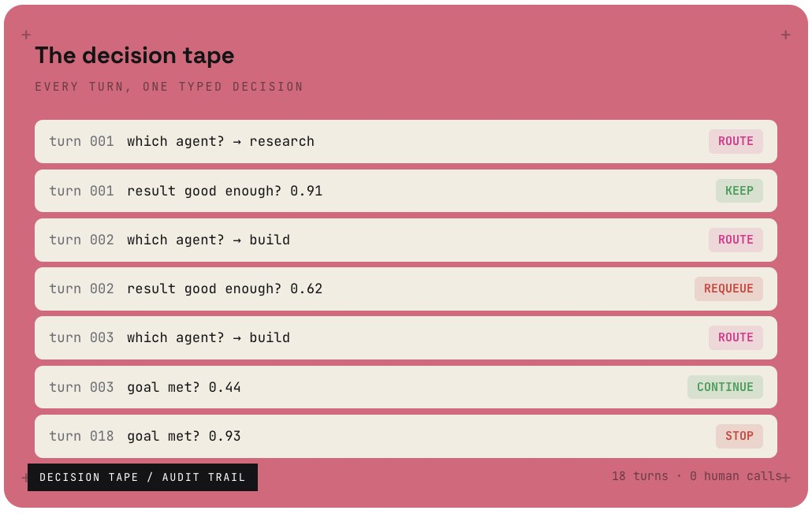
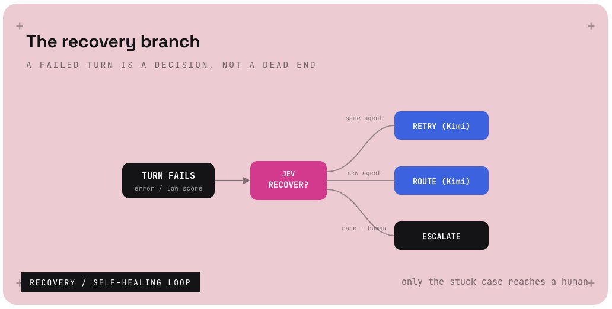
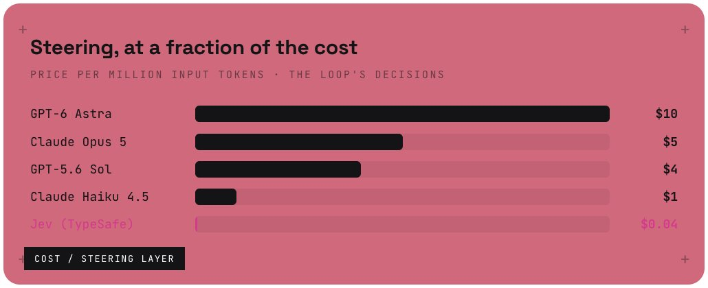

# Jev Engineering: The Decision Loop That Runs a 300-Kimi-Agent Swarm on Autopilot

**Author:** Ricker ([@0xRicker](https://x.com/0xRicker))  
**Published:** Tue Sep 22 13:54:23 +0000 2026  
**Source:** <https://x.com/0xRicker/article/2102396090012115030>



A swarm knows how to execute. It does not know when to stop, what to run next, or whether a result is good enough. Those are decisions, and a decision on every turn is what keeps a human in the loop. Move them to Jev and the loop runs itself.

---

**Jev** decides every turn       **300** Kimi agents execute       **0** humans in the loop

> **Follow my Substack to get fresh AI alpha:** @0xMortyx[https://substack.com/](https://substack.com/@0xmorty)

---

A swarm can run 4,000 steps. The reason it still needs you is the decision between each one.

A **Kimi** swarm is extraordinary at execution. Point 300 agents at a job and they research, build, verify and export at a scale no single model touches. But a swarm has no opinion about itself. It cannot tell whether it is done, whether the last result was good enough, or which of its agents should run next. Someone has to decide, and that someone is usually you.



That is the leak in every "autonomous" swarm. The execution is automated. The decisions between turns are not. **Jev**, the decision model from TypeSafe AI, closes that gap: it reads the swarm's state and answers the between-turn questions in a typed, cheap, instant call. Wire it into the loop and the human steps out.

> **Kimi executes the turn → Jev decides the next one → the loop turns with nobody watching.**

The trap most people fall into is trying to make the swarm itself decide. They ask a frontier model, between turns, "should we keep going?" and pay a generation price for a one-word answer. It works, and it is slow and expensive, and it is why most so-called autonomous agents quietly still have a person watching the terminal. The fix is not a smarter swarm. It is a cheaper decision layer wrapped around it.

---

**STEP 01**

## The loop, not the swarm, is what runs itself

People think autonomy lives in the swarm. It does not. **Kimi**'s agents are the muscle, and muscle does not decide when to move. Autonomy lives in the loop that wraps the swarm: the thing that decides, after each turn, whether to keep going and what to do next.

A self-running loop is five movements. Discover the next task, decide what to do, execute it, save the result, and decide whether to repeat. Kimi owns execution. Everything else is decisions, and decisions are what **Jev** is for.



> Two of the five movements are **Jev** decisions (decide, repeat). One is **Kimi** execution. The rest is plumbing. That ratio is the whole point: the parts that keep a human in the loop are exactly the parts Jev takes over.

---

**STEP 02**

## Watch a single turn go by

Here is one turn of the loop, top to bottom. Notice who does what: **Jev** makes the calls, **Kimi** does the work, and nothing in between asks a human.



---

**STEP 03**

## The decision that makes it autopilot: keep going or stop

Every other decision routes work. This one ends it. On each turn, **Jev** answers a single Noul question: is the goal met? A confident yes stops the loop. Anything less, and it turns again. That one call is the difference between a swarm that needs a babysitter and one that knows when it is finished.

Without it, you are back to watching the run, waiting to hit stop. With it, the loop decides its own end, and you find the finished work waiting for you.

The threshold is the dial you tune. Set it high and the loop keeps working until it is very sure the goal is met, which costs a few extra turns but rarely stops early. Set it lower and it finishes faster with more risk of stopping short. Either way the decision is a single cheap call, so you can afford to check it on every turn instead of only at the end. That is what turns "run and hope" into "run until done."

```python
# the loop that runs itself
while True:
    task   = discover(state)
    agent  = jev.choice(state, roles)     # which Kimi agent?
    result = kimi.run(agent, task)       # execute at scale
    if jev.score(result) >= 0.85:
        persist(result)
    if jev.noul(state, "goal met?") >= 0.85:
        break                         # Jev ends the loop
```

---

**STEP 04**

## Read the loop's decision tape

Because every decision is typed, the whole run leaves a clean trail. This is what a stretch of the loop looks like from **Jev**'s side: a tape of decisions, each one cheap, each one logged, each one steering the **Kimi** swarm one turn further.



---

**STEP 05**

## When a turn fails, Jev decides the recovery

A loop that runs unattended will hit failures: an agent errors, a tool returns nothing, a result scores too low to keep. A naive loop either halts and waits for a human, or blindly retries forever. Neither is autopilot.

Put a **Jev** decision on the failure path too. When a turn fails, Jev reads what went wrong and picks the recovery: retry the same agent, route to a different one, or escalate to a human. Only the rare, genuinely stuck case reaches a person. Everything else, the loop handles itself, and **Kimi** keeps moving.



> This is what separates a demo from a system. A demo runs until the first failure. A loop with a recovery decision on every failure runs until the job is actually done, and only pulls you in when it truly cannot proceed.

---

**STEP 06**

## What autonomy actually costs

A self-running loop makes a lot of decisions. Across a long **Kimi** run, that is thousands of Choice, Score, and Noul calls. Route them through a frontier model and autonomy is expensive. Route them through **Jev** at $0.042 per million input tokens, and the entire steering layer costs less than a rounding error on the execution.

The swarm's compute is where your money should go. The decisions that steer it should be nearly free, and with Jev they are.



---

**The shift**

**Kimi executes the turn → Jev decides the next → the loop runs itself.**

**Jev** is not another agent in the swarm. It is the loop's decision layer, the thing that decides route, keep, and stop on every turn, at a price that makes frontier steering absurd. **Kimi** is the execution layer: 300 agents that turn each decision into finished work.

The real alpha of Jev Engineering for autonomy is realizing that the swarm was never the hard part. Execution was already solved. What kept the human in the loop was the decision between turns, and that is the exact thing Jev removes:

- Let Kimi's 300 agents execute every turn.
- Let Jev decide route, score, and stop.
- Let the loop turn until the goal is met.
> Wire Jev into the loop and you stop supervising a swarm. You start reading its finished work.
