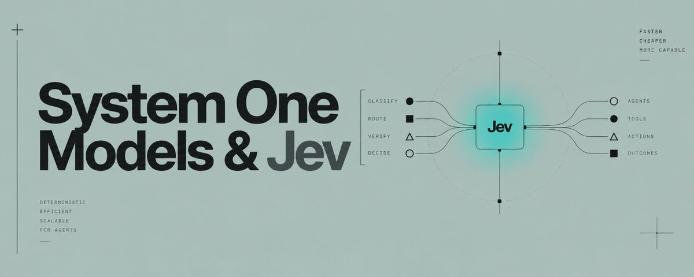
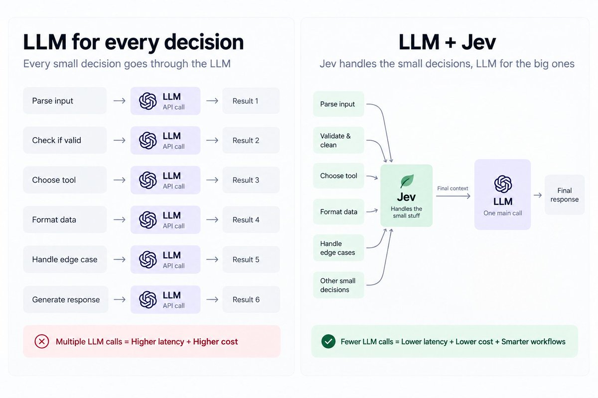
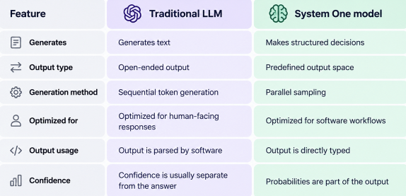
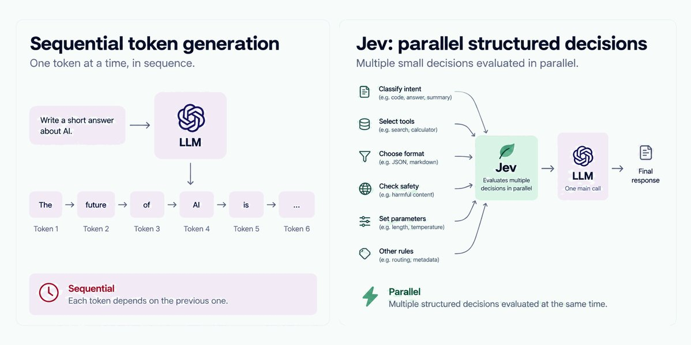
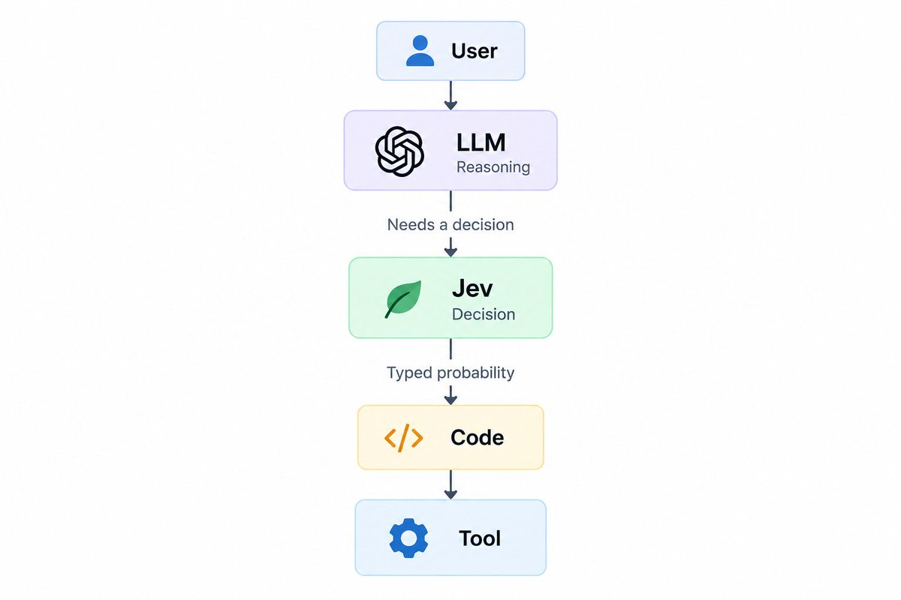
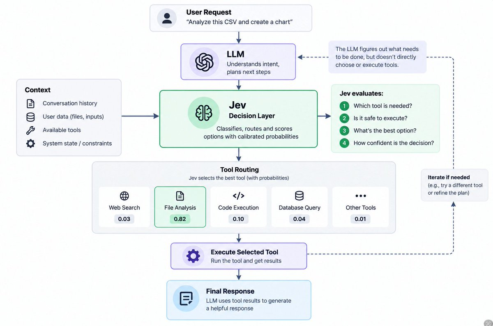
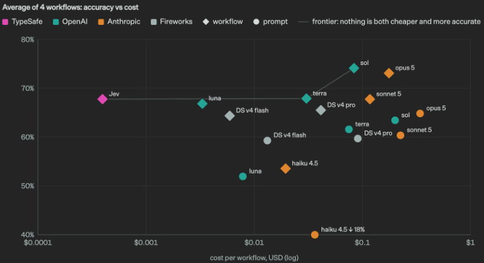

# The complete guide to System One Models & Jev

**Author:** Kr$na ([@krishdotdev](https://x.com/krishdotdev))  
**Published:** Fri Sep 18 17:49:07 +0000 2026  
**Source:** <https://x.com/i/article/2101005612951957847>



**A practical deep dive into System One models and Jev, TypeSafe’s new decision-focused model. We’ll break down how Jev works, how it differs from traditional LLMs and structured outputs, why calibrated probabilities matter, and how developers are using it with LangChain to build faster, cheaper, and more efficient AI agent harnesses.**

AI agents have developed a strange habit. We use large language models for almost everything. 

- Need to decide whether a support ticket is urgent? Call the LLM. 
- Need to choose which model should handle a request? Call the LLM. 
- Need to check whether a tool call is safe? Call the LLM again.

It works, but it is also an expensive way to build software.

Large language models are incredibly good at things that require generation, reasoning, planning, coding, and open-ended problem solving. But a surprising number of decisions inside an agent are much simpler. Sometimes the software just needs to know whether something is true, which option to choose, or where something sits on a scale.

That is the problem TypeSafe is trying to solve with **System One Models**, and Jev is its first public model in this category.

## **What is Jev ?**

**Jev** is actually not a traditional LLM, it doesn’t generate text. It’s what the TypeSafe AI team calls a System One model.

---

## 1. The problem with using an LLM for every decision

Let us take an example of a customer support agent.

A customer sends: “I’ve been trying to connect my Stripe account for three days and I’m losing sales. Please help ASAP.”

The system might need to answer several questions before it does anything:

- Is this urgent?
- Which team should handle it?
- How frustrated is the customer?
- Should it be escalated?
- Is the request legitimate?

The conventional approach is to send the message to an LLM and ask it to return some structured output.

```json
{
  "urgent": true,
  "department": "technical",
  "frustration": "high"
}
```

Modern models can do this surprisingly well. Structured-output APIs make the result easier to parse, and application code can validate the schema before continuing. But there is still a fundamental mismatch.

The model is a generative system. It is producing a sequence of tokens, even though the application may only need one of three predefined labels.

Now imagine the application could ask those questions directly and receive something like:

```plaintext
urgent:       0.997
department:
  technical:  0.84
  billing:    0.15
  sales:      0.01
frustration:
  high:       0.91
```

The software doesn’t need to interpret a paragraph. It already has a decision and a probability that it can feed into its own logic. That is the gap Jev is designed to target.

**Traditional agent loop:**

```python
def run_agent(user_input):
    # 1. Classification & Routing
    intent = call_llm("Classify intent for: " + user_input)
    
    if intent == "use_tool":
        # 2. Tool Decision & Extraction
        tool_call = call_llm(f"Pick tool and extract arguments from: {user_input}")
        result = execute_tool(tool_call.name, tool_call.args)
        
        # 3. Validation & Quality Check
        is_valid = call_llm(f"Is this result accurate for the user? Result: {result}")
        return result if is_valid == "yes" else "Fallback: Human review required."
        
    return call_llm("Generate direct response for: " + user_input)

```

**Before Vs After:** 



---

## 2. What Jev actually is ? 

Jev is the first public **System One Model** released by TypeSafe AI.

The company spent two years developing the approach and describes System One models as a new class of frontier models designed around fast, structured decisions for software. Jev combines a new model architecture, a parallel sampler, and a training approach TypeSafe calls **Reinforcement Learning for Calibrated Decisions**, or RLCD.

The important thing is that Jev isn’t simply being positioned as a smaller or cheaper LLM. Its interface is different.

Jev is very closer to: 

**state + questions → typed decisions + probabilities**

That distinction matters because software doesn’t naturally want prose. Software wants values it can branch on.

For example:

```python
if urgency > 0.95:
    escalate_ticket()
```

That is a much cleaner interface than asking an LLM to explain whether a ticket is urgent and then trying to turn that explanation into a reliable programmatic decision.

TypeSafe’s goal is to make model intelligence behave more like a programmable primitive rather than a chatbot response.

---

## 3. System One Vs Traditional LLMs

Traditional LLMs are built around flexible generation. They can write an email, explain a concept, generate code, plan a task, or reason through a complicated problem. That flexibility is their superpower. It is also part of what makes them expensive.

Jev gives up that flexibility in exchange for a much more constrained interface. Its possible outputs and structure are defined ahead of time, and the model returns typed values rather than arbitrary strings. TypeSafe says this means the model cannot make output type errors because the output space itself is constrained.



---

## 4. How Jev works ? 

Jev’s decision interface is built around three core primitives: **Noul, Choice, and Score**. Instead of asking the model to invent an answer in natural language, the developer defines the kind of decision the application needs.

**Noul: Yes or No -** A Noul represents a binary proposition. 

For example: Does this request require immediate attention?

Jev can return a probability representing how likely that proposition is to be true. That makes the result directly useful to application logic:

```python
if urgency_probability >= 0.95:
    escalate()
else:
    continue()
```

The important part isn’t the if statement. It’s the fact that the application can establish the policy itself. The model supplies a probability. The application decides what probability is sufficient for an automated action.

**Choice: Pick From Known Options**

Choice is useful when the application already knows the possible outcomes.
For example:

Which team should handle this ticket? 

The available choices could be:

- billing
- technical
- sales
- other

Instead of asking an LLM to generate a category and hoping it sticks to the allowed values, the decision space is defined up front. Jev evaluates the state against those choices and returns the corresponding probabilities.

**Score: Put Something on a Scale**

Score is useful when a decision has an ordered range rather than a binary answer or a set of unrelated categories.

You might ask: How severe is this incident?

and define a scale from low to critical. or How frustrated is this customer?

The application can then use the result as another input into its workflow. These three primitives cover a surprisingly large part of the small decisions that appear inside AI applications.

**Parallel Sampling**

There is another important difference under the hood. Traditional language models generate tokens sequentially. Each token depends on what came before it.

Jev is designed around parallel sampling. Instead of generating a long sequence of tokens one after another, it can evaluate multiple structured outputs in a single query. TypeSafe describes this as a hardware-aware parallel sampler.

That becomes particularly interesting when an application has many questions about the same piece of state.

```plaintext
Customer message
       │
       ▼
      Jev
   ┌───┼────┬──────┐
   ▼   ▼    ▼      ▼
urgent? team? risk? escalate?
```

Rather than waking up a large generative model for each question, the questions can be evaluated together.

LangChain has highlighted this property in its Jev integration, particularly for agent harnesses where many small decisions may happen around a single workflow.



**RLCD: Training for Calibrated Decisions**

The other major piece is how Jev is trained. TypeSafe calls its approach **Reinforcement Learning for Calibrated Decisions**, or **RLCD**.

The idea is that a model embedded in software needs a different kind of reliability from a model writing an answer for a human.

If a system returns: “I’m 95% confident this transaction is fraudulent.”

That number needs to have some relationship with reality. TypeSafe describes RLCD as a training approach focused on producing calibrated probabilities for decisions, rather than primarily optimizing for human preferences around generated text.

**Why Calibrated Probabilities Matter ?**

Probabilities change how you can build an AI workflow. Suppose an automated system needs to approve invoices.

Instead of asking an LLM: Should I approve this invoice?

and receiving: “The invoice appears legitimate and complies with the company’s policy.”

you could build an explicit policy around a probability:

```python
if approval_probability >= 0.98:
    approve()
elif approval_probability >= 0.80:
    send_to_human()
else:
    reject()
```

Now the model isn’t deciding the policy. Your software is. 

***The model provides a probabilistic judgment, while the application determines what to do with that judgment.***

---

# **5. Jev vs. Structured Outputs and JSON Mode**

Modern LLMs can already return JSON. They can follow schemas, use structured outputs, call tools, and produce machine-readable responses.

So what is different? The difference is deeper than JSON.

With structured output, the basic process is still:

**generate → constrain → parse → validate → use**

With Jev, the interface is closer to:

**state → typed decision → use**

Consider a simple classification task. With an LLM, you might say:

```plaintext
Classify this ticket as billing,
technical, sales, or other.

Return valid JSON.
```

The model still has to generate a representation of the answer.

With Jev, those possible answers are part of the decision itself.

```plaintext
Choice:
  billing
  technical
  sales
  other
```

The model evaluates the state against that predefined space.

This is why calling Jev “an LLM with better JSON support” misses the point. TypeSafe is proposing a different model interface, not merely a better output parser.

---

## 6. Where Jev fits in an AI Agent

The most useful way to think about Jev isn’t as a replacement for the main LLM. Think of it as the decision layer around the LLM.

A production agent could look something like this:



The LLM handles the difficult, open-ended work. Jev handles the smaller decisions that determine what happens next. The code remains responsible for deterministic rules and execution.

That gives you a clean division:

- **LLM:** reasoning, planning, generation
- **Jev:** routing, classification, scoring, verification
- **Code:** policy, state, thresholds, execution
- **Tools:** actions in the outside world
---

## 7. The Jev + LLM Harness pattern

LangChain’s early work with Jev is particularly interesting because it demonstrates how the model can sit inside an **agent harness** rather than being used as the agent itself. LangChain has shown examples around model routing and tool-call safety.

**Model Routing** Not every request needs your most expensive reasoning model.

A simple request might be handled by a smaller, cheaper model. A difficult architecture question might require a much stronger model.

Jev can sit between the request and the models:

```plaintext
                 Request
                    │
                    ▼
                   Jev
                /       \
           simple       complex
             │             │
             ▼             ▼
        cheaper model   reasoning model
```

**Guardrails**

The same pattern works for tool calls. Imagine an agent wants to execute a command. Instead of allowing the model to directly call the tool, the harness can insert a decision layer first:

```plaintext
LLM proposes action
       ↓
      Jev
       ↓
  Is this safe?
    /      \
  yes       no
   ↓         ↓
execute     block
```

LangChain’s Jev integration demonstrates this kind of tool-call safety pattern.

**Tool Selection**

Agents often have dozens of possible tools. 

Search the web, Query a database, Call the CRM, Run code and Ask the user.

A Choice question can turn that into an explicit decision problem. The LLM can focus on understanding the task, while Jev helps the harness determine which branch should execute.

**Verification:** Jev can also be placed after an action. for example: 

```plaintext
LLM writes code
      ↓
Tests run
      ↓
Jev evaluates result
      ↓
Meets requirements?
   /          \
 yes           no
  ↓             ↓
continue       retry
```

**Classification**

And finally, the obvious one: classification.

Support tickets, emails, documents, security alerts, transactions, agent traces, and countless other workflows contain decisions that are already naturally bounded. The interesting change isn’t that Jev makes classification possible.

LLMs have done that for years. The change is that classification can become a first-class, probabilistic primitive inside the application.

---

## 8. Building a Jev Harness with LangChain

The LangChain integration makes this pattern accessible to developers already building agents with the framework. LangChain provides a TypeSafe integration for running typed classification decisions alongside normal agent workflows.

A simplified version of the idea looks like this:

**LangChain + Jev example:**

```python
from langchain_openai import ChatOpenAI
from jev import Noul, Choice

urgency = Noul(
    "How urgent is this support request?",
    choices=["low", "medium", "high"]
)

routing = Choice(
    "Which team should handle this?",
    choices=["billing", "technical", "general"]
)

result = jev.run(
    request=customer_message,
    decisions=[urgency, routing]
)

if result.urgency == "high":
    notify_on_call()

route_to(result.routing)
```

The important part isn’t the exact API syntax. It is where the model lives. That is what makes the **harness** such an important concept here.

---

## 9. Jev in the wild

Jev is still new, but developers are already experimenting with it beyond basic classification. LangChain has highlighted use cases like browser agents, email triage, and trading, while TypeSafe has demonstrated workflows for invoices, security incidents, customer support, and agent traces.

Two demos stand out. A Doom-playing agent uses structured game state rather than vision and makes roughly 10 Jev queries per second at around $7/hour, according to TypeSafe. Wikiracing is another example, where Jev chooses among hundreds or thousands of possible links at each step. TypeSafe notes that its LLM comparisons used non-reasoning modes, so these results shouldn’t be treated as universal benchmarks.

**Jev playing DOOM in real time: (Source: reddit)**


**The Wikiracing workflow:** 

```plaintext
[ Wikipedia Source Page ] 
           │
           ▼  (Extracts 1,000+ Links)
┌──────────────────────────────────────────────┐
│ STAGE 1: Parallel Scoring (Score)            │
│ * Jev assigns a confidence metric to ALL     │
│   links relative to the final target page.   │
└──────────────────────────────────────────────┘
           │
           ▼  (Filter Top ~50 Scoring Links)
┌──────────────────────────────────────────────┐
│ STAGE 2: Explicit Selection (Choice)         │
│ * Under the 255-limit, Jev processes the     │
│   top-tier links to select the absolute best │
│   link to click.                            │
└──────────────────────────────────────────────┘
           │
           ▼  (Execute Click)
[ Next Wikipedia Page ]  --> Repeat until target reached
```

**Agent/Tool-routing diagram:**



---

## 10. How much faster and cheaper is Jev ?

This is where the marketing numbers need context.

TypeSafe reports Jev as **193.6× faster and 444.6× cheaper** on its published workflow evaluations. But these aren’t universal comparisons against every LLM. The tests use specific System One-style workflows, vendor-defined reference probabilities, and structured-decision wrappers for the LLM baselines. 

The takeaway isn’t that Jev is always 444× cheaper. It’s that **a model built specifically for bounded decisions can have a very different cost and latency profile from a general-purpose LLM.**

**Benchmark chart:  (Source: Typesafe)**



---

## **11. Where System One Models Don’t Fit**

Jev isn’t a replacement for generative LLMs. It works best when the decision space is clearly defined: routing, classification, scoring, or verification.

For open-ended tasks like writing, coding, brainstorming, or designing a new system architecture, you still need a model capable of exploration and reasoning.

The idea isn’t **System One vs. System Two**. It’s using each model for the job it is actually designed to do.

---

## 12. What System One could mean for the future of Agent Architecture ? 

So If this approach scales, the AI agents may move from one giant model to **systems of specialized models**. The LLM handles reasoning and planning, System One handles decisions like routing and verification, other models handle perception, while code enforces rules and tools execute actions.

**LLM → Reasoning | System One → Decisions | Code → Rules | Tools → Actions**

**The Architecture might look something like:** 

```plaintext
                         User
                           │
                           ▼
                    ┌────────────┐
                    │    LLM     │
                    │ Reasoning  │
                    └─────┬──────┘
                          │
              ┌───────────┼───────────┐
              ▼           ▼           ▼
            Jev         Jev          Jev
          Routing     Guardrails   Verification
              │           │           │
              └───────────┼───────────┘
                          ▼
                         Code
                          │
             ┌────────────┼────────────┐
             ▼            ▼            ▼
           APIs         Tools       Databases
```

---

## 13. Final takeway

Jev isn’t trying to replace LLMs. It introduces a different layer for AI systems: **fast, structured, probabilistic decisions**.

LLMs can handle reasoning and generation, while Jev handles routing, classification, verification, and other bounded decisions. The bigger idea is simple: **instead of one model doing everything, use the right model for each job.**
