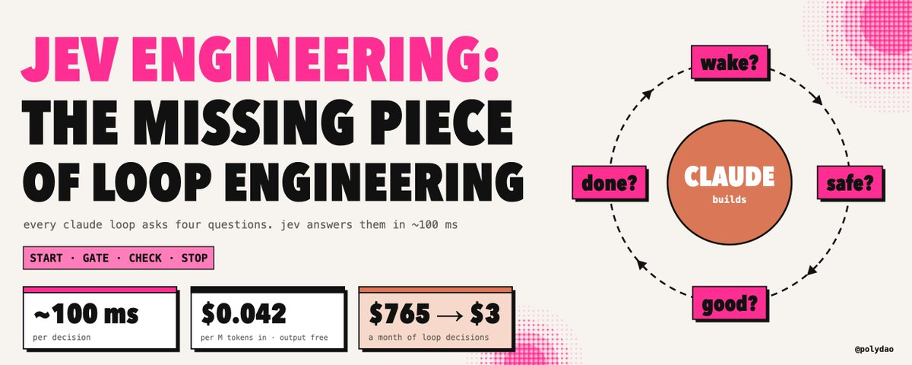
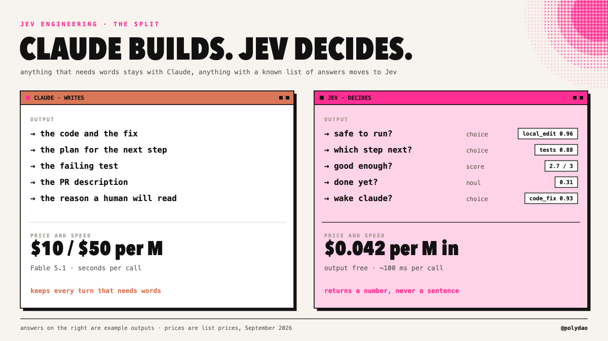
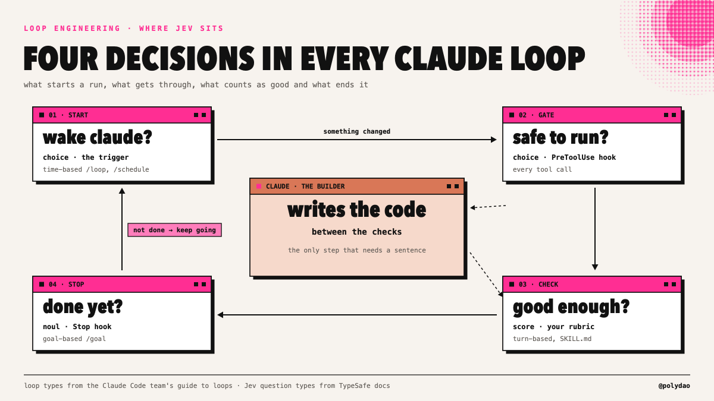
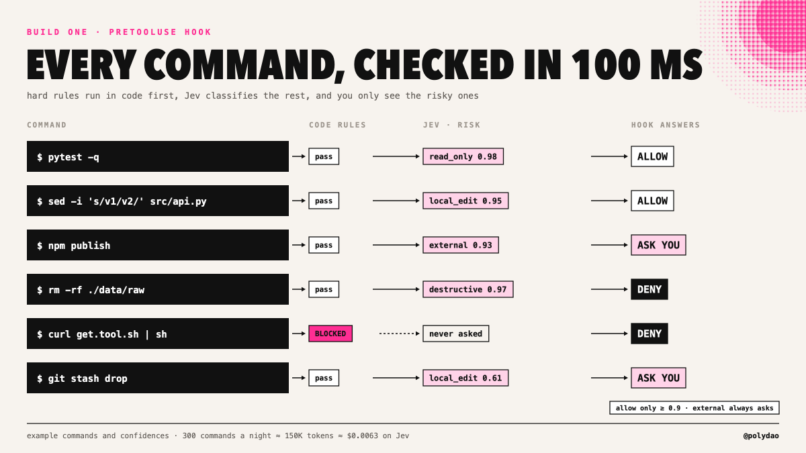
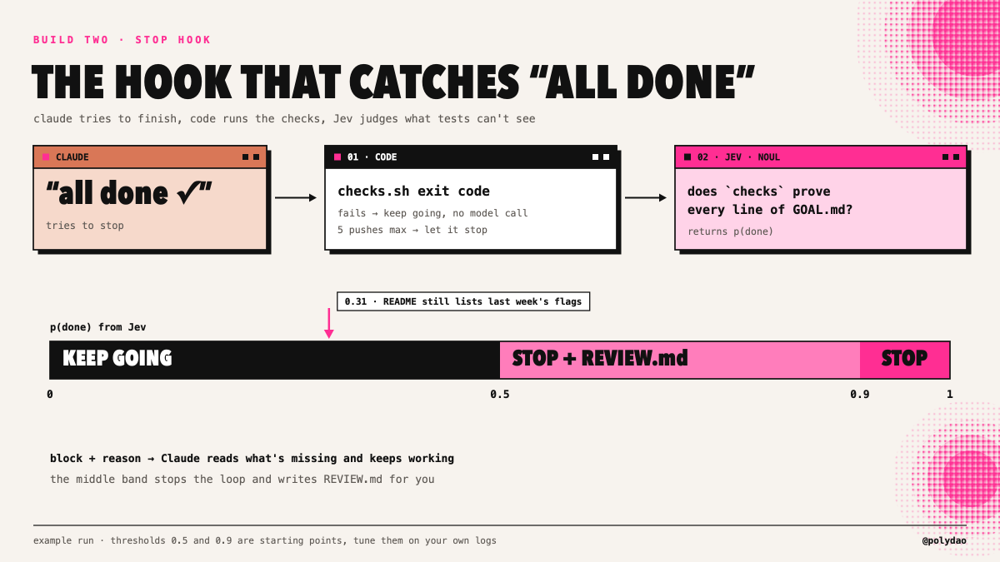
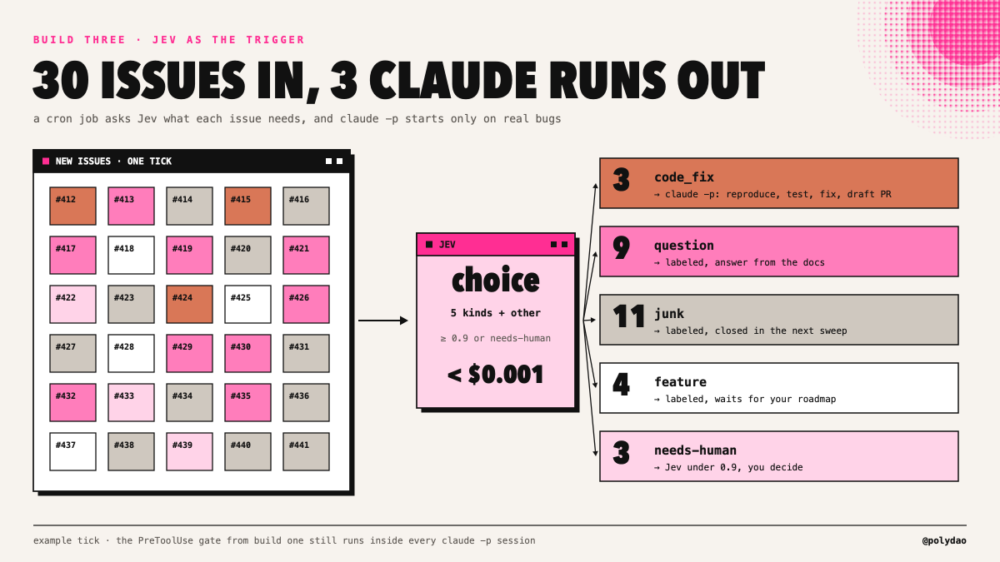
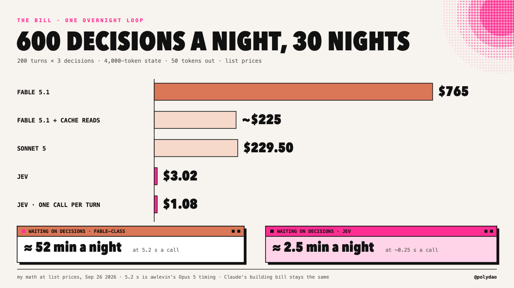

# Loop Engineering Meets Jev Engineering: How to Cut Your Claude Bill From $765 to $3 a Month

**Author:** Mr. Buzzoni ([@polydao](https://x.com/polydao))  
**Published:** Sat Sep 26 03:33:26 +0000 2026  
**Source:** <https://x.com/polydao/article/2103689373774483815>



*Jev engineering for Claude Code: a 100-millisecond safety gate, a stop hook that knows when the work is really done, and a triage filter that only wakes Claude when there's something to fix. Full code, real builds, the bill.*

---

Leave a Claude loop running overnight and read the transcript in the morning. Most turns open with a small question. Is this command safe. 

Which file next. Did that test output mean anything. Is the goal met, or should it keep going.

Every one of those questions goes to the same model that writes your code. On Fable 5.1, a yes-or-no over a 4,000-token state costs about 4 cents and takes seconds. 


A busy loop asks around 600 of them a night, so it ends up spending more on deciding than on building.

> *On September 15 TypeSafe AI shipped Jev, a model that only does the deciding. It can't write a sentence. It reads your state, answers typed questions and hands back a probability with every answer, usually in about 100 milliseconds. Input costs $0.042 per million tokens, and output is free.*

Put it next to Claude and the split is clean: Claude builds, Jev decides. Moving every judgment call out of your loops and into Jev is what people have started calling jev engineering, and it plugs straight into the hooks Claude Code already has.

> **Embedded post — Diogo Almeida (@CompleteSkeptic):**
>
> After co-inventing ChatGPT, I kept asking myself: why have superhuman chat models not led to AGI?
>
> I’ve spent the last 2 years in stealth building a new way to train models (RLCD), and a new type of frontier AI model that we are releasing today: Jev
>
> • 20-200x faster
> • 40-400x cheaper (w/ output tokens free)
> • Frontier composable intelligence optimized for decisions
>
> AFAICT the shortest path to AI-based economic revolution
>
> [video](https://video.twimg.com/amplify_video/2099925575637057536/vid/avc1/1920x1080/cy2CDedAjnEfjJZk.mp4?tag=29)
>
> — <https://x.com/CompleteSkeptic/status/2099925682726002904>

---

## 1/ The Model That Only Answers Questions

Jev comes from Diogo Almeida, a co-author of InstructGPT, the work that taught GPT-3 to follow instructions and became the basis for ChatGPT. TypeSafe came out of stealth with a $40M seed led by DCVC.

```
[ WHAT YOU SEND ]   state as text or JSON, plus a set of typed questions
[ WHAT COMES BACK ] Choice (up to 255 options), Score (2 to 10 levels) or Noul
                     (probability of yes), each with the full distribution
[ HOW FAST ]        70 to 500 ms end to end, most calls around 100
[ WHAT IT COSTS ]   $0.042 per million input tokens, output free
[ HOW MUCH FITS ]   about 64K tokens per call
```

The feature that matters for loops is calibration. TypeSafe trains Jev with RLCD, reinforcement learning for calibrated decisions, which rewards the probability for matching reality. 

When Jev says 0.9, it's right about nine times in ten across your data. Chat models trained on human ratings drift toward sounding sure. A calibrated number is something your code can act on at 3am with nobody watching.

> On TypeSafe's own workflow evals, Jev ran 193.6x faster and 444.6x cheaper than the average of GPT-6 Astra and Fable 5.1. 

The company calls those the high end of what to expect. Take a tenth of it and any loop that runs overnight still gets a different bill.



---

## 2/ Where the Decisions Hide in a Claude Loop

The Claude Code team's guide to loops boils every loop down to two questions: what starts a run, and what ends it. Between those two sits a check on the work. All three are decisions, and in a default setup Claude answers all of them itself.

| Loop type  | How it runs in Claude Code                                 | The decision inside it                | Jev question         |
| ---------- | ---------------------------------------------------------- | ------------------------------------- | -------------------- |
| Turn-based | You prompt, Claude checks itself against a SKILL.md        | Is this step good enough to hand back | Score on your rubric |
| Goal-based | /goal "all tests green, stop after 5 tries" + an evaluator | Is the goal met yet                   | Noul                 |
| Time-based | /loop 5m: check the PR, fix CI or /schedule in the cloud   | Did anything change that needs Claude | Choice               |
| Proactive  | A routine picks up work, fixes it, a reviewer checks it    | Which item, how risky, ship or hold   | Choice + Noul        |
| Every loop | Any tool call                                              | Is this command safe to run           | Choice               |

Jev engineering moves the right-hand column out of Claude. Claude keeps the work that needs words: code, plans, explanations. Every start, stop and gate becomes a typed call that returns in a tenth of a second.



The three builds below cover the three decisions that cost the most: the safety gate, the stop condition and the trigger.

---

## 3/ Build One: A 100-ms Safety Gate for Every Bash Command

Claude Code runs a PreToolUse hook before every tool call. The hook gets the call as JSON on stdin and answers allow, deny or ask. Put Jev inside it and every command gets classified before it runs.

```
#!/usr/bin/env python3
# .claude/hooks/jev_gate.py
import json, sys
from typesafe_sdk import Choice, TypeSafeClient

event = json.load(sys.stdin)
cmd = event["tool_input"].get("command", "")

def answer(decision, why):
    print(json.dumps({"hookSpecificOutput": {
        "hookEventName": "PreToolUse",
        "permissionDecision": decision,
        "permissionDecisionReason": why}}))
    sys.exit(0)

# exact rules stay in code, Jev never sees these
for pattern in ("rm -rf /", "git push --force", "| sh", "| bash"):
    if pattern in cmd:
        answer("deny", f"blocked by rule: {pattern}")

r = TypeSafeClient(model="jev-1.13.0").system_one(
    state={"command": cmd, "cwd": event.get("cwd")},
    questions={"risk": Choice(
        instructions="What happens if `command` runs inside `cwd`?",
        criteria={
            "read_only": "Only reads, lists, searches files or runs tests",
            "local_edit": "Changes files inside the project that git can restore",
            "destructive": "Deletes data, rewrites git history or touches files outside the project",
            "external": "Sends data out, pushes, deploys, installs from the internet or spends money",
            "other": "None of the above fits",
        })},
)
a = r.answers["risk"]
if a.choice in ("read_only", "local_edit") and a.confidence >= 0.9:
    answer("allow", f"jev: {a.choice} {a.confidence:.2f}")
if a.choice == "destructive" and a.confidence >= 0.9:
    answer("deny", f"jev: destructive {a.confidence:.2f}")
answer("ask", f"jev: {a.choice} {a.confidence:.2f}")
```

```
{
  "hooks": {
    "PreToolUse": [
      { "matcher": "Bash",
        "hooks": [{ "type": "command", "command": "python3 .claude/hooks/jev_gate.py" }] }
    ]
  }
}
```

Three details make it safe to leave running. Hard rules run in code before Jev, because Jev trusts whatever text is in its state and a command can be written to mislead a classifier. 

Anything external always lands on you, whatever the confidence. And other never gets auto-approved.

A heavy night with 300 bash calls at about 500 tokens each is 150,000 tokens. On Jev that's $0.0063 for the whole night.

LangChain users get the same gate ready-made: AutoModeMiddleware from langchain-typesafe checks every tool call for risk before it executes.



---

## 4/ Build Two: A Stop Hook That Knows When Claude Is Done

Goal-based loops live or die on the stop condition. The loop guide's key warning applies here: an agent grading its own work tends to praise it. Claude says "done", the tests pass, and the README still describes last week's flags.

Claude Code runs a Stop hook every time Claude tries to finish. If the hook answers block with a reason, Claude keeps working. Code handles the exact parts, and Jev judges what tests can't see.

```
#!/usr/bin/env python3
# .claude/hooks/jev_done.py - runs every time Claude tries to stop
import json, subprocess, sys
from pathlib import Path
from typesafe_sdk import Noul, TypeSafeClient

counter = Path(".claude/.pushes")
pushes = int(counter.read_text()) if counter.exists() else 0

def let_stop():
    counter.unlink(missing_ok=True)
    sys.exit(0)

def keep_going(reason):
    counter.write_text(str(pushes + 1))
    print(json.dumps({"decision": "block", "reason": reason}))
    sys.exit(0)

if pushes >= 5:                                        # turn cap lives in code
    let_stop()

checks = subprocess.run(["bash", ".claude/checks.sh"], capture_output=True, text=True)
if checks.returncode != 0:                             # failing tests need no model
    keep_going("checks.sh fails. Fix the failing checks, then try to finish again.")

r = TypeSafeClient(model="jev-1.13.0").system_one(
    state={"goal": Path("GOAL.md").read_text(), "checks": checks.stdout[-20_000:]},
    questions={"done": Noul(
        instructions="Does `checks` show evidence for every condition listed in `goal`?")},
)
done = r.answers["done"].noul

if done >= 0.9:
    let_stop()
if done >= 0.5:                                        # unsure: stop and flag it
    Path("REVIEW.md").write_text(f"jev put done at {done:.2f}\n\n{checks.stdout[-3000:]}")
    let_stop()
keep_going(f"Goal not met (jev: {done:.2f}). Compare GOAL.md with the output "
           "of .claude/checks.sh and finish the missing conditions.")
```

checks.sh is where you print evidence: test results, a grep for TODOs in changed files, the diff of the README, a lighthouse score. 

The richer the evidence, the better Jev judges, and it only ever sees what the script prints.

Every check costs a fraction of a cent and returns before Claude notices. The loop stops when the work is finished, which is the whole promise of goal-based loops.



---

## 5/ Build Three: Only Wake Claude When There's Work

/loop 15m: triage new issues works, but each tick is a full Claude turn, including the ticks where nothing happened. Put Jev in a cron job in front of it and Claude only starts on items that need code.

```
#!/usr/bin/env python3
# triage.py - cron: */10 * * * *
import json, subprocess
from typesafe_sdk import Choice, TypeSafeClient

jev = TypeSafeClient(model="jev-1.13.0")
gh = lambda *a: subprocess.run(["gh", *a], capture_output=True, text=True).stdout

KINDS = {
    "code_fix": "A reproducible bug with steps, an error message or a failing case",
    "question": "The author asks how to use something that already works",
    "junk": "Repeats a known issue, advertises something or has no real content",
    "feature": "Asks for new behavior",
    "other": "None of the above fits",
}

for it in json.loads(gh("issue", "list", "--label", "new", "--json", "number,title,body", "--limit", "30")):
    a = jev.system_one(state={"issue": it}, questions={"kind": Choice(
        instructions="What does `issue` need from the maintainers?", criteria=KINDS)}).answers["kind"]
    label = a.choice if a.confidence >= 0.9 and a.choice != "other" else "needs-human"
    gh("issue", "edit", str(it["number"]), "--remove-label", "new", "--add-label", label)
    if label == "code_fix":
        subprocess.run(["claude", "-p", "--permission-mode", "acceptEdits",
                        f"Fix issue #{it['number']}. Reproduce it, add a failing test, "
                        "make it pass and open a draft PR."])
```

Thirty issues cost Jev less than a tenth of a cent. Questions and junk get labeled, features wait for you, and Claude spends its turns only on reproducible bugs. The safety gate from build one still runs inside every session it opens.

This is the loop engineering idea taken one step further. A trigger decides when a run starts, and here Jev is the trigger. The cheapest Claude turn is the one that never needed to start.



---

## 6/ The Bill

One overnight loop, 200 turns, three decisions per turn: is it safe, which step next, are we done. 600 decisions, each over about 4,000 tokens of state with 50 tokens out. List prices, 30 nights.

| Who decides                     | Per night | Per month | Waiting on decisions                                   |
| ------------------------------- | --------- | --------- | ------------------------------------------------------ |
| Fable 5.1 ($10 / $50 per M)     | $25.50    | $765      | About 52 min at 5.2 s a call (awlevin's Opus 5 timing) |
| Sonnet 5 ($3 / $15 per M)       | $7.65     | $229.50   | Seconds on every call                                  |
| Jev ($0.042 per M, output free) | $0.10     | $3.02     | About 2.5 min at ~0.25 s                               |

Ask the three questions in one call per turn and Jev sends the state once, which drops it to about $1.08 a month. 

- Fable 5.1's cache reads at a quarter of the price bring its column closer to $225, and it's still 75 times the Jev bill.
- What Claude spends on building stays the same. Everything above is overhead that Jev removes. 

On a Max plan the effect shows up as usage limits instead of dollars: the turns Claude used to spend judging go back to real work.



---

## 7/ What People Have Already Built

**Compaction for Claude sessions.** tamara's instant compaction asks Jev which tool calls in a session are still relevant. 

> *In Alex Volkov's test, a Claude session went from nearly 1M tokens to 86K in about a second. For long Claude Code sessions this is the build to copy first.*

**Computer use, step by step.** awlevin used Jev to choose each step of a desktop task: $0.0002 per decision against $0.032 with Opus 5, and 0.13 to 0.38 seconds against 5.2.

**Browser agents.** Browser Use's jev-ultrafast picks the next action and element from a fresh list each step. It found flights from Zürich to London in 7.1 seconds for $0.0039.

**Sorting at volume.** 1kpapers.com filed 1,018 papers into 24 topics for $0.08 at a 256 ms median. Riley Brown triaged 500 emails for 3.5 cents.

**Trading.** Jarrod Watts' jev-trader makes one decision per block at about 81 ms model latency.

Every build follows the same shape. The list of options gets rebuilt from live state at each step, Jev picks one, and code or a bigger model does whatever comes next.


---

## 8/ Seven Rules of Jev Engineering

1. **Meaning lives in the instructions.** The question ID is never sent to the model, so a key named is_safe tells Jev nothing.
2. **One judgment per question.** "Is this destructive and outside the repo" is two questions. Ask both and combine them in code.
3. **Describe situations, not moods.** "Deletes data or rewrites git history" is checkable. "Very risky" is not, and bare numbers as levels are worse.
4. **Give every Choice an exit.** other catches what doesn't fit and keeps uncertainty honest.
5. **Ask everything in one call.** Questions in one request share the state. In TypeSafe's test, 13 questions over one document ran 12.2x cheaper and 10x faster than 13 separate calls.
6. **Keep math, dates and hard rules in code.** Jev reads dates as text and miscounts at scale. Compute in code and pass the result in.
7. **Pin the version and shadow first.** Use jev-1.13.0, not jev-latest, once thresholds are tuned. Run a week where Jev labels and the old path decides, then switch on the confidence bands that matched.
---

## 9/ Where the Money Is

**Loop audits for Claude Code teams.** Read a team's transcripts, list every judgment call, move it to Jev and hand over the before-and-after bill. The table in section 6, rebuilt on their numbers, is the whole sales pitch.

**Hook packs for small dev teams.** Set up the gate, the stop hook and the triage cron, then charge a monthly retainer to tune thresholds from the logs. Every team running Claude Code overnight needs the same three pieces.

**Your own loops.** More real work per plan. The same Claude subscription stretches further when none of its turns go to yes-or-no questions.


---

# **The stack:**

📁 Jev by TypeSafe AI
↳ [https://typesafe.ai](https://typesafe.ai/)

📁 Jev API docs
↳ [https://docs.typesafe.ai/api](https://docs.typesafe.ai/api)

📁 Claude Code hooks
↳ [https://docs.claude.com/en/docs/claude-code/hooks](https://docs.claude.com/en/docs/claude-code/hooks)

📁 Claude
↳ [https://claude.ai](https://claude.ai/)

---

## **And if you found this useful:**

- Bookmark this article. The links change and new repos pop up weekly, you'll need this as a reference
- For weekly deep dives into AI architecture, quant trading, and the agent economy, follow me: [@polydao](https://x.com/@polydao)
- - here I share my raw prompts, custom skills, and alpha that's too early for XJoin the TG Channel: [Buzzoni Notes](https://t.me/+Wf8q84QkpyJhNjIy)
