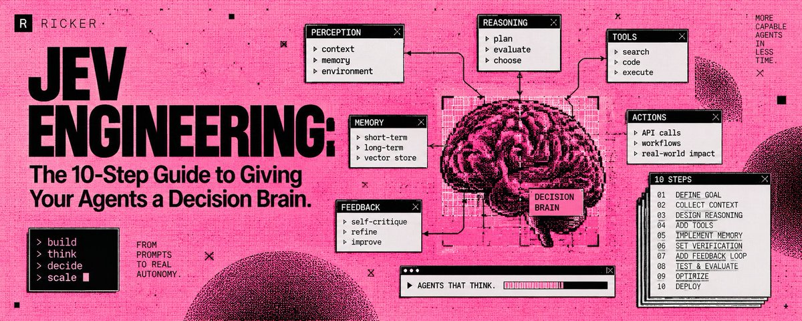
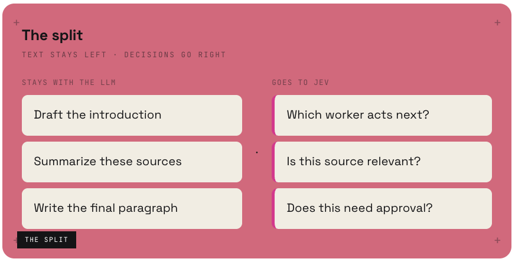
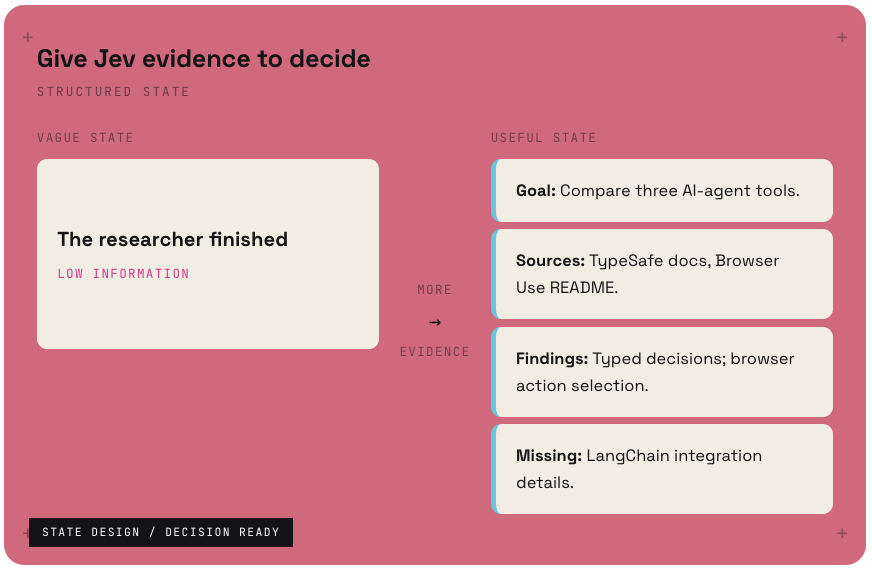
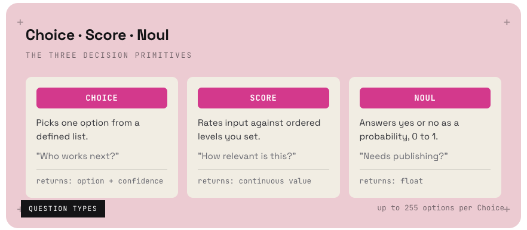
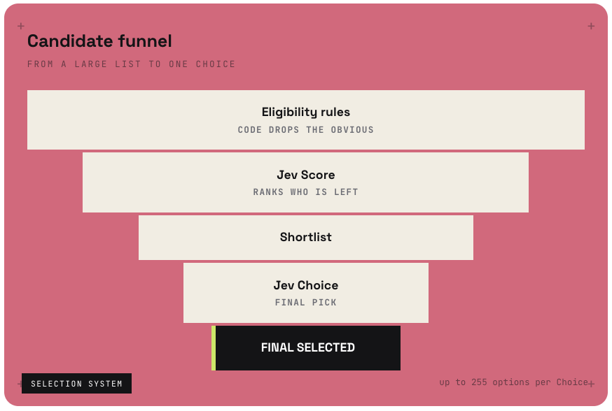
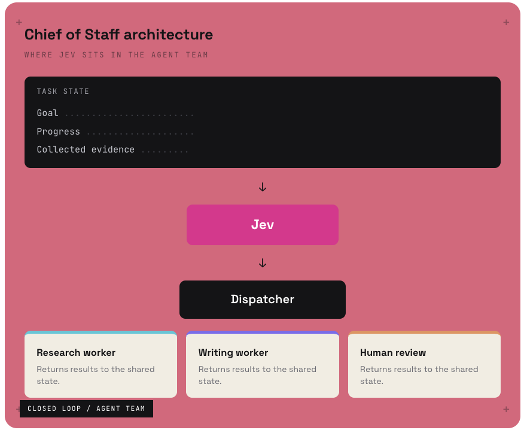
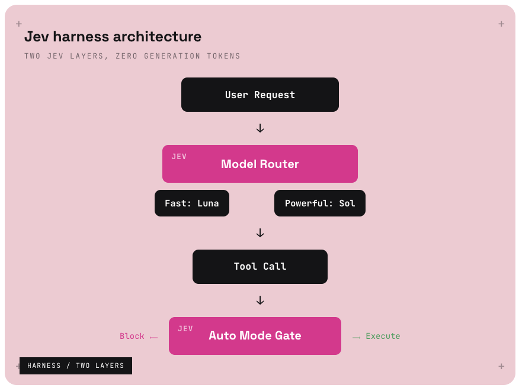
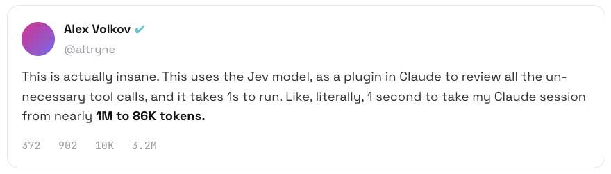
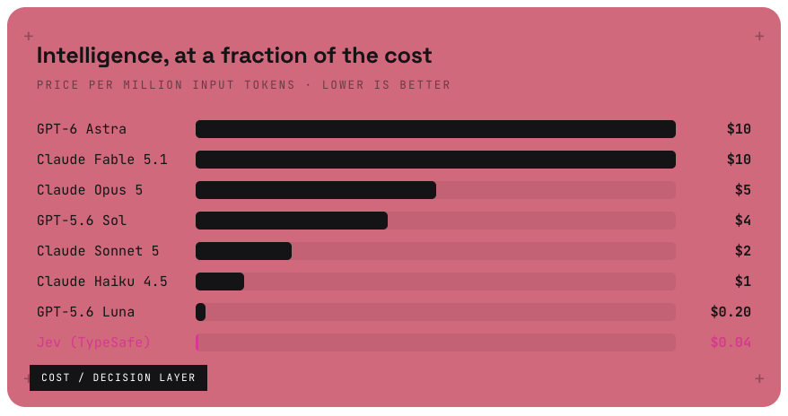

# Jev Engineering: The 10-Step Guide to Giving Your Agents a Decision Brain

**Author:** Ricker ([@0xRicker](https://x.com/0xRicker))  
**Published:** Sat Sep 19 12:48:56 +0000 2026  
**Source:** <https://x.com/0xRicker/status/2101292455391809670>



Every agent you have built has the same leak. An expensive model sits in a loop answering yes-or-no, picking the next worker, and scoring relevance. Those calls never needed generation. This is how you move them to a model built to decide.

**10** steps       **3** question types       **$0.042**/M input

An LLM creates the work. Something else should decide what happens next.

Every agent you have built has the same problem. A frontier model that costs real money per call sits in a loop answering yes-or-no questions, picking the next worker, and scoring how relevant a source is. Those decisions do not need generation. They need a model that was built to decide.

**Jev**, the System One model from TypeSafe AI, is that model. You give it structured state and a set of options. It returns a typed answer with a confidence score. It cannot write your briefing, generate code, or explain its reasoning in prose. It does one thing: it decides, fast and cheap.

> An LLM creates the work → Jev decides what happens next → code executes the decision.

That split is the whole discipline. Below is the 10-step setup to install a decision brain in an agent you already have. The order matters: each step unlocks the next.

---

**STEP 01**

## Find the part of your agent Jev can take over

Before any code, sort your agent's calls into two piles. If the operation creates text, it stays with the LLM. If the operation picks an option from a list, scores a value, or answers yes or no, it belongs to Jev.

Fetching sources, writing paragraphs, and saving files stay with your tools and generative models. "Which worker acts next?" and "Is this source relevant?" are candidates for Jev. An exact rule, such as stopping after ten actions, belongs in code, not in either model.



> The test is simple. If the operation creates text, it stays with the LLM. If it picks, scores, or answers yes or no, it goes to Jev.

---

**STEP 02**

## Design the state Jev reads

Jev is only as good as the state you hand it. It does not go looking for context. It decides on exactly what you give it, so a vague state produces a vague decision.

Give it evidence, not vibes. A useful state names the goal, lists the sources, states what has been found, and flags what is missing. That structure is what lets a decision model return a sharp answer instead of a guess.



```python
state = {
  "goal": "Compare three AI-agent tools in a morning briefing.",
  "completed_work": "No sources collected yet.",
  "available_workers": ["Researcher", "Writer"],
  "constraint": "Save drafts for review. Do not publish."
}
```

---

**STEP 03**

## Test one question in the Playground first

Do not wire Jev into code until you have watched it answer once. Open the TypeSafe Playground, paste your state, and ask a single question: "Which worker should act next?"

Define the options as a defined list. Watch the typed answer come back with a confidence score. If the answer is wrong, the fix is almost always the state, not the model. Sharpen the evidence and ask again.

```python
# three options, one decision
question = {
  "type": "choice",
  "prompt": "Which worker should act next?",
  "options": [
    "research",   # missing evidence
    "write",      # enough evidence to draft
    "review"      # unclear request or completed work
  ]
}
# returns: option + confidence
```

---

**STEP 04**

## Learn the three question types

Jev gives you three question types, each built for a different kind of decision. Every decision in your agent maps to one of them.



> Choice routes. Score ranks. Noul gates. Between them, every yes-or-no, pick-one, or rank-this decision in your agent has a home that is not a frontier model.

---

**STEP 05**

## Narrow a large list down to one

The real power shows up when you chain the types. A single Choice can hold up to 255 options, but the cleaner pattern is a funnel: rules cut the obvious, Score ranks what is left, Choice makes the final pick.

Say you are selecting one candidate from a list of dozens. Eligibility rules drop everyone who does not qualify. A Jev Score ranks the survivors. A Jev Choice makes the final selection. Each layer is cheap, and the decision that reaches the top is defensible.



---

**STEP 06**

## Route work with a dispatcher

Now put Jev where it belongs in an agent team: between the shared state and the workers. This is the Chief of Staff pattern. The shared state holds the goal, progress, and collected evidence. Jev reads it and decides. A dispatcher hands the decision to a worker.

The workers, research, writing, human review, receive the job and return their results to the same shared state. The loop closes. Jev never generates anything. It only decides which worker acts and when.



```python
decision = jev.choice(state, question)   # which worker?

if decision.confidence >= 0.85:
    dispatcher.send(decision.option, state)
else:
    dispatcher.send("human_review", state)   # escalate
```

---

**STEP 07**

## Stop paying for questions to wait on each other

Your dispatcher may need a worker, an urgency score, and an approval check. If all three can inspect the same state, send them together. TypeSafe supports parallel questions, so the three decisions resolve at once instead of in a slow chain.

The one rule: questions cannot read one another's answers. If a decision depends on a fresh search result, run the search first. Everything that reads the current state, though, goes in parallel.

```python
# three decisions, one round trip
results = jev.batch(state, [
  choice("which worker acts next?"),
  score("how urgent is this task?"),
  noul("does this need approval?")
])
# parallel: none reads another's answer
```

---

**STEP 08**

## Add the harness: router and gate

The harness gives you two layers of Jev, and neither one generates text. The model router at the top picks the cheapest model that can handle a request. The Auto Mode gate at the bottom blocks dangerous tool calls before they execute.

Both run on the same decision pricing. A frontier model never gets called just to ask "is this request simple?" or "is this bash command safe?" Those are decisions, and decisions go to Jev.



```python
python · harness.py
# Jev checks every tool call before execution
# blocks risky actions, approves safe ones
guardrail = AutoModeMiddleware(tools=["bash"])

agent = create_agent("openai:gpt-5.6-luna",
                     middleware=[guardrail])
```

---

STEP 09

## Use Jev for compaction, not summarization

Here is the use case that surprised people. Context compaction has always been a summarization prompt: ask a big model to compress the history, and hope it keeps the right parts. That is generation, and it is slow and lossy.

Jev makes it instant by scoring every entry and dropping what is irrelevant. It is not a summary pass. It is a relevance filter running at decision speed. Alex Volkov tested it: one second to compact a Claude session from nearly a million tokens down to 86K.



A summarizer rewrites. A relevance filter keeps or drops. The second is a decision, which is why Jev does it in a second and a frontier model takes a minute.

> Compaction is not a summarization prompt. It is a relevance filter → and a filter is a decision.

---

**STEP 10**

## Count the cost you just removed

Now measure what changed. Jev prices at $0.042 per million input tokens, with no output-token charge. At 1,000 billed input tokens per decision, ten thousand decisions cost about 42 cents for the Jev inference.

Compare that to routing the same ten thousand yes-or-no calls through a frontier model, and the gap is the entire point. You did not make your agent smarter. You stopped paying a generation price for work that was never generation.



---

**The shift**

An LLM creates the work → Jev decides what happens next.

Jev is not another chatbot. It is a fast decision layer that reads the current state of your system and chooses between the options you define. The real alpha is not the seven-second flight demo or the cheap paper classification.

The real alpha is realizing how many expensive LLM calls inside your agents never needed generation at all:

- Let the LLM research, write, and generate.
- Let Jev route, score, approve, or escalate.
- Let code execute the decision.

Jev Engineering is the discipline of putting each of those three where it belongs. Install the decision brain once. Measure it. Then replace every expensive fork you find.

**Notes**

> Jev is TypeSafe AI's System One model. Pricing, thresholds, and model names reflect the current public docs and may change. Test one question in the Playground before wiring anything into production.
