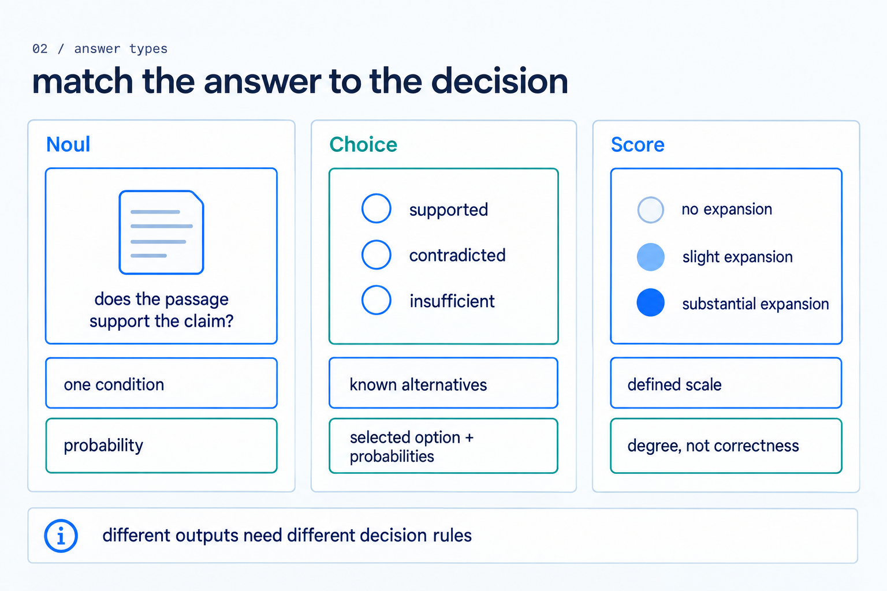
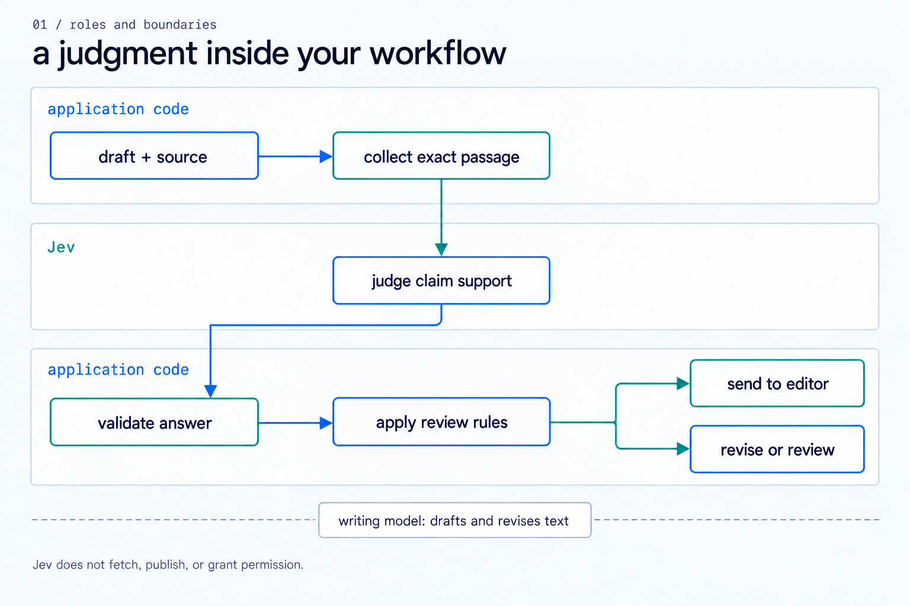
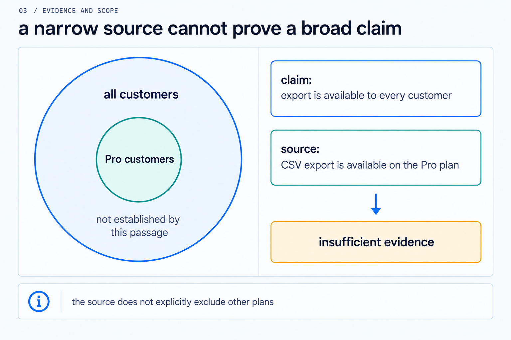
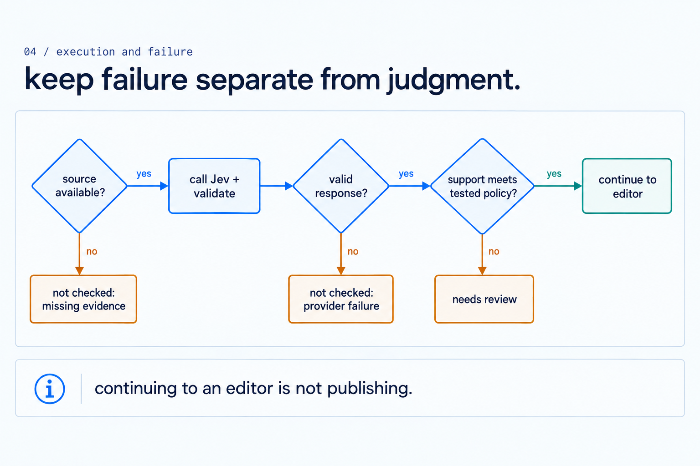
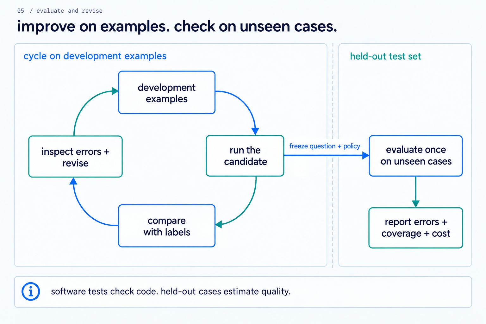
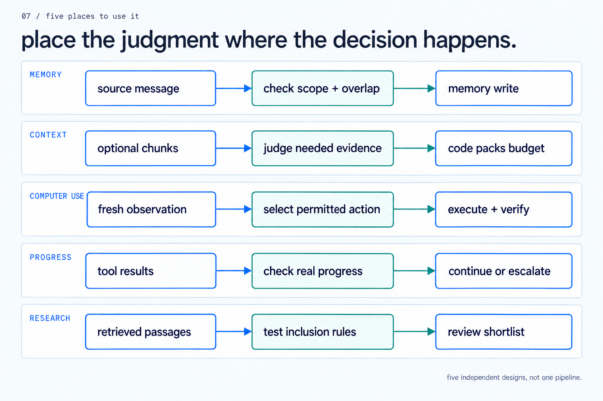
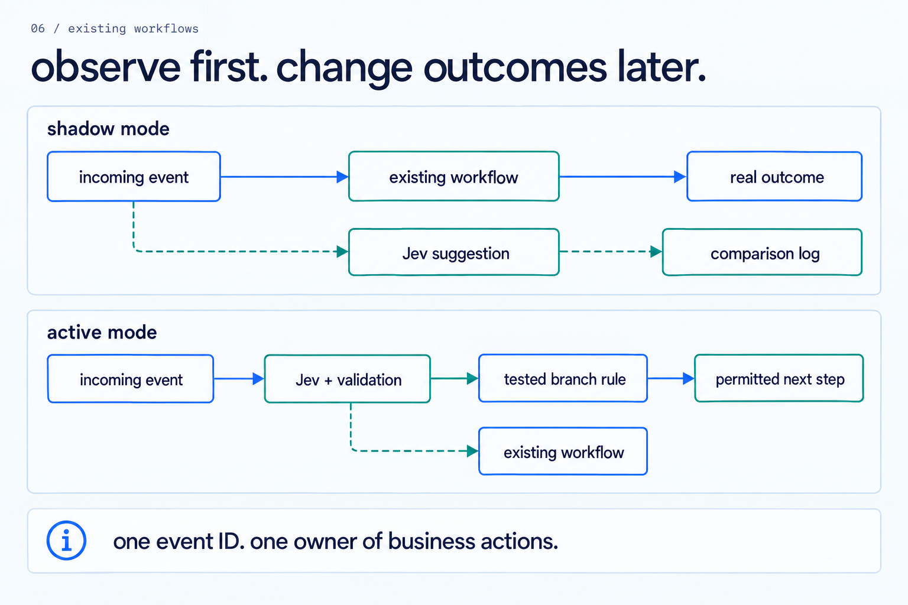
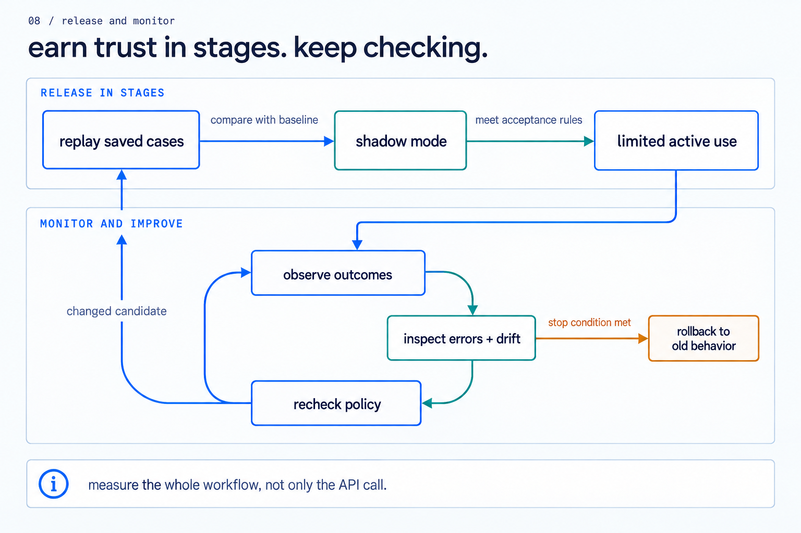

# Jev Engineering

**Source:** <https://github.com/codejunkie99/jev-engineering/blob/main/jev-engineering.md>

Typed Decision Systems for Reliable Agent Workflows

Av1dlive

19 September 2026

## Abstract

Many agent workflows use a generative language model for two different jobs: creating an answer and choosing the next operation. Jev, a System One model from TypeSafe AI, exposes the second job through typed questions over supplied state. This paper examines how to use that interface without giving the model control over permissions, execution, or verification. We develop an engineering framework that separates observation, semantic judgment, deterministic policy, authorized action, and outcome checks. We review public performance reports, explain their measurement boundaries, and derive conditions under which inexpensive decisions can improve a complete workflow. The evidence supports experimentation on bounded tasks, not a universal 100-fold improvement. A worked claim-checking example demonstrates the request contract and failure handling; its companion implementation passes 30 offline checks, but no live model accuracy is claimed. The paper also provides an evaluation protocol, a staged deployment method, and implementation prompts for existing agent, business, research, and data systems. The central conclusion is that the useful unit of design is a verifiable decision loop rather than a standalone prompt. Jev supplies a judgment within that loop. Application code determines whether the judgment is usable, which actions are permitted, and what evidence establishes completion.

## 1 Introduction

An assistant that handles a support request may classify the issue, choose a knowledge source, identify missing information, draft a reply, decide whether escalation is needed, and submit a result for review. These steps do not all require the same kind of model. Drafting needs generation. Selecting among existing handlers needs a bounded judgment. Checking an account limit needs ordinary code. Sending a message needs authority that cannot be inferred from a model's confidence.

Jev offers a specialized interface for the bounded judgments. TypeSafe describes System One as state in and typed probabilistic decisions out. The caller supplies evidence and questions. The model returns probabilities, a selection from listed options, or a value on a defined scale. It does not produce a new paragraph or execute a tool. [1]

This distinction suggests an engineering opportunity. A workflow can retain its existing planner, writing model, tools, and storage while moving selected semantic decisions into a separate service. The change can be small: a router before an expensive model, a source-support check before editorial review, or a relevance filter before loading a long document. Small changes are useful because their effects can be measured against an existing path.

The promotional claim that Jev represents an Internet moment for AI is an interpretation, not an empirical result. Likewise, a stack described as belonging to 2028 is a forecast. Neither statement specifies a workload, error tolerance, comparison model, or measurement procedure. This paper asks a narrower question: under what conditions can typed decision models improve the cost, latency, and reliability of software that already uses agents?

We use the term *Jev engineering* for the design of software around Jev. It is the title of this paper, not the name of a separate TypeSafe product or an official certification. The contribution is an engineering synthesis and implementation guide. It is not a new account of Jev's internal architecture, a reproduction of its training procedure, or a peer-reviewed benchmark publication.

The paper has three practical objectives. First, make the division of responsibility precise enough to implement. Second, preserve the conditions attached to public benchmark results. Third, give builders reusable contracts and prompts that fit their current systems. The appendices retain the detailed application recipes from the earlier mastery guide, but place them after the technical argument so readers can distinguish general principles from proposed builds.

## 2 Evidence and Research Method

The review uses primary materials available on 19 September 2026: TypeSafe documentation and launch material, the official adapter repository, published cookbooks, and reports by developers who ran the described systems. We prefer the original measurement notes to summaries that repeat a headline. Documentation establishes the intended interface; a benchmark establishes only what its stated setup measured.

We distinguish four evidence classes. **Documented behavior** covers the public API and model interface. **Reported experiment** means a result published by its vendor or test author, not reproduced here. **Local verification** covers the companion program's offline checks. **Proposed design** covers the workflow patterns, prompts, acceptance process, and derived calculations in this paper. These labels matter because a runnable example is not evidence that a model will answer its questions correctly.

The review is targeted rather than exhaustive. It audits the main claims in the Jev mastery material and traces them to original sources. It does not estimate publication bias across all Jev experiments, audit TypeSafe's training data, or independently validate the labels used in its workflow dashboard. Source pages and repository branches can change; a reproduction should pin model versions, source revisions, input data, and code commits.

### 2.1 Benchmark claims and their scope

Table 1 summarizes the results most likely to be repeated without their conditions. These are different experiments with different denominators. They must not be combined into one claim about universal agent performance.

| Report | Published result | What was measured |
|---|---|---|
| TypeSafe workflow evaluation | Up to 193.6x faster and 444.6x cheaper | Vendor comparisons using structured decision workflows; not a general agent speedup |
| TypeSafe parallel questions | 10.0x faster and 12.2x cheaper | One 13-question batch versus 13 sequential calls on the same long document |
| Every writing checks | 777 judgments in under 0.7 seconds | Concurrent questions across 37 documents; exploratory quality assessment |
| Browser Use Jev Ultrafast | 7.092-second optimized median | Three matched Google Flights runs; excludes initial navigation |
| Mobile Jev | About 21 seconds for 9 actions | Recorded Android route-entry demo ending at payment selection |
| TypeSafe Hermes skill suggestion | Wrong loads 16.8% to 7.3% | A specific agent, skill catalog, and request set |
| TypeSafe legal re-ranking | Top-10 hit rate 38% to 62% | Forty CLERC queries with 30-passage candidate lists |

*Table 1. Reported results, not measurements performed for this paper. The following paragraphs identify sources and qualifications.*

TypeSafe attributes its 193.6x and 444.6x headline ratios to its workflow evaluation and describes them as being toward the high end of expected gains. The reference probabilities average GPT-6 Astra and Claude Fable 5.1 responses at high thinking. Other evaluated configurations use provider defaults. The LLM wrapper requests compatible structured decisions, including probabilities, which can add time and cost compared with a discrete label. Thus the ratios should not be restated as a guarantee against both named models on every task. [2], [3]

The parallel-questions cookbook uses Jev 1.12, a roughly 54,000-character document, thirteen questions, and five repeats per strategy. Its displayed means are $0.000497 and 0.27 seconds for the batch, versus $0.006090 and 2.71 seconds for the sequential set. The speed ratio sums individual call latencies; concurrent individual requests would narrow it. Although the page describes unchanged answers, its table contains small numerical differences for some questions. The appropriate interpretation is similar observed answers with sampling variation, not a proof of exact invariance. [4]

Every's Mike Taylor reports twenty-one checks across thirty-seven documents, producing 777 judgments in under 0.7 seconds at an estimated quarter-cent cost. He explicitly calls for stronger accuracy testing. A separate comparison reported in the same article found a 0.35-second median for Jev versus 8.83 seconds for Fable 5.1 at high effort. Jev caught six of seven intended defects; Fable caught all seven. These small tests expose a quality tradeoff as well as speed. [5]

Browser Use reports three alternating pairs on one Flights task: a 9.450-second original median and a 7.092-second optimized median. Both arms use Jev and the same text helper, so this comparison measures runtime engineering, not replacing an LLM with Jev. Its current video records 7.073 seconds. Setup, initial navigation, and fresh independent post-run verification sit outside that clock. A completed flight purchase is not the claim. [6]

The Mobile Jev repository describes nine actions in about twenty-one seconds to open Uber, enter a route, and reach payment selection. It explicitly says a completed booking is not demonstrated. The implementation selects text spans from supplied material and uses a separate device API for actions. It is evidence of a particular mobile control loop, not a general mobile-agent success rate. [7]

The Hermes cookbook evaluates 488 requests against a 182-skill catalog. The covered subset contains 315 requests; the uncovered subset contains 173. Wrong loads fall from 16.8% to 7.3%, while needless loads fall from 9.8% to 4.0%. The reported intervention fixes some previously wrong cases and breaks some previously correct ones. The engineering lesson is to measure both directions when adding a recommendation. [8]

The re-ranking cookbook pools 3,565 passages and evaluates forty CLERC queries. BM25 supplies thirty candidates per query. Re-ranking raises the displayed top-1 rate from 5% to 18% and top-10 rate from 38% to 62%. This is retrieval performance on a small constructed corpus, not legal-answer correctness. It also cannot recover a relevant passage that the candidate generator omitted. [9]

### 2.2 What the evidence supports

Together, these reports justify testing frequent, bounded judgments where generation overhead matters. They do not establish a universal quality ranking, a transferable confidence threshold, or an end-to-end 100x advantage. The most useful comparison is the existing application with and without one decision layer, using the same eligible events and the same completion criteria.

A research report should preserve negative observations. A missed defect matters even when the call is inexpensive. A wrong skill suggestion matters even when the aggregate error rate falls. A fast action sequence matters only if the final state meets the user's goal. These are not minor qualifications added after the result; they define what the result means.

## 3 The Typed Decision Interface

The native endpoint is `POST https://api.typesafe.ai/v1/systemone`. A request contains `model`, `state`, and a map of `questions`. Responses contain typed `answers`, the serving model, and token usage. Question IDs associate requests with answers but do not supply meaning to the model; instructions and criteria must state the actual judgment. [10]

The model reference lists `jev-1.13.0`, with moving aliases such as `jev-latest`. It documents text input, a 64K total request budget, and a 32K budget for state plus the longest question. The listed direct price is $0.042 per million input tokens, with output free. These are a dated product snapshot, not a permanent contract. Pin versions for comparisons and check current provider limits before deployment. [11]



*Figure 1. Noul, Choice, and Score represent different questions. Their values should not be treated as interchangeable measures of correctness. Original diagram from the Jev mastery guide.*

### 3.1 Noul

A Noul asks a yes-or-no question and returns a number between zero and one. For a claim checker, the proposition can be: “Does the supplied passage support every material assertion in this claim?” The value is a model estimate for that proposition. It is not a permission token and does not establish that the source itself is true. [12]

Missing evidence needs its own application state. A failed source fetch is not an observed negative answer. A low probability can mean that the supplied passage does not support the claim; it cannot tell the application whether its fetcher retrieved the correct document. Those concerns belong to different layers and should produce different statuses.

### 3.2 Choice

A Choice selects among options defined by the caller. Its answer includes the selected option, a probability for each option, and a confidence value. If the task may have no valid candidate, include an explicit no-match route or a separate applicability check. Otherwise a perfectly valid answer can still select the least-wrong option from an inadequate set. [13]

Candidate construction is therefore part of model quality. A browser selector cannot pick an element that was omitted from the observation. A model router cannot choose a provider excluded by stale availability data. Evaluate candidate recall before evaluating selection accuracy. Record the candidate list that existed at decision time, not the list that happens to exist when someone later inspects the trace.

### 3.3 Score

A Score evaluates ordered descriptive levels. With levels indexed from zero to K minus one, the returned score is the probability-weighted level. For probabilities p(k), the conceptual relationship is:

$$ score = sum[k = 0 to K - 1] k p(k) \qquad (1) $$

A score of 1.6 on a three-level rubric is not a 160% probability or an 80% probability of correctness. Its meaning depends on the level definitions. Treating equal index steps as equal business costs is also an application assumption. If the distinction between “minor” and “major” has asymmetric consequences, encode those consequences in policy rather than assuming a numeric score captures them. [14]

### 3.4 Confidence and consistency

Choice and Score confidence derives from the answer distribution. It is not a second model independently checking the judgment. A concentrated distribution can be wrong because the evidence is misleading, the rubric is incomplete, or the task falls outside the model's reliable range. A threshold becomes useful only after its observed error and coverage are measured on the application. [15]

Independent question evaluation also does not imply that the underlying events are statistically independent. Two questions may test almost the same property. Multiplying their probabilities can create unjustified certainty. Likewise, a support Noul and a relationship Choice can disagree. The host should retain those disagreements as review signals rather than silently inventing consistency between them.

## 4 Architecture of a Verifiable Decision Loop

The proposed architecture consists of a state builder, a typed decision client, a deterministic policy, an executor, and a verifier. These components have different failure modes and should remain separately testable. The model is not the loop controller. The host supplies the permitted decisions and determines how returned values affect the workflow.

Let O denote an observation, B the state builder, J the model, Q the question set, P the policy, E the executor, and V the verifier. A single step can be written as:

$$ s = B(O);\quad a = J(s,Q);\quad d = P(a,s);\quad r = E(d);\quad v = V(r,O_{new}) \qquad (2) $$

This notation is a software decomposition, not a claim about Jev's neural architecture. If no action is warranted, the policy can return review, refresh, wait, or the existing fallback. The executor should accept a validated application decision, not arbitrary text returned by a model.



*Figure 2. The host gathers evidence, validates the result, and applies the branch policy. Jev supplies a judgment. Editorial authority remains outside the model.*

### 4.1 State and provenance

Useful state contains the evidence required for the question, its source, and the context needed to interpret it. It should distinguish verified account fields from user assertions, direct instructions from quoted text, and current observations from historical notes. A large transcript is not automatically better input. Irrelevant material can obscure the distinction the question is supposed to test.

For each decision, retain an event ID, observation time, source IDs, requested and returned model versions, question version, and policy version. Sensitive raw content may require restricted storage or a shorter retention period than operational metadata. The trace should be sufficient to reproduce the branch without turning logs into a second uncontrolled copy of customer data.

In an action loop, state has a useful lifetime. A button can move, a recipient can change, or another worker can complete the task while the request is pending. Bind the result to the relevant observation and target. Before executing, revalidate the target and any facts that affect authority or safety. A general page animation may not matter; a changed destination or amount does.

### 4.2 Policy and authority

The policy maps valid answers to known application outcomes. It handles uncertainty and failure explicitly. It also retains deterministic controls for permissions, budgets, account ownership, and numeric limits. An advisory interpretation of “send this” can help an approval interface, but it cannot replace the product's authorization record.

Authority and relevance are separate. A tool may be relevant but unavailable to the current user. An operation may be requested but exceed an approved limit. A result may be confident but based on a stale target. Candidate generation can exclude known-ineligible operations before inference; final execution still checks the current conditions because they may change afterward.

### 4.3 Execution and fresh verification

The executor owns side effects and retry semantics. If a transport error occurs after a mutation may have happened, blindly repeating the action can duplicate a message or transaction. Use the system's idempotency mechanism where one exists. Otherwise inspect fresh state before deciding whether a retry is valid. Model evaluation retries and business-operation retries are distinct concerns.

The verifier checks the actual outcome. A selected “done” option is not proof that a workflow completed. For a document export, inspect the created artifact. For a changed setting, read the setting again. For a queue insertion, verify the stored record and status. Verification must refer to the user's goal rather than merely confirming that an API returned success.

## 5 Parallel Questions and End to End Economics

Parallel questions are useful when several judgments share the same evidence. A support ticket may need an issue family, evidence completeness, and escalation urgency. These questions can be evaluated together if each is fully specified against the available state. Code then consumes only the answers relevant to the selected branch. TypeSafe calls this speculative fan-out. [16]

A question that depends on an earlier answer is different. “Is the selected tool appropriate?” cannot inspect a selection produced by another independent question in the same request. Either evaluate each named candidate in advance, or make a second request containing the actual selection. Batching is a scheduling technique, not a mechanism for hidden communication between questions.

### 5.1 A simple token model

Suppose a state contains S billed tokens and question i adds q(i). Ignoring request overhead and provider-specific accounting, N separate requests consume approximately N times S plus the question tokens. One batch consumes S plus the same question tokens. The illustrative ratio is:

$$ R_{tokens} = [N S + sum_i q(i)] / [S + sum_i q(i)] \qquad (3) $$

The ratio approaches N when the state dominates. It approaches one when the questions dominate or the state is very small. This explains why a long-document example can show large savings without implying that every thirteen-question workload will produce the same result. Use returned usage rather than this approximation to calculate an actual bill.

Latency has a separate comparison. Sequential requests add round trips. Concurrent requests can overlap them, although limits, queuing, and shared resources still matter. A fair benchmark should compare the existing best-supported implementation, not only an unnecessarily serialized baseline. It should also report failures instead of timing successful requests alone.

### 5.2 Why a fast decision does not make every workflow fast

Let f be the fraction of original end-to-end time spent in the decision component and r the speedup of that component. If other work is unchanged and the new design adds no overhead, the resulting speedup is:

$$ R_{workflow} = 1 / [(1 - f) + f / r] \qquad (4) $$

For illustration, if decisions consume 40% of a workflow and become 100 times faster, the whole workflow becomes about 1.66 times faster. If decisions consume 99%, the same local improvement yields about 50.25 times. These are calculations, not Jev measurements. They show why observation, retrieval, generation, execution, and verification must appear in a performance report.

The assumptions can fail in either direction. Better routing may reduce later work, creating an additional gain. Wrong routing may cause retries and make the workflow slower. A faster classifier can increase queue pressure downstream. A system-level test is needed to capture those effects.

### 5.3 Cost per useful outcome

At the documented direct rate, 100,000 evaluations with 2,000 billed input tokens each imply $8.40 in Jev input charges. This is arithmetic based on an assumed workload, not a measured invoice. It excludes extraction, other models, storage, network services, retries, and human review. Free output tokens do not mean that the complete system has zero cost.

A useful economic measure divides total cost by completed, acceptable outcomes. Include failed cases in the total cost. If a cheap decision sends more work to an expensive reviewer, that effect belongs in the comparison. If it prevents wasted generation, count the avoided work. The correct adoption question is whether the whole process improves at the required quality level.

## 6 Worked Example and Provider Integration

The running example checks a product claim against a cited passage. The claim says that an export feature is available to every customer. The passage says that CSV export is available to customers on the Pro plan. The passage does not establish the broader audience. It also does not explicitly state that other plans lack access. The expected label is insufficient support, not an invented contradiction.



*Figure 3. Evidence about a subset does not automatically support a claim about the entire population. This is an expected human interpretation of a fictional example, not a recorded Jev answer.*

### 6.1 Request construction

The companion `jev-first-request.json` contains a complete native request. Its three questions check support, classify the relationship, and score scope expansion. Three types are used to demonstrate their interfaces; a production check may need fewer questions. The state and question definitions are original examples based on the documented contract.

```json
{
  "model": "jev-1.13.0",
  "state": {
    "claim": "Export is available to every customer.",
    "source_passage": "CSV export is available on the Pro plan."
  },
  "questions": {
    "support": {
      "type": "noul",
      "instructions": "Does source_passage support all of claim?"
    },
    "relationship": {
      "type": "choice",
      "instructions": "How does claim relate to source_passage?",
      "criteria": {
        "supported": "Every material assertion is established.",
        "contradicted": "An assertion explicitly conflicts.",
        "insufficient": "Neither full support nor explicit conflict."
      }
    },
    "scope_gap": {
      "type": "score",
      "instructions": "How much does claim expand the audience?",
      "criteria": ["No expansion", "Ambiguous", "Substantial"]
    }
  }
}
```

The shorter wording above illustrates the envelope; the companion executable uses fuller definitions. A build should version the complete wording, not just a question name. Changing “supported” from “some evidence exists” to “every material assertion is established” changes the task and invalidates assumptions about old thresholds.

### 6.2 Validation and branch mapping

The client should validate required answers, types, finite numeric values, known labels, expected distribution keys, and usage fields. The demonstration additionally checks distribution totals and the relationship between a Score and its level probabilities, with explicit numeric tolerances. Validation detects contract problems. It does not prove semantic correctness.

The policy keeps three broad statuses: not checked, review, and eligible for editor review. Missing evidence, provider failure, and malformed responses stay not checked. Conflicting or insufficient support goes to review. Meeting the demonstration thresholds only makes the claim eligible for the existing editor; it never authorizes publication. The numerical thresholds in the sample are uncalibrated teaching values.



*Figure 4. Failure states remain distinct from negative judgments. A successful API exchange is not equivalent to a supported claim or permission to publish.*

### 6.3 Local verification

The dependency-free `jev-workflow-demo.mjs` requires Node.js 20 or newer and uses the native HTTP endpoint. It prints an advisory result and has no publishing operation. Its offline suite covers valid fixtures, conflicting answers, missing fields, unknown choices, invalid distributions, inconsistent scores, missing credentials, empty evidence, HTTP errors, invalid JSON, network failure, and deadline expiry.

```bash
node jev-workflow-demo.mjs --self-test
```

All 30 offline checks passed in this review. They verify the program's mechanics under synthetic responses. They do not measure model accuracy, service availability, latency, or production readiness. A live run is optional, incurs provider usage, and requires a key supplied through the environment or secret manager:

```bash
node jev-workflow-demo.mjs --live
```

Never paste a real key into a shared prompt, source file, or report. The implementation makes no automatic retries. A production integration should adopt the existing system's retry owner and total deadline rather than nesting independent retry loops.

### 6.4 Build before Jev access

TypeSafe's official System One Adapter is a Python replacement for the evaluation interface backed by LLM APIs. Its repository documents OpenAI and native Anthropic providers, as well as an OpenAI-compatible provider example for xAI. This allows development against the same style of questions while access or a provider decision is pending. [17]

Interface compatibility does not mean behavioral equivalence. Provider configuration differs, the adapter can request probabilities or discrete answers, and its retry and normalization behavior affects cost and output. A native Jev client also should not receive adapter-only arguments without a translation layer. Keep a small application-owned evaluation interface and separate provider implementations behind it.

Switching providers should preserve the state schema, question versions, and branch tests, then trigger a new semantic evaluation. Do not carry confidence thresholds across providers without measurement. The adapter is useful precisely because it allows a controlled comparison; it does not establish that a provider swap needs no testing.

## 7 Evaluation Design

An evaluation must distinguish the judgment from its downstream consequence. For each event, preserve the evidence available at decision time, a human or otherwise explicitly identified reference label, and the eventual workflow outcome. A correct route can still lead to failure. A wrong route can succeed accidentally. Combining these into one success field hides the mechanism being tested.

Construct a development split for wording and policy changes and a held-out split for final assessment. Group near-duplicate documents or related entities where leakage is plausible. For a deployed temporal process, testing on later events may be more representative than a random split. Once failures from a held-out set guide tuning, that set no longer serves as an untouched final test.



*Figure 5. Question and threshold development is cyclical. Held-out evaluation is a separate gate, not another input to each tuning iteration.*

### 7.1 Baselines and units

Compare against the existing application, a simple deterministic alternative where appropriate, and an LLM-based structured classifier when that is the real substitute. Use identical eligible inputs and completion criteria. Record model IDs, provider settings, retries, concurrency, question versions, prices, and cache state. A probability-producing baseline and a discrete-label baseline answer different operational needs; report that difference.

Define the unit of analysis before calculating a percentage. A document with twenty questions yields twenty judgments but only one document. A workflow with ten actions is one task, not ten independently completed goals. Report both levels when useful. Correlated errors within one source or session should not be treated as independent evidence of reliability.

### 7.2 Selective automation

Two useful measures are coverage, the fraction of eligible cases handled automatically, and selective error, the fraction of automatic decisions that are wrong. Let A be the automatic subset and N the number of eligible events:

$$ coverage = |A| / N;\quad selective\ error = errors(A) / |A| \qquad (5) $$

If no cases are automated, selective error is undefined rather than zero. A policy that escalates almost everything can show a low error rate while providing little operational value. Report review burden alongside quality. For a critical class, report misses among actual critical cases rather than relying on overall accuracy dominated by ordinary events.

| Measure | Required denominator or scope | Why it matters |
|---|---|---|
| Overall decision quality | All eligible labeled events | Includes difficult and failed cases |
| Automatic coverage | All eligible events | Shows how much work the policy handles |
| Selective error | Automatically handled events | Describes the risk of active decisions |
| Critical miss rate | Actual critical cases | Exposes failures hidden by class imbalance |
| Tail latency | Complete workflow attempts | Captures slow paths and retries |
| Cost per accepted outcome | All costs and accepted completions | Connects inference to operational value |

*Table 2. Recommended evaluation measures. These are proposed reporting requirements, not measured Jev results.*

For probabilities, compare predicted ranges with observed frequencies and report a proper scoring measure such as mean squared probability error. Small bins provide weak calibration evidence. For Choice, inspect class confusion and no-match behavior. For Score, inspect threshold-adjacent errors and disagreements about the rubric itself. A poor rubric can limit every model tested against it.

### 7.3 Failure analysis

Classify failures by layer: missing source, wrong retrieval, unclear question, omitted candidate, numerical task assigned to the model, semantic error, conflicting answers, stale state, invalid response, provider failure, policy bug, execution failure, or disputed reference label. Repair the layer that failed. Adding another question does not fix an authorization bug or an unavailable source.

TypeSafe's jaggedness documentation identifies weaknesses including arithmetic, counting, dates, literal interpretation, indirection, distracting context, hostile input, and contradictory criteria. These should inform challenge cases. A documented mitigation remains a hypothesis until it works on the local workload. [18]

## 8 Application Design Patterns

The proposed applications share the same host-controlled loop, but their risks and useful outcomes differ. A research filter should preserve relevant evidence. A browser controller should avoid wrong or stale actions. A model router should preserve final answer quality. A memory filter should retain supported, useful records within the user's storage policy. One global quality score cannot stand in for these different objectives.



*Figure 6. The same typed-decision interface can serve several independent workflows. The applications are alternatives, not mandatory stages of one pipeline.*

### 8.1 Chief of Staff and inbox firewall

A Chief of Staff design can classify incoming items by required attention and route them to existing queues. Supply the actual message, verified ownership, open commitments, and explicit escalation rules. Use code for deadlines and calendar arithmetic. Use Jev for bounded questions such as whether a message requests a decision, contains missing information, or matches a known workstream.

An inbox firewall is best understood as a review-routing layer, not an infallible security barrier. It can flag likely instruction injection, unsolicited requests, or contradictions with an approved task. It should not silently delete mail or grant access. Preserve a review path, protect credentials outside the model, and test attacks that resemble legitimate requests as well as legitimate requests that resemble attacks.

Measure missed actionable items, unnecessary escalations, and time to a useful decision. Do not optimize for an empty inbox if the system achieves it by hiding difficult messages. The first version can produce a proposed queue without sending any reply.

### 8.2 Model and skill routing

Filter options mechanically for capability, availability, context, budget, and access. Then use semantic questions to distinguish among eligible choices. With large catalogs, rank broadly and inspect a small shortlist in detail. The shortlist must preserve a no-match outcome; otherwise the second stage can only choose among possible errors.

The full evaluation includes destination quality and retries. A cheaper first model may create more repair work. A skill suggestion can save context or distract an otherwise correct agent. Start with shadow recommendations and inspect disagreements with the existing router before letting the new route affect tasks.

### 8.3 Research feeds and evidence checks

A research feed can screen retrieved abstracts against explicit inclusion criteria, retain contradictory evidence, and send uncertain items for deeper reading. An evidence checker can judge whether one passage supports one atomic claim. These tasks should retain source IDs and exact excerpts throughout the pipeline. A label without provenance is difficult to audit and difficult to improve.

Do not equate a relevant paper with a strong result or an accessible URL with supporting evidence. Treat failed extraction as missing input. Keep synthesis and explanation in the writing stage, and preserve human review where the domain requires expert judgment. Appendix A includes separate recipes for screening, citation checks, dataset review, and semantic features.

### 8.4 Browser control and safety checks

Construct permitted operation-target pairs from fresh observations. Jev can select among those pairs or request refresh, wait, or escalation. The host resolves actual targets, checks authority, executes once, and reads the resulting state. If text must be created, use a separate generator; if an exact supplied value is sufficient, copy it in code.

A safety check can add another advisory signal, but the same model should not be the sole barrier between hostile input and a consequential action. Protect the action space and permissions independently. Untrusted page text can influence semantic judgments even when the response is perfectly typed. Structural validity narrows the output format; it does not establish that the chosen operation is safe.

## 9 Integration and Deployment

Add Jev where an existing decision has clear inputs, known possible outcomes, and a useful fallback. Preserve the system's storage, authentication, queues, and output tools. A narrowly scoped change is easier to evaluate than a rewrite that simultaneously changes the model, retrieval, prompts, and user experience.

There are two prompt audiences. A build prompt tells a coding assistant what to inspect and implement. A Jev question defines one judgment inside the implementation. Sending a repository-level build prompt to Jev will not create the application. Appendix C supplies the former; the worked request illustrates the latter.



*Figure 7. Shadow mode records proposals while the existing path remains authoritative. Active mode consumes a validated decision for an explicitly enabled branch.*

### 9.1 Offline and shadow stages

First implement the state builder, provider interface, policy function, and synthetic fixtures locally. Test missing fields, malformed responses, conflicting answers, timeouts, and the fallback without invoking a paid service. Then, with appropriate data and provider authority, evaluate labeled examples to estimate semantic usefulness.

Shadow mode should not execute a second copy of the business operation. It records the proposed branch alongside what the existing workflow actually did. Background evaluation may avoid delaying users, but it must preserve the original decision-time evidence. Sending a later, improved state makes the comparison unfair. Record failed shadow evaluations so quality reports do not silently discard them.

### 9.2 Limited active use

Enable only the task slice supported by the evaluation. Keep a mode switch, an owner, an explicit fallback, and conditions for stopping the pilot. Test rollback before relying on it. An unavailable checker should show not checked or invoke the existing path; it must not silently create a pass.

Question changes, new languages, new document types, new providers, and moving model aliases can alter behavior. Treat them as evaluation events. Retain old settings so a changed branch can be traced to a specific version. A cache key should include the evidence identity, question version, and model version where those affect the result.



*Figure 8. Deployment progresses through replay, shadow evaluation, and limited active use. Monitoring forms a continuing cycle with explicit rollback; it is not a one-time launch check.*

### 9.3 Queue semantics

A usable system needs a real work queue, not only a printed model response. The proposed queue record contains event ID, source pointers, decision version, permitted handler, status, creation time, and an idempotency key. Workers claim records through the existing queue mechanism and recheck current eligibility before executing. An advisory decision does not become executable merely because it has been stored.

Use explicit terminal states such as verified complete, failed, cancelled, and needs review. An execution request accepted by a tool may still be pending. Separate that state from verified completion. If the worker crashes after a side effect, recovery should reconcile against the external system rather than assume that the action did not occur.

## 10 Limitations and Open Questions

The public interface is much better specified than the internal model. TypeSafe names its training approach Reinforcement Learning for Calibrated Decisions, but the reviewed materials do not provide a complete training recipe or a reproducible account of model weights and data. This paper therefore analyzes the API and surrounding software rather than reverse-engineering an unsupported architecture.

The reviewed experiments are heterogeneous and often small. Some use model-generated reference judgments; others use synthetic examples or one demonstration task. They are useful for identifying promising designs and possible failure modes. They do not establish reliability under production distribution shift, adversarial use, or rare high-impact events. Independent reproduction remains necessary for strong comparative claims.

Calibration requires particular care. A probability can be useful on one domain and misleading on another. Wording, candidate sets, class prevalence, language, and source quality can alter the operating point. A developer should not adopt a threshold from an attractive demo without testing its selective error and coverage. For consequential operations, probability calibration still does not replace permission and outcome checks.

There is also an organizational cost. Teams must own rubrics, adjudicate disputed labels, monitor drift, and respond to failures. A low token bill does not remove that work. If the existing process already solves the task with a reliable rule or a small established classifier, adding a remote semantic decision may increase complexity without enough benefit.

Useful future work includes broader independent task suites, human-adjudicated reference sets, repeated end-to-end comparisons, and measurements of how error changes under source or language shift. A strong study should compare model quality at fixed operational constraints and operational cost at fixed quality. It should preserve failures and publish the exact definition of completion.

## 11 Conclusion

Jev makes a useful architectural distinction explicit: selecting a bounded outcome is different from generating content. Its interface can support inexpensive checks and routes inside existing software, provided the host retains control of evidence, permissions, execution, and verification. Public reports show promising results in specific settings, but their ratios do not transfer automatically to a complete agent.

The practical path is to choose one decision, define its evidence and fallback, implement a typed boundary, and evaluate the resulting workflow. Use batching where questions share state and do not depend on one another's answers. Preserve uncertainty as a real outcome. Expand active use only when the measured results justify it. The durable advantage comes from a well-designed decision loop, not from assuming that one model replaces the rest of the system.

## Appendix A Application Recipes for Agent and Research Systems

The following fifteen recipes are proposed designs adapted from the earlier mastery guide. They are not claims of deployed products or demonstrated performance. Each build prompt is intended for a coding assistant with access to the existing project. Keep the general integration contract in Appendix C and add the prompt for the selected recipe.

### A1 Route work to the right agent handler

**Suitable setting:** Teams with an assistant that already has several skills or specialist workflows. This chooses the handler for a task; Recipe A2 separately chooses a model within a handler.

**Existing workflow:** request → general agent interprets everything → loads tools/context → begins work.

**Proposed workflow:** request → shortlist eligible handlers in code → Jev evaluates fit → policy chooses handler or original router → selected workflow begins.

**Required evidence:** `request`, `task_phase`, and `handlers`, with each handler's ID, purpose, supported inputs, and exclusions. Do not include hundreds of irrelevant tool schemas. Retrieve a shortlist first.

**Decision questions:** Choice: “Which listed handler best matches `request`?” Noul per candidate: “Does handler H support the requested operation?” Noul: “Does the request lack a fact required to choose among these handlers?” Include `none` in the Choice.

**Implementation:** Find the dispatch function. Add a state builder and a single evaluation call. Store the chosen ID in your existing dispatch type. Validate that the handler remains enabled before use. In shadow mode, compare to the original router without dispatching twice. Use code to retain the original route for unsupported requests or API failure.

**Example:** “Find the cause of this failing test” should shortlist investigation and testing handlers. It should not pick deployment merely because a failure appears after a release.

**Evaluation:** correct handler, fallback rate, context loaded, routing latency, and downstream completion. A faster router that repeatedly chooses the wrong specialist has not improved the product.

**Implementation prompt**

```text
Implement Jev-assisted handler selection in the existing task dispatcher.
Find the actual handler registry and preserve its eligibility checks. Shortlist
handlers with their descriptions and exclusions, then use a Choice including
none plus one Noul for each candidate's applicability. Build criteria from the
current registry so returned IDs map to real handlers.

Add shadow comparison with the existing router and record disagreements. Do not
dispatch a handler in shadow mode. Active mode must validate the selected ID and
fall back to the original router on uncertainty, no match, timeout, or error.
Add replay cases for overlapping handlers, unsupported tasks, missing context,
disabled handlers, and a request containing misleading handler names.
Deliver the insertion point, local implementation, and replay results.
```

### A2 Choose the right model for a task

**Suitable setting:** An existing handler that can call several models with different cost and capability profiles.

**Insertion point:** after the workflow or handler has been selected and its required output is known.

**Required evidence:** task text, needed capabilities, available model descriptions, and stable capability labels. Code checks current availability, context size, modality, budget, and provider restrictions before forming the candidate set.

**Decision questions:** Scores for task reasoning depth and ambiguity; Noul for whether synthesis of multiple supplied sources is required; optional Choice among eligible model tiers. Do not ask Jev to calculate which model is cheapest from a rate table.

**Implementation:** Collect replay tasks. Evaluate each plausible destination model on the same held-out tasks. Learn a routing rule from actual outcomes. Measure whether the classification call's overhead is worth adding. If a task has only one eligible model, skip Jev entirely.

**Example:** rewriting a short sentence and resolving a cross-file race condition need different capabilities even if their input lengths are similar.

**Evaluation:** quality loss versus the existing route, total task cost including retries and escalations, latency, and escalation rate. Model identity alone is not a quality label.

**Implementation prompt**

```text
Add optional Jev-based model routing inside our existing model gateway. Inspect
the current provider catalog and routing constraints. Filter candidates in code
for modality, context capacity, availability, and budget. Use Jev to estimate
semantic task requirements, then apply a configurable routing policy.

Skip classification if only one route is eligible. Retain the current default
route on timeout or uncertainty. Build an offline comparison that runs identical
labelled tasks through destination models where authorized and measures quality,
total cost, retries, and completion latency. Do not assume expensive always means
better or compare only first-call prices. Deliver the route policy and rollback.
```

### A3 Select the next action in a browser or desktop workflow

**Suitable setting:** People maintaining an existing browser or desktop automation harness.

**Existing workflow:** read UI → generative model chooses action and target → execute → read UI.

**Proposed workflow:** read UI → host constructs action candidates → Jev chooses one → host validates current target and permissions → execute once → verify state change.

**Required evidence:** objective, observed UI text, observation version, relevant recent actions, and candidates such as `{id, operation, target_id, description}`. Targets must come from the current observation. Attach risk and authorization metadata in code where they are already known.

**Decision questions:** Choice over candidate IDs plus `refresh`, `done`, and `escalate`. For each candidate, a Noul can assess whether its description advances the stated subgoal. Check completion using a concrete observable condition. A separate question cannot refer to the result of the Choice until it is supplied in a later request.

**Implementation:** Start with one app and one reversible task, such as navigating settings or muting a microphone. Generate complete action/target pairs so separate choices cannot create an incompatible combination. Invalidate choices when the UI changes. Keep argument generation, typing, and navigation code in the existing harness. Verify the resulting state after execution and use a bounded recovery count.

**Example:** a microphone control labelled “Mute” is a different candidate from the neighboring “Deafen” control. Both sound related; evaluation fixtures must exercise that distinction.

**Evaluation:** completed subgoals, stale selections, wrong targets, extra refreshes, and full observed latency, including UI tools.

**Implementation prompt**

```text
Add Jev action selection to one reversible flow in my existing computer-use
harness. Inspect how it obtains accessibility or DOM state and executes actions.
Construct candidates as complete operation/target pairs grounded in that state.
Include refresh, done, and escalate choices. Bind each decision to an observation
version and reject it if its target or state is no longer current.

Keep the current perception and execution tools. Jev receives text state only.
Keep permissions and known action risk in the host. Verify a concrete post-action
condition; never interpret a selected candidate as a completed task. Add bounded
recovery and replay tests for stale state, ambiguous targets, an already-complete
goal, and no matching action. First deliver shadow mode and one local demo.
```

### A4 Recognize the scope of a user's instruction

**Suitable setting:** Applications whose assistants can both prepare content and perform external actions.

**Insertion point:** when the host has an explicit candidate operation, before its existing permission check.

**Required evidence:** the direct user instruction, candidate operation with target, and relevant prior approvals. Keep tool output and quoted text separate from user instructions; their presence in a transcript does not make them authority.

**Decision questions:** Choice for requested scope: inspect, prepare, execute, or unclear. Noul: “Does this user instruction request execution of the specified operation on this target?” These classify language; the final authorization result belongs to the established permission mechanism.

**Implementation:** Maintain structured metadata for operation side effects. Attach Jev's interpretation as advisory input to the existing approval UI or policy logic. If a target changes after classification, re-evaluate the request/target pair. Keep prior valid approvals when the operation remains within their actual scope.

**Example:** “Draft a reply to Sam” permits preparing text; “Send this approved reply to Sam” refers to a particular message and recipient. The qualifier matters.

**Evaluation:** scope misclassification, unnecessary confirmation requests, and target mismatches. Higher confidence must never erase a missing permission record.

**Implementation prompt**

```text
Add a Jev interpretation step next to the existing action-authorization code.
Evaluate the direct user instruction against one explicit candidate operation
and target. Classify inspect, prepare, execute, or unclear, and separately assess
whether this operation was requested. Preserve the existing permission system
as the authority; Jev supplies a language interpretation only.

Reuse valid prior approvals within their scope. Distinguish quoted instructions
and tool-returned text from the user's request. Test draft/send distinctions,
changed recipients, withdrawn instructions, missing targets, and a previously
approved action. Report both erroneous permissions and needless user prompts.
```

### A5 Detect when an agent stops making progress

**Suitable setting:** Teams operating multi-step agents with long traces and expensive failed runs.

**Insertion point:** after a tool result, before the next planning turn. Code already enforces exact budgets and repeated-call counts. Jev judges whether apparently different actions are semantically repeating or drifting away from the goal.

**Required evidence:** goal, current subgoal, the last few action/result pairs, deterministic progress counters, and explicit completion requirements. Include actual observations; a trace of tool names alone cannot establish progress.

**Decision questions:** Noul: “Do the last actions repeat the same attempted solution without new relevant evidence?” Noul: “Does the proposed next step address an unresolved requirement?” Noul: “Does the claimed completion lack the required evidence in `observations`?”

**Implementation:** Add the observer behind a feature flag. Start with advisory records. Define policy actions such as continue, replan once, or return to the existing escalation handler. Treat unavailable evaluation as unknown. Keep hard budget limits active regardless of Jev's recommendation.

**Example:** reading three different files can be real investigation; rereading the same error through differently named tools may be a loop. Label both patterns.

**Evaluation:** wasted steps detected, useful runs interrupted, intervention latency, and recovery success. Optimize around avoidable failed work rather than the number of warnings.

**Implementation prompt**

```text
Add an advisory Jev observer after tool results in this agent harness. Reuse its
trace format and exact budget controls. Build compact state containing the goal,
subgoal, recent action/result text, progress markers, and completion requirements.
Ask separate Noul questions for semantic repetition, scope drift, and unsupported
completion claims. Keep the proposed next action explicit in state.

Create a deterministic intervention policy with continue, replan, and escalation
outcomes. Initially log proposals only. Replay successful and failed historical
runs, counting false interruptions as errors. Do not let Jev extend hard budgets
or turn missing observations into a success signal.
```

### A6 Decide which memories are worth retaining

**Suitable setting:** Assistants that already propose notes for a persistent memory store.

**Insertion point:** after a candidate note has been produced and before the existing storage operation.

**Required evidence:** candidate text, source excerpt, retrieved possible duplicates, and the explicit retention policy. Retrieve within the same user's authorized memory scope. Source text distinguishes a personal preference from a quoted preference or a hypothetical example.

**Decision questions:** Noul: “Does the speaker explicitly express a preference likely to matter in future sessions?” Noul: “Is this claim supported by the source excerpt?” Choice over duplicate candidate IDs plus `none`. Noul: “Is the candidate temporary status rather than a durable fact?”

**Implementation:** Preserve source IDs. Detect exact duplicates in code. Use Jev for semantic overlap and support. Keep storage operations as append, link-to-existing, or review. Contradictory memories should be reviewed or versioned, not silently overwritten. Treat retentions and deletions according to the existing product policy.

**Example:** “Use short updates for this incident” may be temporary; “I prefer short progress updates in every project” is a more durable preference. Neither guarantees future usefulness without evaluation.

**Evaluation:** retrieval usefulness, unsupported notes, duplicate rate, and how often important preferences are missed.

**Implementation prompt**

```text
Add Jev evaluation before proposed notes enter the existing memory store. Inspect
the current retention policy and user boundaries first. Supply candidate text,
the supporting source excerpt, and a small authorized shortlist of possible
duplicates. Evaluate source support, durable preference, temporary status, and
semantic duplication with separate questions.

Keep exact deduplication in code. Store source pointers and proposed decisions.
Preserve existing write authority; a model probability cannot create consent.
Route contradictions to the existing review/versioning mechanism. Test quoted
preferences, temporary instructions, unsupported summaries, real duplicates,
and a valid long-term preference. Begin with shadow decisions.
```

### A7 Retain useful context during compaction

**Suitable setting:** an agent harness with an existing summarizer or token-budget manager.

**Insertion point:** after deterministic retention rules, before selecting optional chunks for the next context window.

**Required evidence:** each candidate chunk's actual content, goal, unresolved questions, source ID, and references from current work. Include only information available at the compaction time. Using later turns to guide retention would leak future information into your evaluation.

**Decision questions:** Noul per chunk: “Does this contain evidence needed for an unresolved requirement?” Score: “How directly does it inform the current subgoal?” Noul: “Can the same information be recovered from one of the supplied retained chunks?”

**Implementation:** Retain mandatory records first. Score optional content. Code computes token costs and selects chunks under the budget. A generative summarizer compresses selected chunks when needed; Jev does not produce summaries. Keep original material in retrievable storage rather than deleting it.

**Example:** a lengthy stack trace may contain one essential error, while a short confirmation token may be mandatory. Raw length is not an adequate relevance signal.

**Evaluation:** tokens removed, re-fetch frequency, task completion, retained evidence coverage, and latency. Compare with a simple recency baseline.

**Implementation prompt**

```text
Integrate Jev into the optional-chunk selection stage of our context compactor.
Inspect existing retention rules and summarization. Hard-retain required records
before scoring. Send real chunk content plus the current goal and unresolved
requirements; never ask for relevance using only tool name and text length.

Use independent evidence/relevance questions. Select under the token budget in
code and leave text summarization to the existing component. Preserve originals
for retrieval. Replay sessions using only evidence available at each compaction
point, compare against recency-based retention, and report completion failures,
re-fetches, evidence lost, and tokens saved. Add a switch back to the old policy.
```

### A8 Check whether citations support a claim

**Suitable setting:** Research assistants, knowledge-base writers, newsletter tools, and teams generating reports from retrieved sources.

**Insertion point:** after a draft has linked a claim to a passage, before the existing review/export step.

**Required evidence:** one atomic claim, the actual cited passage, source ID, and any explicitly supplied contextual qualifiers. A title or URL alone is insufficient. A fetcher verifies that the source was retrieved; Jev judges its contents.

**Decision questions:** Noul for complete source support; Choice among supported, contradicted, and insufficient; separate Noul for invented causal attribution. The worked example in Section 6 gives the question definitions.

**Implementation:** Segment compound claims using existing parsing or a generative model. Preserve the source mapping. Evaluate claims separately and aggregate their statuses in code. Display the original claim and passage alongside the result. Route disagreements to review rather than asking Jev to manufacture an explanation.

**Example:** “Users liked the update” is not supported by “support tickets declined.” A decrease in tickets may have several causes and does not directly establish satisfaction.

**Evaluation:** unsupported claims accepted, supported claims flagged, review burden, and performance by claim type. Keep numerical comparisons in code when they can be parsed exactly.

**Implementation prompt**

```text
Add a claim-evidence checking stage to the existing writing/export workflow.
Find where claims are associated with source passages. Preserve those IDs and
evaluate one atomic claim against its actual passage. Add Noul questions for
complete support and unsupported causal attribution, plus a relationship Choice
with supported, contradicted, and insufficient labels.

Show the original passage with advisory findings. If fetching fails, record
missing evidence. Do not treat a reachable URL as supporting content. Use a
deterministic policy for review routing and retain the existing export controls.
Create fixtures covering literal support, paraphrase, broader audience scope,
missing evidence, invented causality, and a clearly contradictory passage.
```

### A9 Add semantic policy checks to CI

**Suitable setting:** Teams with conventions that matter in review but are difficult to express as syntax rules.

**Insertion point:** after existing static checks collect the diff and metadata, before displaying review results. Start as a separate advisory check.

**Required evidence:** a focused diff, relevant surrounding code, applicable policy text, existing test results, and PR description. Code should select policies by changed paths before sending anything.

**Decision questions:** Noul per policy, for example “Does this migration description specify how existing rows are handled?” or “Does the supplied release note explain the changed default?” Check observable requirements instead of asking broadly whether the code is safe.

**Implementation:** Create a small policy registry with IDs and applicability rules. Evaluate only applicable policies. Map findings back to files or policy records using host-owned IDs. Use report-only mode while collecting reviewer labels. Avoid duplicate comments by updating one stored report or using the existing check output mechanism.

**Example:** a migration with valid SQL may still omit how incompatible existing data is migrated. This is a useful review signal; correctness still requires code inspection and tests.

**Evaluation:** useful findings accepted by reviewers, false alerts per PR, missed known policy failures, runtime, and cost. Generic warnings that cannot identify evidence are poor findings.

**Implementation prompt**

```text
Add an advisory semantic-policy check using Jev to our CI configuration. Discover
our actual review conventions and select three concrete policies with observable
evidence. Scope each policy by changed paths and provide only the relevant diff,
context, and description. Keep deterministic checks in existing linters/tests.

Store policy IDs and question versions. Produce a single review artifact showing
policy, source evidence, answer, and uncertainty. An API failure must show the
check as unavailable, not passed. Add fixtures for applicable, inapplicable,
satisfied, violated, and missing-evidence cases. Do not enable a merge-blocking
rule until its false-positive rate has been measured.
```

### A10 Offer help when someone is stuck in a product

**Suitable setting:** SaaS onboarding, setup wizards, checkout support, or data-import tools.

**Insertion point:** after a meaningful error or repeated failed step, not on every click.

**Required evidence:** current task, the visible error, recent relevant user actions, completed prerequisites, and available help topics. Avoid unrelated browsing activity. Code computes event counts, elapsed time, and cooldowns.

**Decision questions:** Choice among known problem categories; Noul: “Does the visible error prevent the current step?” Noul: “Does the user already appear to be following the recovery instructions?” Assess observable task progress rather than diagnose emotional state.

**Implementation:** Use a few existing help cards as candidates. Trigger only after deterministic event conditions. Render the chosen existing card, with dismiss and cooldown behavior. Have a general help fallback when no category fits. Use controlled rollout comparisons to determine whether interventions help completion.

**Example:** a repeated CSV import failure for missing headers can show the import-format help card. A person browsing templates successfully should not be interrupted because they clicked many items.

**Evaluation:** completion after help, dismissals, false interruptions, and time added to the flow. More intervention clicks are not automatically success.

**Implementation prompt**

```text
Add optional Jev selection of an existing help card after a user encounters a
blocking workflow error. Find the current event schema and help components.
Compute retry counts, time windows, and cooldowns in code. Send the current task,
relevant events, visible error text, and eligible help topics to Jev.

Classify the problem and whether recovery is already underway. Show only a known
help component, with a dismiss action. Keep routine successful exploration quiet.
Instrument completion and interruption rates. Test repeated errors, successful
recovery, ordinary browsing, no matching help topic, and an evaluation timeout.
```

### A11 Screen a large research corpus

**Suitable setting:** Research teams with more papers, interviews, or documents than they can inspect deeply.

**Insertion point:** after parsing and deduplication, before expensive summarization or full review.

**Required evidence:** abstract or relevant passage, inclusion criteria, source ID, and metadata. Keep uncertain or missing abstracts identifiable instead of treating absent text as exclusion evidence.

**Decision questions:** one Noul per inclusion criterion, a study-type Choice, and a relevance Score. Define missing-information outcomes in application policy. Avoid a single “is this a good paper?” judgment.

**Implementation:** Deduplicate documents. Evaluate screening units with stable IDs. Cache by content, model, and question version. Preserve per-criterion results. Queue uncertain cases for full-text review. Aggregate independently of completion order and track every failed request.

**Example:** a paper can discuss a technique without evaluating it. Separate “mentions technique” from “reports an experiment using technique.”

**Evaluation:** recall on truly relevant papers, review reduction, duplicate work, missing records, and subgroup performance. For exclusion, prioritize not missing relevant material over confidently rejecting many documents.

**Implementation prompt**

```text
Add Jev screening between document ingestion and deep analysis in this research
pipeline. Use our explicit inclusion criteria to make one narrow question each.
Keep source IDs and exact text snippets. Distinguish an absent abstract from
evidence that a criterion is false. Retain uncertain cases for full-text review.

Implement resumable evaluation keyed by content hash, model, and question version.
Track failed and skipped documents explicitly. Produce a reviewer table with
criterion-level signals and the source text. Evaluate recall using a manually
reviewed sample and compare with existing keyword screening. Keep synthesis in
the existing writing stage. Do not present model screening as expert adjudication.
```

### A12 Find ambiguous training examples

**Suitable setting:** Teams curating classification, extraction, or instruction datasets.

**Insertion point:** after exact format/dedup checks and before human label review or training-set assembly.

**Required evidence:** input example, assigned label, label definitions, and a small set of possibly similar records. Exclude the target from features used to predict that target in later training.

**Decision questions:** Noul: “Does the input support its assigned label under this rubric?” Noul: “Would more than one allowed label fit?” Choice over likely duplicate IDs plus none. A difficulty rubric must describe observable task complexity rather than simply label confidence.

**Implementation:** Queue disagreements for human adjudication. Preserve original labels and correction history. Split train/validation/test by source or entity when appropriate before iterative question tuning. Use semantic duplicate signals to investigate leakage; they cannot prove the absence of contamination.

**Example:** an email both asks about pricing and requests a refund. Whether this is ambiguous depends on whether the label definition permits multiple intents or declares a precedence rule.

**Evaluation:** confirmed label issues per review hour, errors introduced by edits, duplicate groups crossing splits, and downstream model quality. The goal is useful review prioritization.

**Implementation prompt**

```text
Build a Jev advisory pass over the existing dataset-validation workflow. Keep
format checks and exact deduplication in code. Evaluate label support, rubric
ambiguity, and similarity to supplied candidate records. Preserve original labels
and send proposed corrections to review rather than overwriting them.

Split data before tuning questions, grouping related sources when needed. Keep
test labels out of feature construction and prompt iteration. Produce a review
queue with source examples and criterion-level judgments. Measure confirmed issues
per reviewed item and test examples whose labels depend on an explicit precedence
rule. Treat leakage detection as a flag requiring investigation.
```

### A13 Triage disagreements among agents

**Suitable setting:** Systems that already collect multiple candidate answers, analyses, or plans.

**Insertion point:** after candidates arrive, before invoking a costly adjudicator.

**Required evidence:** user request, candidate texts, evidence passages, and evaluation criteria. Use anonymous candidate IDs if author or model identity is irrelevant.

**Decision questions:** Noul: “Do these answers recommend materially different actions?” Noul per candidate for evidence support and addressing the request; optional Choice for the best-supported candidate including none. Do not assume agreement establishes truth.

**Implementation:** Detect identical outputs in code. Evaluate remaining disagreement. Route material conflicts to the current judge. Include cases where all answers are wrong. Any final explanation must be produced from the evidence by the existing writing component, not presented as Jev's hidden reasoning.

**Example:** two agents phrase the same rollback recommendation differently; no substantial conflict exists. Two agents agreeing on an unsupported cause should still trigger review.

**Evaluation:** adjudications saved, wrongly suppressed disagreements, shared-error misses, and final answer quality. Test candidate-order permutations to detect position sensitivity.

**Implementation prompt**

```text
Add a Jev triage stage before the existing multi-answer adjudicator. Present the
request, anonymized candidate IDs and texts, source evidence, and a specific
rubric. Evaluate material disagreement and support for each candidate separately.
Use code to decide whether to invoke the existing judge; keep it for uncertain
or materially conflicting cases.

Evaluate paraphrase agreement, conflicting actions, agreement on a false claim,
no supported candidate, and candidate-order permutations. Log full decisions for
comparison with the current adjudicator. Report judge calls avoided together
with errors introduced, not just speed or cost savings.
```

### A14 Organize feedback by the underlying problem

**Suitable setting:** Founders and product teams collecting support tickets, feedback forms, and interviews.

**Insertion point:** after feedback ingestion and deduplication, before weekly product review.

**Required evidence:** feedback text, known product workflows, controlled taxonomy, and relevant product context. Keep revenue and account totals out of semantic questions when they can be joined later.

**Decision questions:** Choice for the underlying user job; Nouls for reported inability to complete it, an existing workaround, and explicit intent to stop using the product. Score for strength of evidence, with examples ranging from vague request to reproducible failure.

**Implementation:** Preserve links to original messages. Group by existing product taxonomy. Keep an other/unknown bucket. Let code aggregate unique users and accounts, then display evidence per theme. A writing model can propose a new theme for human acceptance; Jev chooses only from the current taxonomy.

**Example:** “add an Excel button” and “I need these rows in my finance workbook” can describe the same export job. Mentioning cancellation policy alone does not establish churn intent.

**Evaluation:** tagging accuracy, taxonomy coverage, unique-user aggregation, and usefulness in product review. Validate predictive churn features against observed outcomes before calling them churn probabilities.

**Implementation prompt**

```text
Add Jev classification to our feedback ingestion workflow. Use the current
product/job taxonomy plus an unknown category. Evaluate job, blocking problem,
workaround, explicit cancellation intent, and evidence strength as separate
questions. Retain original text and source links.

Count unique users/accounts and join business metrics in code. Build a reviewer
table grouped by job, with representative source messages and uncertain cases.
Do not invent customer segments or automatically modify the roadmap. Add fixtures
for paraphrased duplicate problems, unsupported feature demands, existing
workarounds, and cancellation-policy questions without cancellation intent.
```

### A15 Turn text into features for a predictive model

**Suitable setting:** Teams with labelled historical outcomes and useful text that their current statistical model ignores.

**Insertion point:** alongside existing feature extraction, before training a classifier or regressor.

**Required evidence:** the text that would have been available at prediction time. For example, a support note before resolution, not the final resolution written afterward.

**Decision questions:** Noul for observable properties, such as an explicit missing setup prerequisite; Score for semantic dimensions, such as specificity of a reported failure. Each answer becomes a named feature. Keep feature definitions versioned and available at inference time.

**Implementation:** Establish a simple baseline. Split data by time or entity before question discovery. Use a development set for proposing questions, another validation layer for tuning, and a final untouched test set. Train a conventional model on semantic features plus structured data. Fit imputation and preprocessing only on training data. Handle Jev outages using the model's documented missing-feature path.

**Example:** predicting resolution time from the first ticket and intake metadata could use reported reproducibility, number of systems involved as computed by code, and whether a concrete error is supplied. A note written after the ticket was solved would leak the answer.

**Evaluation:** held-out prediction error, calibration when predicting probabilities, inference latency, cost, and degradation when text features are absent. Feature importance is not evidence of causation.

TypeSafe publishes an AutoResearch feature-discovery example. [19]. The adaptation here requires its own labels and evaluation.

**Implementation prompt**

```text
Add Jev-derived semantic features to this existing supervised-learning pipeline.
Inspect the prediction target and exactly which text is available at inference
time. Establish the current baseline before adding features. Propose a compact
set of observable Noul and Score questions and version their definitions.

Split by time or entity as appropriate before feature discovery. Do not expose
test labels or post-outcome text to prompt tuning. Cache outputs by text/model/
question version and join on stable record IDs. Compare structured-only, existing
text baseline, and Jev-feature variants on identical held-out records. Include
cost, latency, and a missing-feature fallback. Report negative results honestly.
```

## Appendix B Integration with Existing Business Workflows

These five examples show where the decision layer can fit in an existing process. Product categories do not imply native Jev connectors. Verify current platform contracts and reuse the organization's existing data and action permissions.

### B1 Support inbox: ask for the missing detail before generating an answer

**Today:** a ticket arrives, a general assistant reads the whole conversation, retrieves help articles, writes a response, and sometimes asks for information it should have requested first.

**Change:** add an intake decision before retrieval and generation. The application reads the ticket and verified account fields. Jev identifies the issue family and whether specific prerequisites are present. Code chooses a troubleshooting path or a clarification template. Your existing writing model still drafts the reply.

**Useful input:** the latest customer message, a short relevant conversation window, product area, known plan, and the information each troubleshooting flow needs. An email mentioning “Enterprise” is not proof that the account has that plan; fetch account facts separately.

**Decision questions:** Choice among your actual issue families plus `unknown`; Noul for whether an error message is supplied; Noul for whether reproduction steps are supplied; Noul for whether the customer reports being unable to use a paid feature. For a selected issue family with special requirements, a second evaluation can check those requirements explicitly.

**Concrete example:** “It keeps failing when I connect my workspace.” The workflow should request the integration name and exact error, rather than inventing a fix. If those fields already appear in the thread, it should use them rather than asking again.

**Responsibility boundary:** Jev labels the text. Existing code performs account verification, determines support entitlement, and applies escalation rules. The writing assistant receives a structured brief and retrieved evidence. A human or the existing approved sending policy controls outbound replies.

**Evaluation:** clarification loops per resolved ticket, unnecessary questions, escalation misses, handling time, and customer corrections. Measure resolution outcomes, not just agreement with old labels.

```text
Add a Jev intake layer to our existing support workflow. Inspect the current
ticket ingestion, account lookup, knowledge retrieval, and reply-drafting steps.
Identify the top three issue families from our actual routing configuration.
For each, list the evidence required before troubleshooting can begin.

Implement an advisory classifier and evidence-presence questions using the real
ticket fields. Keep verified account data separate from customer assertions.
Choose between the existing troubleshooting path, a clarification draft, and
human review. Never treat missing information as a negative account fact.

Reuse the current reply writer and sending permissions. Run in shadow mode
first. Add replay cases for details supplied earlier in the thread, mixed issues,
quoted instructions, absent account data, and API errors. Report clarification
loops avoided and incorrect clarification requests, not just classifier accuracy.
```

### B2 Creator workflow: turn an approved brief into a content preflight

**Today:** a creator gathers source material, writes a draft, checks claims and positioning manually, then schedules it.

**Change:** run a preflight between drafting and scheduling. An ordinary parser or writing model identifies checkable claims. Retrieval attaches source passages. Jev evaluates each claim and a small set of brief-specific constraints. The writer receives a revision checklist; the publishing queue retains its current approval process.

**Useful input:** approved brief, intended audience, draft, atomic claims, source passages with dates, and examples of acceptable tone. Evaluate source support per claim. A global “is this factual?” question is too coarse to identify the needed repair.

**Decision questions:** Does this passage support this claim? Does the opening name a concrete reader problem? Does the draft state a measurable outcome without a supplied measurement? Does it present a proposed workflow as an already tested result? These checks are original editorial rubric examples, not objective definitions of good writing.

**Concrete example:** a draft says “This reduces costs by 80%,” while the source only supplies a per-token price. Flag the unsupported result. The writer can replace it with an attributed price or a clearly labelled hypothetical calculation.

**Responsibility boundary:** code verifies arithmetic and links; a person approves subjective positioning. Store the exact brief version, because a later brand update should not silently change the meaning of old evaluations.

**Evaluation:** unsupported claims caught, false alarms, revision time, and reviewer agreement. A stylistic score is not proof of commercial performance.

```text
Build a Jev preflight inside my existing content workflow, after drafting and
before the scheduling handoff. Use the actual approved brief and source bundle.
Separate factual support checks from subjective editorial preferences.

Create a per-claim result linked to the original draft span and source passage.
Have code check numbers and links. Use Jev for source support, audience fit, and
whether claimed results exceed the supplied evidence. Missing or inaccessible
sources must produce not_checked, not factual approval.

Feed an actionable checklist into the current revision assistant. Preserve the
original draft and show a diff. Do not schedule or publish anything. Include
fixtures for vendor claims, personal test results, hypothetical calculations,
missing citations, and a good draft that should pass without needless rewriting.
```

### B3 Sales handoff: qualify the request, not the person

**Today:** inbound form text enters a CRM and a salesperson manually decides whether it is a demo request, support issue, partnership proposal, or spam.

**Change:** keep form validation and duplicate detection in code. Jev classifies the stated request and checks for explicit buying-process details. Code selects an existing queue or creates a review draft. A writing model may prepare a reply using approved facts.

**Useful input:** the submitted message, voluntarily supplied business requirements, product capabilities, and route definitions. Avoid inferring protected characteristics, wealth, personality, or hidden intentions from names or writing style.

**Decision questions:** Which existing queue matches this request? Does the message explicitly mention an implementation deadline? Does it request a capability the supplied product description excludes? Is it missing information required to choose a route?

**Concrete example:** “Can your tool run inside our private network by November?” should surface a deployment requirement and stated timeline. It should not receive an invented purchase probability or be promised an unsupported deployment mode.

**Responsibility boundary:** eligibility and contract terms remain governed by policy and verified product data. Respect existing outreach consent. No autonomous commitments or messages are necessary for the first version.

```text
Add Jev-assisted inbound routing to this CRM intake flow. Use only the submitted
request, verified business fields, current product facts, and approved queue
definitions. Classify request type and explicitly stated requirements. Do not
infer sensitive traits or manufacture a probability that someone will buy.

Map results to existing queues with a review fallback. Preserve lead ownership,
duplicate rules, and outreach consent checks. Draft suggested follow-up questions
only when information is actually missing. Start with advisory fields and no
automatic email. Evaluate misroutes, duplicate handoffs, and missing-requirement
recall on historical inputs, using the product facts available at the time.
```

### B4 Document intake: decide which extracted passages deserve attention

**Today:** a folder or upload form receives documents, text is extracted, and reviewers search through them for a small set of relevant facts.

**Change:** keep file access, OCR, indexing, and retrieval in the existing pipeline. Retrieve candidate passages, then use Jev to judge relevance against a specific question. Send selected passages and provenance to the existing analyst or writer.

**Useful input:** the review question, extracted passage, document ID, page or section locator, extraction quality signal, and document date. Jev's current text interface is not an OCR replacement. Empty extraction must not become “no relevant content.”

**Decision questions:** Does this passage explicitly discuss the requested condition? Does it specify an exception? Does it contain enough information to answer the review question? Does it refer to a superseded policy, where the document itself makes that clear?

**Concrete example:** an operations team asks which supplier documents mention delivery delays. Jev screens retrieved passages; the writer summarizes the actual delay language and links to its location. The system should not make legal conclusions about liability.

**Evaluation:** relevant-passage recall, review time, extraction failures, and provenance completeness. Evaluate retrieval misses separately: Jev cannot select a passage it never receives.

```text
Add a semantic screening stage to the existing document-ingestion pipeline.
Preserve file permissions, extraction, indexing, and retrieval. Evaluate only
retrieved text passages against the user's explicit review question.

Return passage IDs and typed relevance signals, not invented quotations. Keep
document version and page or section provenance through the entire workflow.
Route failed OCR and missing text to extraction review. Keep low-certainty
candidates available for manual review rather than silently discarding them.

Build a replay evaluation with both retrieved and missed relevant passages so we
can distinguish retrieval failure from screening failure. Do not alter original
documents or send their contents to a provider without the existing data policy.
```

### B5 Automation tools: use an HTTP decision branch

For a workflow built in an automation tool rather than a code repository, the integration still needs the same pieces. The following is a generic design, not a verified set of current n8n, Make, or Zapier UI instructions.

1. Receive the trigger and assign a stable event ID.
2. Apply existing access checks; select and redact relevant fields.
3. Build a native TypeSafe request with fixed, versioned questions.
4. Send the request from a server-side HTTP step using credential storage.
5. Validate the response before reading the selected branch.
6. Map only known outcomes to existing workflow paths; handle unknown/error separately.
7. Record the decision and final outcome without duplicating side effects on retries.

The first proof should end in a preview table, not an email send, payment, or record deletion. If the automation platform cannot perform the necessary validation, use a small server-side adapter that exposes a simpler validated result.

```text
Design and implement a Jev decision branch in this existing automation:
[paste an export or describe its trigger, steps, and destination]
Platform: [name and version, if known]
Decision to improve: [bounded judgment]

First inspect the workflow and the current official platform documentation.
Show exactly which step to add or modify and how data maps between steps. Use
the native TypeSafe contract, server-side credential storage, and explicit
success, uncertain, malformed-response, and API-error paths.

Keep the workflow's current business actions disabled in the test copy. Use a
preview output with event IDs. Explain retry ownership and duplicate prevention.
If the platform cannot validate the response safely, propose a minimal adapter
and provide its contract. Do not invent importable workflow JSON without checking
the installed node schemas. Deliver a test walkthrough and a rollback procedure.
```

## Appendix C Reusable Implementation Prompts

### C1 Inspect and implement one integration

```text
Add TypeSafe Jev to one useful decision point in my existing project.

My workflow: [describe what happens today in two or three sentences]
The problem: [cost, latency, brittle classification, missed checks, or review volume]
The outcome I care about: [specific measurable improvement]

Inspect the repository and follow its existing conventions. Identify the real
entry point, relevant modules, current decision logic, and existing tests. Do not
invent a framework or file structure before inspecting the project.

Read the current official references:
https://docs.typesafe.ai/concepts/system-one
https://docs.typesafe.ai/api
https://docs.typesafe.ai/models
https://docs.typesafe.ai/model-jaggedness/jev-1.13

Find up to three suitable insertion points. Rank them by expected usefulness,
availability of evaluation data, and implementation effort. Choose one that fits
my stated outcome and implement it locally behind a disabled-by-default flag.

For the chosen integration:
- Define the exact bounded decision and the existing fallback.
- Build compact state from fields the application actually has.
- Write one explicit judgment per Jev question.
- Keep exact calculations and permission checks in application code.
- Batch independent questions; stage questions that require earlier answers.
- Put questions, versions, and threshold configuration in reviewable files.
- Keep API credentials server-side and use existing secret management.
- Add off, shadow, and active modes using the project's configuration pattern.
- Validate returned fields and handle timeout, authentication, validation, and
  rate-limit failures without silently converting them into successful decisions.
- Record model version, question version, latency, usage, selected branch,
  fallback reason, and eventual outcome using the existing logging system.

Implement offline fixtures and meaningful checks for the new boundary. Compare
against the old behavior. Use synthetic examples only to check mechanics; mark
model accuracy as unmeasured until representative labelled inputs are evaluated.
Do not change production traffic or invoke paid APIs without existing authority.

Deliver the local implementation, configuration instructions, replay command,
evaluation plan, and a short explanation of exactly where Jev now fits.
```

### C2 Audit a failed decision

```text
Trace this Jev-assisted decision through our actual implementation:
[event ID or redacted trace]

Inspect the state supplied, candidate construction, question version, raw typed
answers, response validation, threshold policy, and eventual handler. Determine
whether the failure came from missing evidence, model judgment, policy mapping,
stale state, or execution. Do not invent the model's private reasoning.

Reproduce the application behavior with a saved response fixture before changing
prompts. Propose a minimal fix and add a regression case. If testing the proposed
question change needs a live API call, show the required run and estimated scope;
keep it separate from offline policy-test success.
```

### C3 Prepare a measured rollout

```text
Prepare this Jev integration for a limited rollout. Inspect the implementation,
offline evaluation, shadow traces, existing permissions, and operational owner.
Separate evidence we have from evidence still missing.

Create a go/no-go report with error by class, automatic-decision coverage,
critical misses, API failure rate, end-to-end latency, cost, and downstream
outcome. Include sample sizes and unresolved label disagreements. Propose
workflow-specific acceptance criteria for review, not universal confidence
thresholds.

Verify off/shadow/active behavior and test the rollback switch. Check that shadow
mode cannot duplicate external actions and that retries preserve idempotency.
Identify who can enable the rollout and what events require stopping it. Do not
enable production traffic as part of this preparation.
```

## Appendix D Reproduction and Artifact Inventory

The companion package contains this paper, its editable Markdown source, all eight original diagrams, the dependency-free demonstration, a native example request, fictional practice cases, and a standalone integration prompt. Run the offline checks before attempting a live request. The practice labels express an illustrative rubric, not recorded model predictions.

The local verification reported in Section 6 covers 30 offline checks and no live provider request. The performance reports in Section 2 belong to their cited authors. The workflow designs and build prompts are proposals for local adaptation. No production integration, paid model benchmark, or external action was performed for this paper.

For a new benchmark, save the dataset split, source revisions, exact questions, model and provider configuration, policy thresholds, concurrency, retries, raw answers, latency boundaries, usage, and independent outcome labels. Publish enough information to distinguish the cost of choosing an action from the cost of completing the user's task.

## References

[1] System One. https://docs.typesafe.ai/concepts/system-one. Accessed 19 September 2026.

[2] Launch report. https://typesafe.ai/blog/introducing-system-one-models-and-jev. Accessed 19 September 2026.

[3] evaluation methodology. https://evals.typesafe.ai/. Accessed 19 September 2026.

[4] Parallel questions. https://docs.typesafe.ai/cookbooks/parallel_questions. Accessed 19 September 2026.

[5] Every experiment. https://every.to/also-true-for-humans/mini-vibe-check-typesafe-s-jev-judged-everything-i-ve-written-in-0-7-seconds. Accessed 19 September 2026.

[6] Browser measurements. https://github.com/browser-use/jev-ultrafast/blob/main/docs/performance.md. Accessed 19 September 2026.

[7] Mobile Jev. https://github.com/droidrun/mobile-jev. Accessed 19 September 2026.

[8] Skill suggestion. https://docs.typesafe.ai/cookbooks/skill_suggestion. Accessed 19 September 2026.

[9] Re-ranking. https://docs.typesafe.ai/cookbooks/rerank_typesafe. Accessed 19 September 2026.

[10] API reference. https://docs.typesafe.ai/api. Accessed 19 September 2026.

[11] Models. https://docs.typesafe.ai/models. Accessed 19 September 2026.

[12] Noul. https://docs.typesafe.ai/primitives/noul. Accessed 19 September 2026.

[13] Choice. https://docs.typesafe.ai/primitives/choice. Accessed 19 September 2026.

[14] Score. https://docs.typesafe.ai/primitives/score. Accessed 19 September 2026.

[15] Confidence. https://docs.typesafe.ai/confidence. Accessed 19 September 2026.

[16] Fan-out pattern. https://docs.typesafe.ai/patterns/fan-out. Accessed 19 September 2026.

[17] Official adapter. https://github.com/typesafe-ai/system-one-adapter-python. Accessed 19 September 2026.

[18] Jev limitations. https://docs.typesafe.ai/model-jaggedness/jev-1.13. Accessed 19 September 2026.

[19] AutoResearch feature-discovery example. https://docs.typesafe.ai/cookbooks/autoresearch_feature_discovery. Accessed 19 September 2026.
