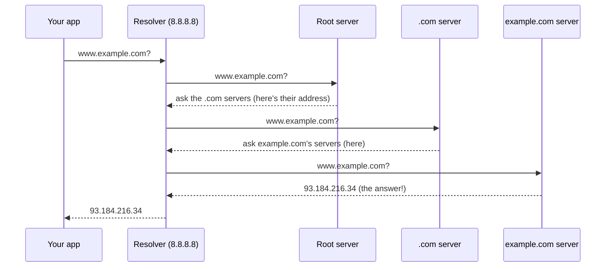

# DNS — turning names into addresses

> DNS is the Internet's phone book: it translates human names like `example.com` into the
> [IP addresses](../network-layer/ip-addressing.md) (`93.184.216.34`) the network actually
> routes on. It's a globally distributed, heavily cached, hierarchical database — and
> almost every connection starts with a DNS lookup.

## Top-down: where you already meet this
You type `youtube.com`, not `142.250.190.46`. But routers have no idea what "youtube" is —
they only forward by IP. So **before any connection can happen**, something must translate
the name. That something is DNS, and it runs so fast and so silently (mostly from caches)
that you never notice the extra step. It's the first thing that happens in
[loading any web page](../fundamentals/web-request-end-to-end.md).

## Problem
Names are for humans; addresses are for routers. We need a lookup system that maps one to
the other — but for the *entire Internet*, billions of names, changing constantly, with no
single company in charge and no single server that could possibly hold it all or survive
the query load. The answer is **hierarchy + delegation + caching**.

## Core concepts

**A hierarchy, read right-to-left.** A domain name is a path through a tree, most-general
on the right:
```
            www . example . com .
             |       |       |   └─ root  (the implicit trailing dot)
             |       |       └───── TLD (top-level domain): .com, .org, .io
             |       └───────────── second-level domain: example
             └───────────────────── subdomain / host: www
```
No single server knows everything. Instead each level **delegates** to the next: root
servers know where the `.com` servers are; `.com` servers know where `example.com`'s
servers are; `example.com`'s servers know the address of `www`.

**The lookup (a cold, uncached resolution).** Your machine asks a **resolver** (usually run
by your ISP, or `8.8.8.8` / `1.1.1.1`), which does the walking:



Two query styles appear here: your app→resolver is **recursive** ("go get me the final
answer"), while resolver→servers is **iterative** ("here's a referral to who knows more").

**Caching is what makes it fast.** That whole walk happens *once*; the answer is then
cached at every level — your browser, your OS, the resolver — for the record's **TTL**
(time-to-live, e.g. 300 s). The next lookup of `example.com` returns in microseconds from
cache. The root and `.com` servers would melt without this; in practice they're rarely
hit. Caching is the single reason a distributed phone book for the whole planet is fast.

**Record types — DNS stores more than addresses:**

| Record | Maps name → | Example use |
| --- | --- | --- |
| **A** | IPv4 address | `example.com → 93.184.216.34` |
| **AAAA** | IPv6 address | `example.com → 2606:2800:220:1::…` |
| **CNAME** | another name (alias) | `www.example.com → example.com` |
| **MX** | mail server | where to deliver `@example.com` email |
| **NS** | nameserver | which servers are authoritative for a zone |
| **TXT** | arbitrary text | domain verification, SPF/DKIM (anti-spam) |

**Transport: usually UDP.** A DNS query is tiny — one packet out, one back — so it rides on
[UDP](../transport-layer/ports-and-udp.md) port **53**, skipping TCP's handshake for speed.
It falls back to TCP for large answers. Modern privacy variants wrap it: **DoH** (DNS over
HTTPS) and **DoT** (DNS over TLS) encrypt queries so your ISP can't read them.

## Essential terminology

| Term | Meaning |
| --- | --- |
| **Resolver** (recursive) | The server that does the lookup walk *for* you (ISP, 8.8.8.8, 1.1.1.1). |
| **Root servers** | The 13 logical servers at the top of the tree; know the TLD servers. |
| **TLD** | Top-level domain — the last label: `.com`, `.org`, `.io`, `.uk`. |
| **Authoritative server** | The server that holds the *real* records for a zone. |
| **Zone** | A slice of the namespace one operator controls (e.g. everything under `example.com`). |
| **Record (RR)** | One entry: a name, a type (A/MX/…), and a value. |
| **TTL** | How long a record may be cached before re-fetching. |
| **Recursive vs iterative** | "Get me the final answer" vs "give me a referral." |
| **Propagation** | The delay before a DNS change is seen everywhere (≈ old TTLs expiring). |

## Example
Resolve a name by hand with `dig` (see the [dig lab](../../3-practice/lab-dig-dns.md)):
```console
$ dig example.com +short
93.184.216.34

$ dig example.com            # the full answer, trimmed
;; QUESTION SECTION:
;example.com.            IN  A
;; ANSWER SECTION:
example.com.    3600    IN  A   93.184.216.34
                ^TTL                ^the address
;; Query time: 24 msec        ← cold; a second run is ~0 ms (cached)
```
Trace the *whole delegation chain* yourself with `dig +trace example.com` — you'll watch it
hit a root server, then `.com`, then the authoritative server, exactly like the diagram.

## Common tools
| Tool | What it is | Use it for |
| --- | --- | --- |
| `dig` | DNS query tool | inspecting any record type, TTLs, the full trace |
| `nslookup` | Simpler DNS lookup | quick name→IP on any OS |
| `host` | One-line lookup | fast checks |
| `getent hosts` | OS resolver path | seeing what *your system* resolves (incl. `/etc/hosts`) |
| 1.1.1.1 / 8.8.8.8 | Public resolvers | fast, privacy-focused alternatives to your ISP's |

## Trade-offs
- ✅ **Scales infinitely** via delegation — no server knows everything; load spreads.
- ✅ **Fast** thanks to aggressive caching at every layer.
- ✅ **Flexible indirection:** change a server's IP, update one A record, traffic follows.
- ⚠️ **Propagation delay:** because of caching/TTLs, changes aren't instant — lower the TTL
  *before* a migration.
- ⚠️ **Security:** classic DNS is unauthenticated and plaintext → spoofing/poisoning and
  ISP snooping. **DNSSEC** signs records; **DoH/DoT** encrypt the query.
- ⚠️ **A single point of operational failure:** a DNS outage takes everything down even
  when servers are healthy (it has caused several global outages).

## Real-world examples
- **CDNs & geo-routing** return *different* A records depending on where you are, steering
  you to the nearest server — DNS as a load balancer.
- **The 2016 Dyn outage** (a DDoS on a big DNS provider) knocked out Twitter, Spotify, and
  Reddit — though the sites themselves were fine.
- **`1.1.1.1` (Cloudflare) and `8.8.8.8` (Google)** are public resolvers people switch to
  for speed and privacy.
- **Email anti-spam** (SPF, DKIM, DMARC) is all built on TXT and MX records.

## References
- Kurose & Ross, *Top-Down Approach* — Ch. 2.4 (DNS)
- [How DNS works (Cloudflare Learning)](https://www.cloudflare.com/learning/dns/what-is-dns/)
- [DNS for Cats / "howdns.works" comic](https://howdns.works/)
- RFC 1034 / 1035 — the original DNS specs
