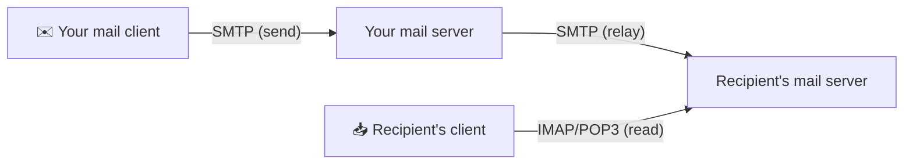
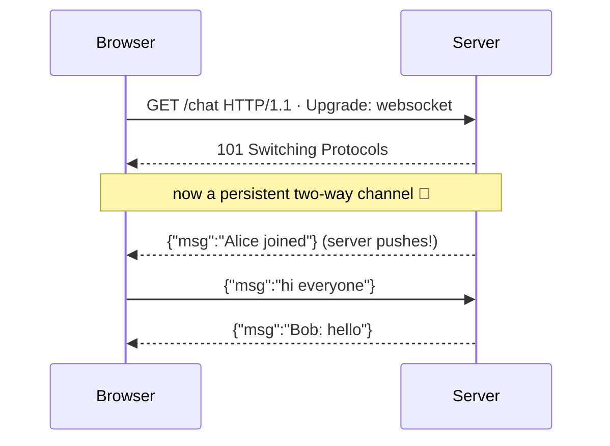

# Email, WebSockets & other application protocols

> [HTTP](./http.md) and [DNS](./dns.md) aren't the only languages spoken at the top of the
> stack. This doc tours the other application-layer protocols you'll actually meet — **email**
> (SMTP/IMAP/POP3), **WebSockets** and **SSE** (real-time over the web), **SSH** (secure
> remote shells), and **FTP/SFTP** (file transfer) — and the one pattern they all share:
> they're just agreed message formats riding on [TCP or UDP](../transport-layer/ports-and-udp.md).

## Top-down: where you already meet this
You send an email, a chat message pops up instantly without refreshing, you `ssh` into a
server, you upload a file. Each *feels* like its own kind of magic, but each is just another
application protocol — a documented set of text (or binary) messages over a transport
connection, exactly like HTTP. Once you've seen HTTP, every other app protocol is a variation
on the same theme: **connect, exchange structured messages, disconnect.** This doc shows that
they rhyme.

## Problem
HTTP's request/response model is perfect for "fetch a resource," but not for everything:
- Email must be **store-and-forward** — the recipient is usually offline when you send.
- Chat, live dashboards, and games need the **server to push** data unprompted — HTTP can't.
- Remote administration needs a **secure interactive session**, not one-shot requests.
- Bulk file transfer wants **streaming throughput**.

Different jobs → different protocols, each optimized for its shape of communication.

## Core concepts

**Email — three protocols, two directions.** Email splits "sending" from "reading":



| Protocol | Port | Job |
| --- | --- | --- |
| **SMTP** | 25 / 587 | **Sending** mail and server-to-server relay (push) |
| **IMAP** | 143 / 993 | **Reading** mail, kept *on the server* (sync across devices) |
| **POP3** | 110 / 995 | **Reading** mail by *downloading* it off the server (older) |

The `MX` [DNS record](./dns.md) tells a sending server *which* server handles a domain's mail.
Anti-spam (SPF, DKIM, DMARC) is layered on via [DNS TXT records](./dns.md). The secure ports
(587/993/995) wrap the protocol in [TLS](../security/tls-https.md).

**WebSockets — a two-way pipe over the web.** HTTP is one-shot request/response; a chat app
needs the server to push messages the instant they arrive. A **WebSocket** solves this: the
client sends an HTTP request with `Upgrade: websocket`, the server replies `101 Switching
Protocols`, and that *same* [TCP](../transport-layer/tcp.md) connection becomes a persistent,
**full-duplex** channel — both sides send anytime, no new request per message.



**SSE (Server-Sent Events)** is the lighter cousin: a *one-way* server→client stream over a
single long-lived HTTP response (`Content-Type: text/event-stream`). Great for live feeds
(stock tickers, notifications) when the client doesn't need to push back. Choose WebSockets
for two-way (chat, games), SSE for one-way (feeds).

**SSH — secure remote shells.** **SSH** (port 22) gives you an encrypted interactive session
to a remote machine — a terminal, file copies (`scp`/`sftp`), and **port forwarding/tunneling**.
It does its own key exchange and authentication (passwords or, better, **public-key auth**),
conceptually similar to [TLS](../security/tls-https.md) but built for interactive sessions and
multiplexed "channels" over one connection.

**FTP / SFTP — file transfer.** Classic **FTP** (port 21) is notable as a teaching example
because it uses *two* connections — a **control** channel for commands and a separate **data**
channel for the bytes — which famously confuses firewalls and [NAT](../network-layer/nat-and-dhcp.md).
In practice it's been largely replaced by **SFTP** (file transfer *over SSH*) and plain
**HTTPS** uploads/downloads, which are simpler and encrypted.

**The unifying pattern.** Strip away the specifics and every one of these is: pick a
[transport](../transport-layer/ports-and-udp.md) (almost always TCP), connect to a
**well-known port**, exchange **structured messages** in the protocol's grammar, optionally
wrapped in **TLS**. That's *all* an application protocol is — which is why you can often "speak"
them by hand with `telnet`/`openssl s_client`.

## Essential terminology

| Term | Meaning |
| --- | --- |
| **Application protocol** | An agreed message format/grammar between two programs (HTTP, SMTP, SSH…). |
| **Store-and-forward** | Relaying a message through intermediate servers until the recipient can receive it (email). |
| **SMTP / IMAP / POP3** | Send mail / read mail kept on server / read mail by download. |
| **MX record** | DNS entry naming a domain's mail server. |
| **WebSocket** | A persistent, full-duplex channel upgraded from an HTTP connection. |
| **Full-duplex** | Both sides can send simultaneously. |
| **SSE** | Server-Sent Events — one-way server→client stream over HTTP. |
| **SSH** | Secure Shell — encrypted interactive remote sessions + tunneling. |
| **Public-key auth** | Logging in with a key pair instead of a password (SSH, TLS). |
| **Control vs data channel** | FTP's split of commands and file bytes onto separate connections. |

## Example
Application protocols are just text you can type. Speak SMTP by hand (conceptually) and watch
a real WebSocket upgrade:
```console
# An SMTP conversation is literally readable commands:
$ openssl s_client -connect smtp.gmail.com:587 -starttls smtp
HELO example.com          ← you greet the server
MAIL FROM:<me@x.com>      ← envelope sender
RCPT TO:<you@y.com>       ← envelope recipient
DATA                      ← begin the message body
Subject: hi
...
.                         ← a lone dot ends the message
```
```console
# Watch a WebSocket upgrade with curl:
$ curl -v -H "Connection: Upgrade" -H "Upgrade: websocket" \
       -H "Sec-WebSocket-Key: x3JJHMbDL1EzLkh9GBhXDw==" -H "Sec-WebSocket-Version: 13" \
       https://echo.websocket.org
< HTTP/1.1 101 Switching Protocols      ← the handshake that flips HTTP → WebSocket
< Upgrade: websocket
```
The `101` is the moment a normal HTTP connection becomes a live two-way pipe.

## Common tools
| Tool | What it is | Use it for |
| --- | --- | --- |
| `openssl s_client` | TLS-aware raw client | hand-speaking SMTP/IMAP over TLS |
| `ssh` / `scp` / `sftp` | Secure shell suite | remote login, file copy, tunneling |
| `swaks` | SMTP test tool | sending test emails, debugging mail |
| Browser DevTools → WS | WebSocket inspector | watching live WS frames in a web app |
| `websocat` | netcat for WebSockets | testing WS endpoints from the CLI |

## Trade-offs
- ✅ **Right tool per shape:** push (WebSocket/SSE), store-and-forward (email), interactive
  (SSH), bulk (SFTP) — each fits its job better than forcing HTTP request/response.
- ✅ **Same foundations:** all ride TCP + ports + (usually) TLS, so the mental model transfers.
- ⚠️ **Persistent connections cost state:** WebSockets/SSE hold a connection per client —
  millions of them strain servers and complicate load balancing.
- ⚠️ **Legacy baggage:** plain SMTP/FTP are unauthenticated and plaintext; the secure variants
  (STARTTLS, SFTP) exist because the originals leaked everything.
- ⚠️ **Firewall/NAT friction:** multi-connection protocols (FTP) and non-HTTP ports are often
  blocked, which is why "everything over HTTPS:443" has become the path of least resistance.

## Real-world examples
- **Slack, Discord, and live dashboards** use WebSockets for instant message delivery.
- **Gmail/Outlook** speak IMAP+SMTP under the hood (and offer their own HTTPS APIs on top).
- **`git push` over SSH** and server administration are everyday SSH; **GitHub deploy keys** are
  SSH public-key auth.
- **Stock tickers and "X is typing…" feeds** often use SSE — cheaper than WebSockets for one-way.
- **MQTT** (over TCP) is the WebSocket-like protocol of choice for IoT devices on constrained links.

## References
- Kurose & Ross, *Top-Down Approach* — Ch. 2 (email, application protocols)
- [MDN — WebSockets](https://developer.mozilla.org/en-US/docs/Web/API/WebSockets_API) ·
  [MDN — Server-Sent Events](https://developer.mozilla.org/en-US/docs/Web/API/Server-sent_events)
- RFC 5321 (SMTP), RFC 6455 (WebSocket), RFC 4251 (SSH)
