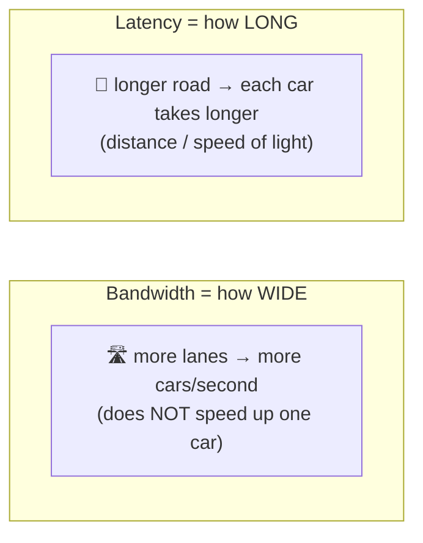

# Latency, bandwidth & throughput

> Three numbers describe network performance, and beginners constantly confuse them.
> **Bandwidth** is how *wide* the pipe is, **latency** is how *long* the pipe is, and
> **throughput** is how much you *actually* get. A "fast" connection can be any mix.

## Top-down: where you already meet this
"My internet is 500 Mbps but this site still feels slow." That sentence is the confusion
this doc fixes. The ISP sells you **bandwidth**; what you *feel* on a small request is
**latency**; what a big download achieves is **throughput**. They're independent, and
knowing which one is biting you is the difference between buying a faster plan (won't help)
and moving a server closer (will). Every performance decision in networking comes back to
these three.

## Problem
"Make the network faster" is meaningless until you say *faster how*. Loading a tiny API
response and streaming a 4K movie are bottlenecked by completely different things. We need
precise, separate words — and a feel for their typical magnitudes — to reason about
performance at all.

## Core concepts

**Bandwidth — the width of the pipe.** The maximum **rate** a link can carry data,
measured in **bits per second** (bps, Mbps, Gbps). It's a property of the link, like the
number of lanes on a highway. More bandwidth = more cars *per second*, but it does **not**
make any single car arrive sooner.

**Latency — the length of the pipe.** The **time** for one bit to travel from source to
destination, in milliseconds. Usually quoted as **RTT** (round-trip time): there and back.
Latency is dominated by **distance** (signals travel at ~⅔ the speed of light in fibre ≈
200,000 km/s), plus queuing and processing delays. You cannot beat physics: NYC↔London is
~5,600 km, so the *theoretical floor* is ~28 ms one-way, ~56 ms RTT — no money buys less.



**Throughput — what you actually get.** The *real* data rate you achieve end-to-end. It's
≤ bandwidth and is dragged down by the *narrowest* link on the path (the **bottleneck**),
by [congestion](../transport-layer/congestion-control.md), by packet loss, and — crucially
— by latency, because reliable protocols like [TCP](../transport-layer/tcp.md) must pause
to wait for acknowledgements.

**The pipe analogy makes it click:**
- **Bandwidth** = the pipe's diameter (volume per second once flowing).
- **Latency** = the pipe's length (time for the first drop to come out).
- **Throughput** = the actual water you collect per second (limited by the narrowest
  section and how often you have to stop and wait).

**The bandwidth-delay product (BDP)** = bandwidth × RTT. It's the amount of data "in
flight" filling the pipe at once. It explains a famous gotcha: on a **high-bandwidth,
high-latency** link (a "long fat network" — e.g. a satellite link or a transcontinental
10 Gbps path), TCP can't fill the pipe unless its **window** is at least the BDP. With a
small window you spend most of the time *waiting for ACKs*, so throughput collapses far
below the bandwidth — pure latency tax.

**Total delay** on one hop is the sum of four pieces (worth knowing the names):

| Delay component | What it is |
| --- | --- |
| **Propagation** | distance ÷ signal speed — the unavoidable physics term |
| **Transmission** | packet size ÷ link bandwidth — time to *push* the bits onto the wire |
| **Queuing** | time spent waiting in a router's buffer behind other packets (varies with load) |
| **Processing** | time a router takes to inspect the header & decide the next hop (tiny) |

Under congestion, **queuing delay** is what spikes — that's why a saturated link feels
laggy even before it drops packets (see **bufferbloat** below).

## Essential terminology

| Term | Meaning | Typical unit |
| --- | --- | --- |
| **Bandwidth** | Max rate a link *can* carry | Mbps / Gbps (bits!) |
| **Latency** | One-way travel time for a bit | ms |
| **RTT** | Round-trip time (there and back) | ms |
| **Throughput / goodput** | Rate actually achieved (goodput = useful payload only) | Mbps |
| **Bottleneck** | The slowest link on the path; it caps throughput | — |
| **Jitter** | Variation in latency packet-to-packet (kills voice/video) | ms |
| **Packet loss** | Fraction of packets dropped (forces retransmits) | % |
| **BDP** | Bandwidth × RTT = data "in flight" the pipe holds | bytes |
| **Bufferbloat** | Oversized router buffers that add huge queuing latency under load | ms |

## Example
Download a **1 GB** file over a **100 Mbps** link. How long?

```
1 GB = 8,000 Megabits  (×8: bytes → bits)
time = 8,000 Mb ÷ 100 Mbps = 80 seconds   (bandwidth-bound — latency barely matters)
```
Now load a **2 KB** API response from a server **100 ms RTT** away over the *same* 100 Mbps
link:
```
transmission time of 2 KB ≈ 0.16 ms   (negligible)
but: DNS + TCP + TLS + request ≈ ~4 round-trips × 100 ms = ~400 ms
```
**Same link, opposite bottleneck.** The big download is **bandwidth-bound** (buying a
faster plan helps). The small request is **latency-bound** (a faster plan does *nothing*;
only moving the server closer or cutting round-trips helps). This is the single most
important performance intuition in networking.

## Common tools
| Tool | What it is | Use it for |
| --- | --- | --- |
| `ping` | RTT probe | measuring latency & jitter to a host |
| `iperf3` | Throughput tester | measuring real achievable bandwidth between two hosts |
| `traceroute` | Per-hop latency | finding *where* latency is added |
| `speedtest` | ISP bandwidth test | the number your ISP sells you |
| Browser DevTools | Per-request timing | seeing TTFB (latency) vs download time (bandwidth) |

## Trade-offs
- ✅ Bandwidth is *cheap and improvable* — fibre, more lanes, upgraded plans.
- ⚠️ Latency is *bounded by physics* — you can't go faster than light, so the only wins are
  **shorter distance** (CDNs, edge) and **fewer round-trips** (HTTP/3, caching, keep-alive).
- ⚠️ Adding buffers to avoid loss can *increase* latency (bufferbloat) — the two goals fight.
- ⚠️ On long-fat networks, throughput is capped by the BDP and the protocol's window, not by
  raw bandwidth — tuning matters.

## Real-world examples
- **CDNs exist to fight latency, not bandwidth** — they shorten the distance term by
  serving you from a city near you.
- **Gaming & video calls care about latency + jitter**, not bandwidth: a 4K stream needs
  ~25 Mbps but tolerates 2 s of buffering; a game needs <50 ms and almost no bandwidth.
- **Satellite (old GEO)** offered decent bandwidth but ~600 ms RTT — web browsing felt awful;
  **Starlink (LEO)** fixed it by flying the satellites *lower* (shorter distance → ~30 ms).
- **HFT firms** lay dedicated fibre and microwave links between exchanges to shave
  *milliseconds* of latency — the purest example of latency-as-money.

## References
- Kurose & Ross, *Top-Down Approach* — Ch. 1.4 (delay, loss, throughput)
- [It's the Latency, Stupid (Stuart Cheshire)](https://www.stuartcheshire.org/rants/latency.html) — the classic rant
- [High Performance Browser Networking — Primer on Latency & Bandwidth](https://hpbn.co/primer-on-latency-and-bandwidth/)
