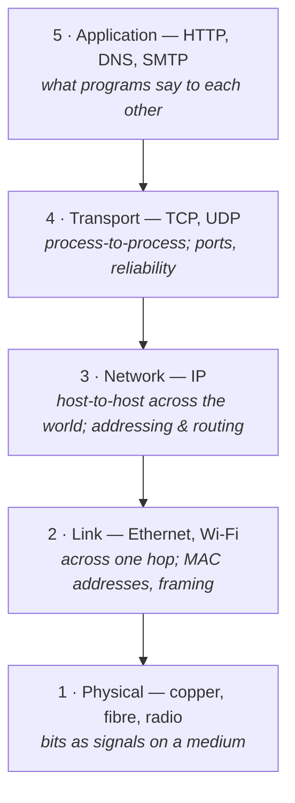
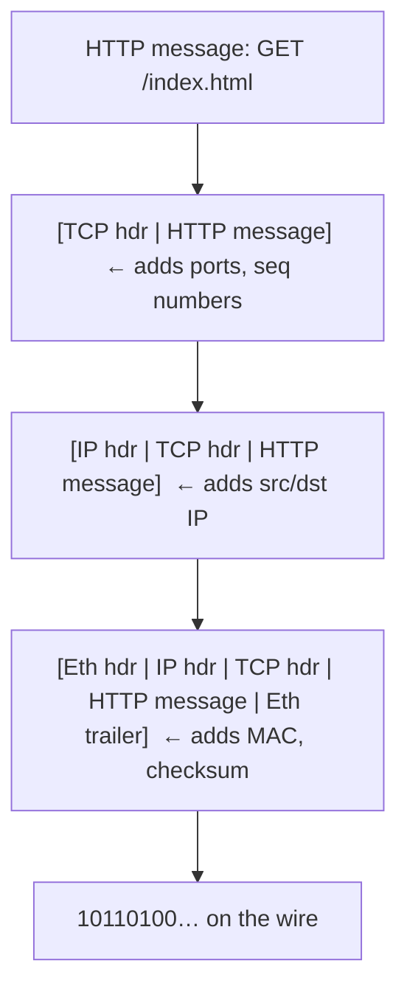

# Protocol layers & encapsulation

> The network is built as a **stack of layers**, each solving one problem and offering a
> simple service to the layer above. A message is wrapped in a header at every layer on
> the way down (**encapsulation**) and unwrapped on the way up.

## Top-down: where you already meet this
When your browser fetches a page, it thinks about *HTTP* — methods, headers, status
codes. It does **not** think about Wi-Fi frequencies, IP addresses, or retransmitting
lost packets. That's not because those don't happen — they all happen on every request —
but because each is handled by a **different layer**, and each layer hides its details
from the one above. Understanding networking *is* understanding this division of labor.
This doc is the backbone of the whole area: every other topic lives in one of these layers.

## Problem
Building "send data across the world reliably" as one giant program would be unmanageable
and unchangeable. You'd have to solve addressing, routing, reliability, and the physics of
radio all at once — and changing your Wi-Fi card would mean rewriting your web browser.
We need to **decompose** the problem so each piece can be solved, reasoned about, and
swapped independently.

## Core concepts

**Layering = divide and conquer.** Each layer:
1. **uses** the service of the layer below (without knowing how it works), and
2. **provides** a cleaner service to the layer above.

This is exactly like an OS: your app calls `write()` without knowing about disk sectors.
The payoff is **modularity** — you can replace Wi-Fi with Ethernet (swap the bottom
layers) and HTTP keeps working unchanged.

**The TCP/IP model — 5 layers.** This is the model the real Internet uses, and the one
we teach top-down:



| Layer | Job in one line | Address it uses | Data unit |
| --- | --- | --- | --- |
| Application | What the two programs actually say | hostname / URL | **message** |
| Transport | Deliver to the right *process*, optionally reliably | **port** | **segment** (TCP) / **datagram** (UDP) |
| Network | Get from host to host across many networks | **IP address** | **packet** (datagram) |
| Link | Get across one physical hop | **MAC address** | **frame** |
| Physical | Push bits onto the wire/air | — | **bit** |

> **OSI's 7 layers.** You'll also hear of the **OSI model** (7 layers), which splits the
> top into Application / Presentation / Session. It's a useful vocabulary — people say
> "that's a layer-7 load balancer" (application) or "a layer-4 load balancer"
> (transport) — but the *running Internet* is the 5-layer TCP/IP stack. We use 5.

**Encapsulation — the heart of it.** As your data goes *down* the stack, each layer wraps
it in its own **header** (and the link layer adds a trailer too). Each layer treats the
*entire* thing handed down from above as opaque **payload** — it doesn't look inside.



At the receiver the reverse happens — **decapsulation**: the link layer strips its header
and hands the rest up; transport strips its header and hands the message up; the app gets
exactly the bytes the sender's app produced. Each layer talks to its **peer** layer on the
other machine, *as if* it had a direct line — even though everything really flows down to
the wire and back up.

**Routers are layer-3 devices.** A key consequence of layering: devices in the core only
need to understand the layers relevant to their job. A **switch** works at layer 2 (MAC),
a **router** at layer 3 (IP). A router doesn't open the TCP or HTTP headers — it only
reads the IP destination to pick the next hop. The headers above it are just payload.
That's *why* the network scales: the core stays simple.

## Essential terminology

| Term | Meaning |
| --- | --- |
| **Layer** | A level of the stack solving one problem and offering a service upward. |
| **Protocol** | The rules/format two *peer* layers use to talk (HTTP, TCP, IP…). |
| **Header** | Metadata a layer prepends (addresses, sequence numbers, lengths). |
| **Payload** | The data a layer carries for the layer above — treated as opaque. |
| **Encapsulation** | Wrapping the payload in this layer's header on the way down. |
| **PDU** | "Protocol Data Unit" — the generic name for a layer's data unit (segment/packet/frame). |
| **Stack** | The full set of layers running on a host (a.k.a. the *protocol stack*). |
| **Peer layers** | The same layer on two different machines (your TCP ↔ the server's TCP). |

## Example
One HTTP `GET` as it's encapsulated leaving your laptop. Notice each header is added by a
different layer, and lengths add up:

```
Application →   GET /index.html HTTP/1.1\r\nHost: example.com\r\n\r\n         (38 bytes)
Transport   →   [TCP: srcPort 51000, dstPort 443, seq 1, ACK…] + the 38 bytes  (+20 bytes)
Network     →   [IP: src 192.168.1.5, dst 93.184.216.34, proto=TCP] + above    (+20 bytes)
Link        →   [Eth: src AA:BB.., dst (router MAC), type=IPv4] + above + [CRC] (+18 bytes)
Physical    →   1011010001110…  (the whole frame as electrical/radio signals)
```

The web server reverses it: link checks the CRC and strips the frame → IP confirms the
address and strips its header → TCP reassembles the stream and strips its header → the web
server process reads exactly `GET /index.html HTTP/1.1…`. See the full journey in
[what happens when you load a web page](./web-request-end-to-end.md).

## Common tools
| Tool | What it is | Use it for |
| --- | --- | --- |
| Wireshark / `tcpdump` | Packet capture & decode | **seeing the layers** — it shows Eth → IP → TCP → HTTP nested |
| `curl -v` | Verbose HTTP client | watching the application + TLS layers of one request |
| `ip route` | Routing table viewer | seeing layer-3 next-hop decisions on your host |
| `ss` / `netstat` | Socket lister | seeing transport-layer connections & ports |

## Trade-offs
- ✅ **Modularity:** swap Wi-Fi for Ethernet, or HTTP/1.1 for HTTP/3 — other layers don't
  care. This is why the Internet could evolve for 40+ years without a rewrite.
- ✅ **Reasoning:** you can debug one layer at a time ("is it DNS? routing? the app?").
- ⚠️ **Overhead:** every layer adds a header — small payloads can be mostly headers.
- ⚠️ **Hidden costs / duplication:** a layer can't see what another is doing, so you can
  get redundant work (e.g. reliability at two layers) or surprises (TCP-over-TCP meltdown
  in some VPNs). Layering is a *simplification*, and the real world occasionally leaks
  through it.

## Real-world examples
- **"Layer 4 vs layer 7 load balancer"** is everyday cloud vocabulary: L4 balances by
  IP/port (fast, dumb), L7 reads HTTP (can route by URL/cookie, smarter).
- **QUIC / HTTP/3** rebuilt the transport layer *on top of* UDP to escape limitations of
  TCP — possible precisely because layers are swappable. See [TCP](../transport-layer/tcp.md).
- **VPNs** encapsulate an entire IP packet *inside another* IP packet (tunneling) — layering
  applied recursively.

## References
- Kurose & Ross, *Top-Down Approach* — Ch. 1.5 (protocol layers & service models)
- [TCP/IP model (Cloudflare Learning)](https://www.cloudflare.com/learning/ddos/glossary/open-systems-interconnection-model-osi/)
- RFC 1122 — Requirements for Internet Hosts (the layering, formalized)
